# DataHek Context Layer & Schema Knowledge Graph — Source of Truth

**Status:** Authoritative reference for the Context Layer subsystem and its Schema Knowledge Graph
**Audience:** DataHek engineers, architects, and operators
**Related:** `ADR/` (13 immutable decision records) · `context-layer-deck.html` (presentation)

> **This is the single document to read.** It consolidates what were 27 separate topic files:
> architecture, context model, SRD, profiling, taxonomy, ontology, topology, granularity,
> enrichment, validation, lifecycle, provenance, retrieval, composition, API, security,
> multi-tenancy, observability, testing, graph abstraction, Neo4j, and the Knowledge Graph.
> The `ADR/` folder remains the immutable decision log; this file carries the digest.

---

## Table of contents

1. [What the Context Layer is](#1-what-the-context-layer-is)
2. [The Schema Knowledge Graph and its relationship to the layer](#2-the-schema-knowledge-graph-and-its-relationship-to-the-layer)
3. [Architecture](#3-architecture)
4. [Artifacts (the context model)](#4-artifacts-the-context-model)
5. [Build sequencing (persistent context)](#5-build-sequencing-persistent-context)
6. [Lifecycle and versioning](#6-lifecycle-and-versioning)
7. [Runtime sequencing (question → answer)](#7-runtime-sequencing-question--answer)
8. [Retrieval](#8-retrieval)
9. [Composition](#9-composition)
10. [Compilation](#10-compilation)
11. [Planner integration and degradation](#11-planner-integration-and-degradation)
12. [Profiling](#12-profiling)
13. [Taxonomy](#13-taxonomy)
14. [Ontology](#14-ontology)
15. [Entities](#15-entities)
16. [Relationships](#16-relationships)
17. [Topology](#17-topology)
18. [Granularity / grain](#18-granularity--grain)
19. [Semantic enrichment](#19-semantic-enrichment)
20. [Provenance](#20-provenance)
21. [Human validation](#21-human-validation)
22. [Schema Knowledge Graph — the Neo4j model](#22-schema-knowledge-graph--the-neo4j-model)
23. [Neo4j schema design and Cypher cookbook](#23-neo4j-schema-design-and-cypher-cookbook)
24. [Graph retrieval and the SQL agent](#24-graph-retrieval-and-the-sql-agent)
25. [Graph abstraction and backend replaceability](#25-graph-abstraction-and-backend-replaceability)
26. [Security](#26-security)
27. [Multi-tenancy](#27-multi-tenancy)
28. [Observability](#28-observability)
29. [Testing strategy](#29-testing-strategy)
30. [Storage architecture](#30-storage-architecture)
31. [Failure handling](#31-failure-handling)
32. [REST API surface](#32-rest-api-surface)
33. [Operations and configuration](#33-operations-and-configuration)
34. [V1 vs future](#34-v1-vs-future)
35. [Decision digest (ADR-001 … ADR-013)](#35-decision-digest-adr-001--adr-013)
36. [Evidence and reproduction](#36-evidence-and-reproduction)

---

## 1. What the Context Layer is

The Context Layer is a first-class DataHek subsystem that produces the **minimum relevant,
trustworthy, governed, versioned, task-appropriate information** an agent needs to answer
correctly — as **structured artifacts, not prose**. A system prompt is one consumer of context, not
the context itself.

```
Persistent Context → Retrieval → Selection → Composition → Compilation → Context Package → Agent → LLM
```

Three principles drive the design:

1. **Deterministic by default.** Only one stage (semantic enrichment) uses an LLM; everything else
   is rule-based, reproducible, and testable without a model.
2. **Fail closed.** Unknown semantics clarify; unsafe values deny; unverifiable plans are rejected.
   The system never guesses on the user's behalf.
3. **Bounded always.** Retrieval caps tables/columns, composition caps tokens, graph reads are
   depth-bounded — a hostile "select everything" question still returns small slices.

### 1.1 Objectives

| Objective | Requirement | How it is met |
|---|---|---|
| Correct table/column selection | FR-012 | deterministic token retrieval + bounded caps |
| Correct joins | FR-012 | topology edges + fanout risk, bounded join paths |
| Correct aggregation | FR-012/FR-013 | grain statements delivered to the planner |
| Safe execution | FR-018 | read-only enforcement, validation, guardrails, policy |
| Trustworthy semantics | FR-010 | provenance, trust levels, human validation |
| Reproducibility | FR-013 | byte-identical `ContextPackage` for the same inputs |
| Replaceable graph | FR-017 | `GraphRepository` contract, no Cypher in the domain |
| Never break answers | FR-020 | every failure degrades or clarifies; `/ask` still works |

### 1.2 Scope (V1) and non-goals

**In scope:** schema context, profiling, taxonomy, ontology (LLM proposals), topology, granularity,
governance, capabilities, Schema Knowledge Graph (Neo4j projection), registry/versioning, retrieval,
composition, compilation, planner integration, REST surface, human validation, observability.

**Non-goals (V1):** data-level knowledge graph, vector/RAG platform, autonomous agent swarm,
unrestricted Cypher or SQL from LLM output, credentials in context, entire-graph injection into
prompts, Neo4j-specific domain model, cross-database federation, window functions/self-joins in plans.

### 1.3 Where it sits in DataHek

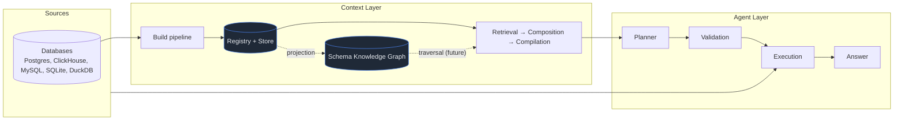

---

## 2. The Schema Knowledge Graph and its relationship to the layer

> **The Knowledge Graph is a representation of the Context Layer's semantic knowledge — it is not
> the Context Layer itself.**

The Context Layer is the subsystem: contracts, services, storage adapters, lifecycle. The graph is
**one representation/storage mechanism inside it**. Removing Neo4j degrades performance and
forecloses traversal features, but never changes the meaning of context — the registry and store
remain canonical and the graph can be rebuilt at any time.

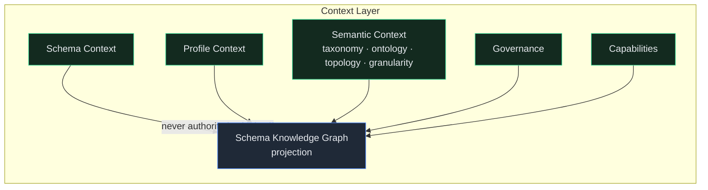

**Normative consequences**

1. `ContextRegistryService` owns versions and lifecycle; the graph mirrors a version.
2. Writes flow `registry → store → graph`; a graph failure marks `DEGRADED` and never blocks a
   state transition.
3. The graph stores **metadata and semantics, never row data or raw values**.
4. The graph is **rebuildable** from artifacts alone, deterministically.

---

## 3. Architecture

### 3.1 Components

| Component | File | Responsibility |
|---|---|---|
| Snapshot | `context/snapshot.py` | Catalog → canonical `SchemaContext` + SHA-256 `schema_hash` |
| Profiler | `context/profiler.py` | Batched aggregates: null ratio, distinct, uniqueness, min/max/avg, roles, value hints |
| Topology | `context/topology.py` | FK edges, `<entity>_id` inference, cardinality, fanout, bounded join paths |
| Granularity | `context/granularity.py` | "1 row of X means …" grain statements + metric grains |
| Taxonomy | `context/taxonomy.py` | Domain → Subdomain → Category classification |
| Enrichment | `context/enrichment.py` | The only LLM stage: ontology proposals (PENDING) |
| Quality | `context/quality.py` | Six coverage dimensions → `QualityState` |
| Freshness | `context/freshness.py` | Age/schema-hash/permission-version signals |
| Lifecycle | `context/lifecycle.py` | Legal state transitions |
| Hashing | `context/hashing.py` | Canonical schema hashing |
| Provenance | `context/provenance.py` | Trust ordering + effective trust |
| Serialization | `context/serialization.py` | Typed JSON for artifacts/records/packages |
| Registry | `context/registry.py` | Publish / supersede / invalidate |
| Validation | `context/validation.py` | Review inbox: approve / edit / reject |
| Build job | `context/jobs/build_context.py` | 9 ordered stages with retries + degradation |
| Rebuild queue | `context/jobs/rebuild_queue.py` | Background, deduplicated, tenant-scoped rebuilds |
| Retriever | `context/retriever.py` | Deterministic question → bounded `RetrievedContext` |
| Composer | `context/composer.py` | Token budget + ordered degradation |
| Compiler | `context/compiler.py` | Deterministic `ContextPackage` |
| Graph vocabulary | `context/graph/vocabulary.py` | Controlled relationship types |
| Graph builder | `context/graph/builder.py` | Artifacts → graph projection |
| Graph adapters | `context/graph/memory.py`, `neo4j.py` | In-memory and Neo4j implementations |
| Contracts | `contracts/context.py` | All enums, dataclasses, and protocols |

### 3.2 Layer diagram

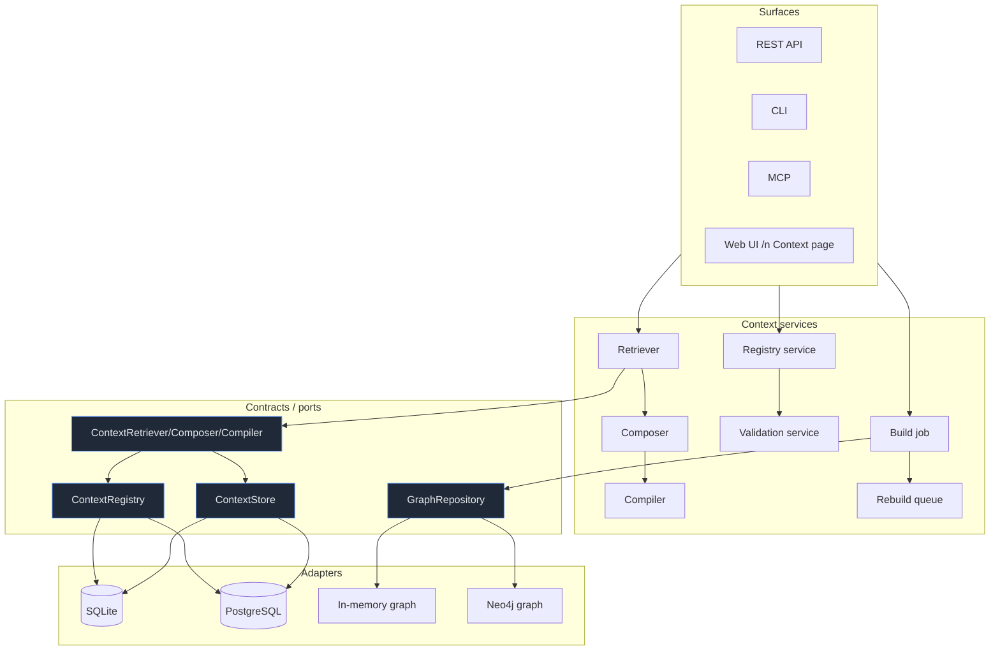

### 3.3 Dependency rules

- `Context services → contracts → adapters → drivers`. No reverse arrows.
- Cypher/Bolt types exist **only** in `context/graph/neo4j.py`.
- The agent/API code resolves protocols from the DI container; Enterprise replaces implementations
  via `Container.override` without touching agent code.

---

## 4. Artifacts (the context model)

Every artifact carries an **`ArtifactEnvelope`**: `kind`, `schema_version`, `provenance`, `trust`,
`validation`, `confidence`, `generated_at`, `warnings`.

### 4.1 Enumerations

| Enum | Values |
|---|---|
| `ArtifactKind` | `schema`, `profile`, `taxonomy`, `ontology`, `topology`, `granularity`, `governance`, `capability` |
| `LifecycleState` | `discovered`, `profiling`, `enriching`, `generated`, `pending_validation`, `validated`, `active`, `stale`, `rebuilding`, `degraded`, `failed`, `superseded` |
| `ProvenanceSource` | `database`, `system`, `llm`, `user`, `human_validated`, `inferred`, `imported` |
| `TrustLevel` | `system`, `validated`, `structural`, `proposed`, `untrusted` |
| `ValidationStatus` | `not_required`, `pending`, `approved`, `edited`, `rejected` |
| `QualityState` | `insufficient`, `partial`, `sufficient`, `validated` |

### 4.2 Artifact catalogue

| Artifact | Contents | Provenance |
|---|---|---|
| **Schema** | tables, columns, types, PK/FK, indexes, nullability, comments | Database |
| **Profile** | null ratio, distinct count, uniqueness, min/max/avg, role candidates, value hints, sensitive flag | Database |
| **Topology** | join edges (FK + inferred), cardinality, fanout risk, bounded join paths | Database / inferred |
| **Granularity** | table grain statements, metric-grain caveats | System / human |
| **Taxonomy** | role-based hierarchy (Domain → Subdomain → Category) | System |
| **Ontology** | concepts, synonyms, controlled relationships | LLM (PENDING) |
| **Governance** | sensitive/restricted columns, allowed operations, masking refs, permission version | System |
| **Capability** | skills, tools, providers available to the connection | System |

### 4.3 Key structures

```text
ColumnSchema(name, data_type, nullable, ordinal, default, is_primary_key,
             is_foreign_key, references, comment)
TableSchema(name, columns, primary_key, foreign_keys, indexes, comment, estimated_rows)
SchemaContext(envelope, database, schema, tables, schema_hash)

ColumnProfile(name, row_count, null_ratio, distinct_count, distinct_estimated,
              uniqueness_ratio, min_value, max_value, avg_value, min_length, max_length,
              top_values, role_candidates, role_confidence, sensitive)
ProfileContext(envelope, tables: dict[str, tuple[ColumnProfile, ...]], sampled, sample_size)

TaxonomyNode(path: tuple[str, ...], members, node_kind, provenance, validation, confidence)
OntologyConcept(name, kind, maps_to, attributes, provenance, validation, confidence,
                description, synonyms)
OntologyRelationship(subject, predicate, object, kind, provenance, validation, confidence)
JoinEdge(left, right, kind, cardinality, fanout_risk, provenance, confidence)
GrainStatement(table, statement, qualifier, entity, source, validation, confidence)
MetricGrain(metric, valid_at, caveat)
GovernanceContext(envelope, sensitive_columns, restricted_columns, allowed_operations,
                  masking_policy_refs, permission_version)
CapabilityContext(envelope, skills, tools, providers)

QualityReport(state, schema_completeness, profiling_coverage, semantic_confidence,
              relationship_coverage, granularity_confidence, human_validation,
              freshness_score, governance_coverage, details)
FreshnessReport(state, age_seconds, schema_hash_matches, permission_version_matches,
                refresh_due_at)
ProvenanceEntry(field, source, confidence, validation, note)
ContextBudget(tokens_estimate, dropped_sections)
```

### 4.4 The `ContextPackage` (what the agent receives)

```text
ContextPackage(context_id, org_id, project_id, connection_id, version, schema_hash,
               purpose, generated_at,
               schema, profile, taxonomy, ontology, topology, granularity,
               semantics, governance, capabilities, quality, freshness,
               provenance, trust, budget, degraded)
```

- **Immutable** and keyed by `(context_id, version, purpose, retrieval_digest)`.
- **Byte-identical** for the same inputs (ADR-007).
- `trust` is the **minimum effective trust** of included content.
- **Governance and granularity are never dropped by budgeting**; if they cannot fit, the package is
  `INSUFFICIENT` and the planner fails closed.

### 4.5 The registry record

```text
ContextRecord(context_id, org_id, project_id, connection_id, scope, version, state,
              schema_hash, created_at, updated_at, artifact_kinds, quality, freshness,
              previous_version, supersedes, validated_at, provenance_summary, notes)
```

---

## 5. Build sequencing (persistent context)


| # | Stage | Input | Output | On failure |
|---|---|---|---|---|
| 1 | **INTROSPECT** | connection + provider | catalog | **abort** (no publish) |
| 2 | **PROFILE** | catalog | `ProfileContext` | degrade (warning) |
| 3 | **TOPOLOGY** | schema | `TopologyContext` | degrade |
| 4 | **GRANULARITY** | schema + profiles | `GranularityContext` | degrade |
| 5 | **TAXONOMY** | profiles | `TaxonomyContext` | skip if no profiles |
| 6 | **ENRICH** | schema + taxonomy + validated priors | `OntologyContext` | degrade (publish without ontology) |
| 7 | **GRAPH_BUILD** | all artifacts | `GraphBuildReport` | degrade (`graph backend unavailable`) |
| 8 | **QUALITY** | all + freshness | `QualityReport` | — |
| 9 | **PUBLISH** | artifacts + quality + freshness | `ContextRecord` v+1 | fail |

**Sequencing guarantees**

1. **Fixed order.** Later stages depend on earlier artifacts (topology needs schema; taxonomy needs
   profiles; enrichment needs taxonomy; the graph needs everything).
2. **Retries.** Each stage retries once (`max_retries`); only INTROSPECT abort is fatal.
3. **Degradation.** A failed stage yields `degraded` + warning; the build still publishes.
4. **Enrichment is opt-in.** Spends model tokens; automated builds default to `enrichment=false`.
5. **Skip-if-current.** A matching `schema_hash` short-circuits with `state="current"`.
6. **Idempotent graph.** Rebuilds MERGE by stable ids and prune stale nodes per connection.
7. **Atomic publish.** A new version supersedes the previous; older versions stay readable.

**Live reference (InsForge: 730,962 rows / 40 columns):** total ~29 s deterministic
(`PROFILE` ≈ 27 s); with value hints ~44 s.

**Background rebuilds.** `ContextRebuildQueue` drains queued rebuilds in the API lifespan,
deduplicated per `(org, connection, scope)`; `POST …/context/rebuild` (202) and
`GET /context/rebuilds`; auto-rebuild on stale preview when `DATAHEK_CONTEXT_AUTO_REBUILD=on`.

---

## 6. Lifecycle and versioning

```mermaid
stateDiagram-v2
    [*] --> discovered
    discovered --> profiling --> enriching --> generated
    generated --> pending_validation: proposals present
    generated --> active: publish
    pending_validation --> validated: human review
    validated --> active
    active --> stale: schema_hash mismatch
    stale --> rebuilding: rebuild queued
    rebuilding --> active: v+1 published
    active --> superseded: v+1 published
    rebuilding --> degraded: stage failure
    degraded --> active: retry ok
    active --> degraded: graph/enrichment degraded publish
```

| Rule | Detail |
|---|---|
| Monotonic versions | per `(org, connection, scope)`; `version = previous + 1` |
| Immutability | ACTIVE versions are never mutated; changes create a new version |
| Links | `supersedes` (new → old) and `previous_version` (old → new) |
| Invalidation | on schema-hash mismatch, permission-version change, manual request, staleness policy |
| Stale handling | `STALE` is flagged; retrieval returns `stale=true`; rebuild is queued |
| Terminal state | `superseded` |
| Illegal transitions | rejected via `assert_transition` (`ErrorCode.VALIDATION`) |

**Freshness policies by artifact class (ADR-009):** schema event-driven (no TTL); profile aging;
taxonomy/ontology version-driven; topology schema-driven; granularity drift/correction; governance
near-real-time (never stale); capabilities registry-version; semantics long-lived.

**Schema change detection (ADR-010):** canonical `schema_hash = SHA-256(canonical_form)` persisted on
the record and every graph node/edge; mismatch marks `STALE`, audits `schema_changed`, queues a rebuild.

---

## 7. Runtime sequencing (question → answer)

Every `/ask` compiles context **before** planning:

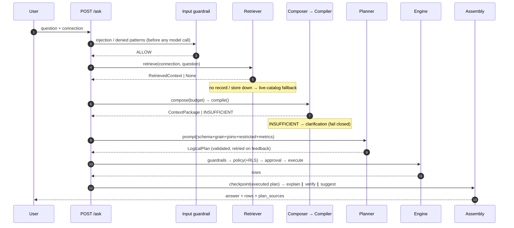

| # | Guarantee | Why it matters |
|---|---|---|
| 1 | Retrieval precedes any model call | deterministic, cheap (~36 ms), auditable |
| 2 | Missing/invalid context degrades to live catalog | the layer never breaks `/ask` |
| 3 | `INSUFFICIENT` clarifies instead of guessing | no answers on unverified foundations |
| 4 | Policy/RLS run **after** planning, in the engine | context informs; guardrails enforce |
| 5 | Checkpoints store the **executed** plan (post-RLS) | replay and audit see real SQL |
| 6 | explain ∥ verify ∥ suggest run concurrently | up to two model latencies removed |
| 7 | Stale context can enqueue a background rebuild | repair without blocking `/ask` |

---

## 8. Retrieval

`ContextRetrieverService.retrieve(ctx, *, connection_id, question, scope="connection", current_schema_hash=None)`

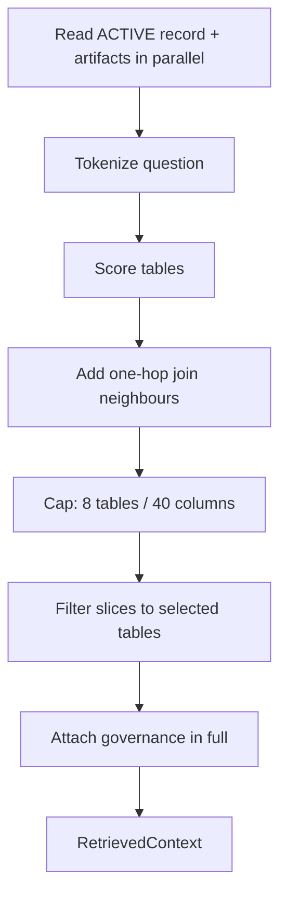

1. **Read** the ACTIVE record (tenant-scoped) and its artifacts (`asyncio.gather`); require `SchemaContext`.
2. **Tokenize**: lowercase, split snake_case (`error_category` → `error`, `category`), drop stopwords.
3. **Score tables**: name match ×3; any column match +2; `name.replace("_"," ")` overlap; taxonomy path
   overlap; ontology concept name/description/synonym overlap ×2 for `maps_to` tables; metric
   name/description overlap ×3.
4. **Expand**: pull in one-hop join neighbours.
5. **Cap**: `_DEFAULT_TABLE_CAP = 8`, `_DEFAULT_COLUMN_CAP = 40`; overridable via
   `DATAHEK_CONTEXT_TABLE_CAP` / `DATAHEK_CONTEXT_COLUMN_CAP`. No matches → schema-order floor.
6. **Filter slices**: profiles/grain/taxonomy/ontology to selected tables; topology to edges
   **between** selected tables; metrics by token overlap.
7. **Governance** is always attached in full.
8. **Caps aren't shrinking with questions**: low-cardinality non-sensitive columns carry top-value
   hints from the profiler, rendered into the planner schema block.

**Staleness:** `stale = current_schema_hash is not None and current_schema_hash != active.schema_hash`.

**Caps configuration:** `DATAHEK_CONTEXT_TABLE_CAP`, `DATAHEK_CONTEXT_COLUMN_CAP`
(`ContextRetrieverService(table_cap=…, column_cap=…)`).

---

## 9. Composition

`BudgetContextComposer(default_budget=None)` — `DATAHEK_CONTEXT_BUDGET_TOKENS`, default **4000**;
per-request override via the preview API.

- Cost model: `estimate_tokens(value) = len(str(value)) // 4` — deterministic, monotonic.
- **Mandatory sections**: `schema`, `governance`, `granularity`. If they alone exceed the budget →
  `insufficient_reason="budget"` (they are never dropped).
- **Optional drop order**: `profiles → taxonomy → topology → ontology → metrics`.
- Empty sections are absent, not "dropped".
- **Metric pruning**: before dropping the metrics section entirely, metrics with zero token overlap
  with the question are pruned; if the relevant remainder fits, it is kept.

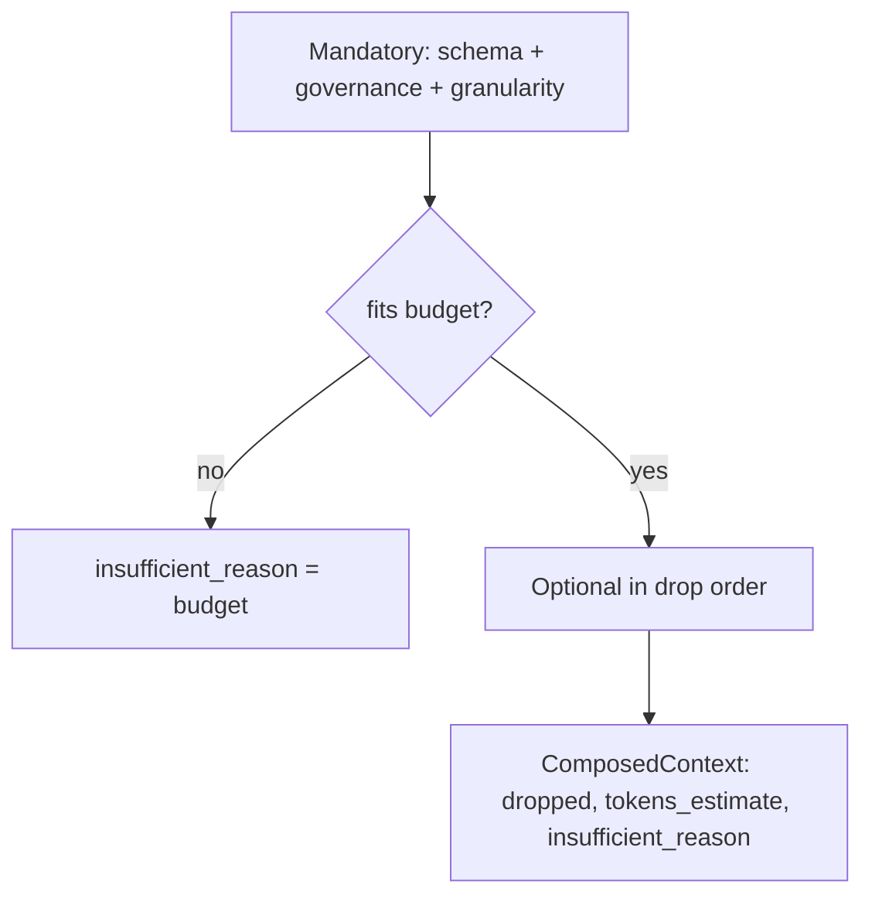

---

## 10. Compilation

`PackageContextCompiler.compile(ctx, composed, *, quality, freshness, governance=None, skills=(), tools=(), providers=())`

- **Deterministic**: identical inputs → byte-identical package.
- **Semantics summary**: dimensions/identifiers/temporal from taxonomy `Dimension`/`Identifier`/
  `Temporal` categories; **fallback** to profile `role_candidates`; metrics carried through.
- **Trust floor**: minimum effective trust of included content — an included LLM ontology lowers the
  package to `PROPOSED`.
- **Governance**: composed governance, else a synthesized `SYSTEM` block
  (`allowed_operations=("SELECT",)`, `permission_version="oss:local"`).
- **Degradation**: `composed.dropped` → `package.degraded` and `budget.dropped_sections`.
- **Fail closed**: `insufficient_reason` overrides `quality.state=INSUFFICIENT` with the reason.

---

## 11. Planner integration and degradation

With a package, the planner renders **schema + grain + joins + restricted columns + metrics** (plus
value hints) and **skips the live catalog fetch** (unless a skill needs it). Without one, the
pre-existing path runs unchanged.

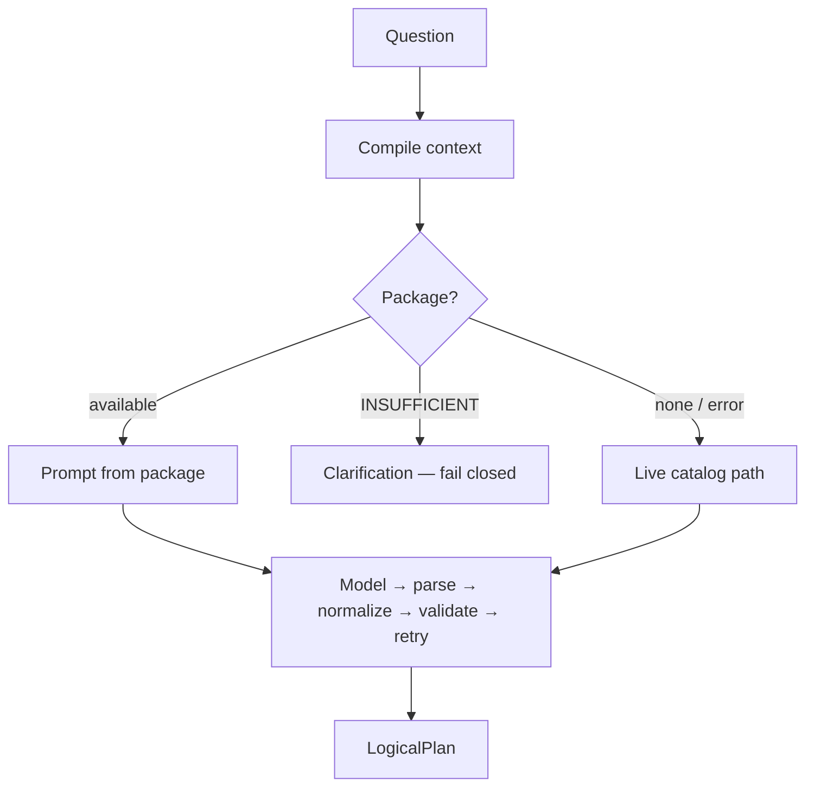

| Failure | Behavior |
|---|---|
| No active record | Live-catalog planning; `/ask` unaffected |
| Store/retriever down | Log warning, live-catalog fallback |
| Package `INSUFFICIENT` | Clarification (no guessing) |
| Stale context | Returned with `stale=true`; planning still works |
| Preview store failure | `CONTEXT_UNAVAILABLE` (503) with reason |

**Planner hardening learned from the 215-query campaign:** snake_case token splitting; `DATE_TRUNC`
time buckets (whitelisted, `AS` aliases preserved); stable `ORDER BY` + primary-key tiebreaker for
raw row listings; no invented columns/tables (unknown table → clarification); `HAVING` for aggregate
thresholds; aggregate-as-column noise rejected; fail closed on undocumented encoded columns;
self-joins rejected with actionable feedback.
---

## 12. Profiling

Profiling converts structure into statistics and **candidate roles**. It is the evidence base for
taxonomy, grain, entity inference, and value hints.

| Profiled signal | Where it lives | Notes |
|---|---|---|
| data type, nullability, PK/FK, indexes | canonical artifact + graph property | stable |
| `row_count` per table | artifact + graph `p_row_count` | refreshed per build |
| `null_ratio`, `distinct_count`, `uniqueness_ratio` | artifact + graph properties | curated subset |
| `min_value`, `max_value`, `avg_value` | artifact only | numeric noise; planners only |
| `role_candidates` / `role_confidence` | artifact + graph `p_roles` | drives taxonomy |
| `sensitive` flag | artifact + graph `p_sensitive` | governance input |
| `top_values` (value hints) | artifact (+ optional graph) | **non-sensitive only**, ≤6 columns/table, ≤25 distinct, 24-char truncation |
| distributions / histograms | future (artifact) | too large for a graph |

**Privacy rules.** Sensitive columns contribute **counts only** — no min/max, no samples, no values.
Hints are produced only for non-sensitive, low-cardinality **string** columns and skip free-text/
identifier names (`*_message`, `*_id`, `*_url`, JSON, …).

**Cost.** Hints add grouped `count(*)` scans through the guarded engine: on the InsForge fixture
(730k rows) six hints add ~17 s (PROFILE ≈ 27 s → 44 s). Knobs:
`DATAHEK_PROFILE_VALUE_HINTS`, `DATAHEK_PROFILE_HINT_MAX_COLUMNS`, `DATAHEK_PROFILE_HINT_TOP_K`,
`DATAHEK_PROFILE_HINT_MAX_DISTINCT`.

**Implementation.** One batched aggregate plan per table through the engine
(`count(*)`, per-column `count`, `count_distinct`, min/max for numeric/time, avg for numeric), then a
second pass for hints. Sensitive columns are excluded from value-bearing aggregates.

---

## 13. Taxonomy

Deterministic classification: **Domain → Subdomain → Category**, with columns as members.

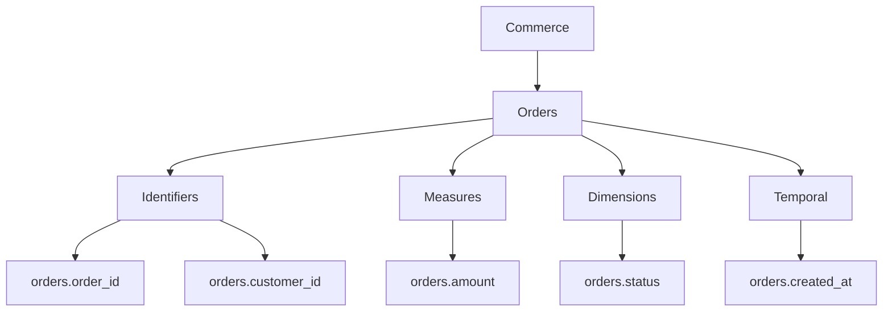

**Roles** derived from type family, uniqueness, distinct count, null ratio, sensitive flag, and name
markers: `identifier`, `measure`, `dimension`, `temporal`, `flag`, `text`.
Rule of thumb: uniqueness ≈ 1.0 → identifier; numeric → measure; boolean or 2 distinct → flag;
time → temporal; small distinct string → dimension.

**In the graph:** the category label is stored as `p_taxonomy_category` on the Column node plus
`p_roles`; category nodes are intentionally not materialised in V1 to keep traversals shallow.

---

## 14. Ontology

Meaning: concepts, attributes, semantic relationships. Unlike taxonomy (classification) and topology
(connectivity), ontology is interpretation and is **LLM-proposed then human-validated**.

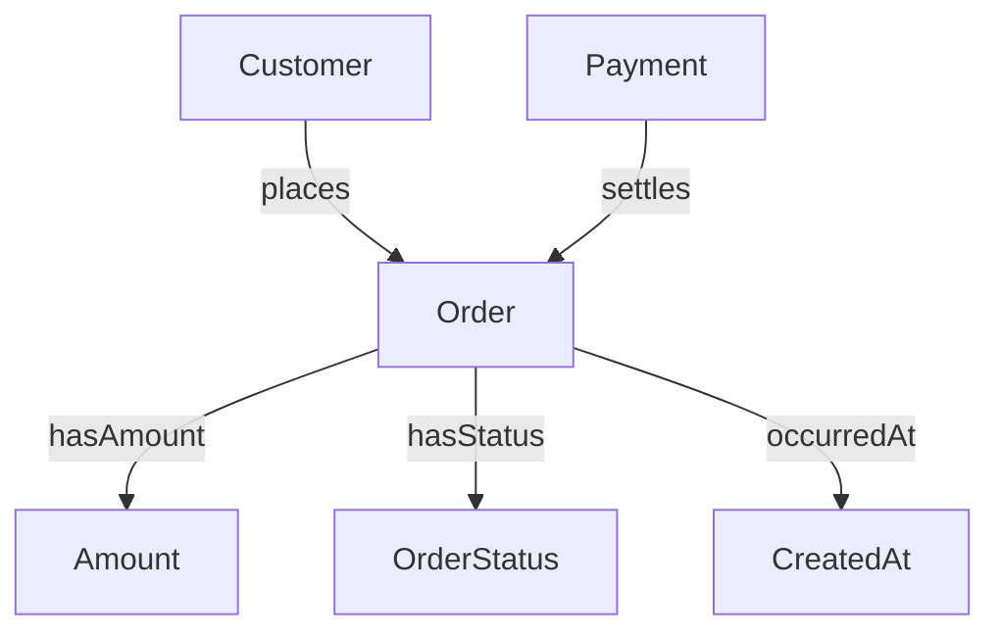

| | Foreign key | Ontology relationship |
|---|---|---|
| Source | database DDL | LLM → human validation |
| Meaning | referential integrity | business semantics ("placed by") |
| Direction | column → column | concept → concept |
| Cardinality | declared | business cardinality (may be M:N) |
| Trust | `DATABASE`, confidence 1.0 | `LLM` `PROPOSED` → `VALIDATED` |
| Use | join safety | metric/entity interpretation, grounding |

**Rules:** concepts must be **grounded** (`maps_to` real tables) or dropped; `kind` and `predicate`
use controlled vocabularies; proposals are `PENDING`/`PROPOSED`; validated items are fed back as
fixed priors (humans are never asked twice).

---

## 15. Entities

> **A database table is not automatically a semantic entity.**

A table may represent an **entity**, an **event/fact**, a **relationship (junction)**, an
**aggregation/mart**, or a **transaction**.

| Signal | Inference |
|---|---|
| Table name (`customers`) | entity candidate |
| Single-column PK, uniqueness ≈ 1.0, non-null | entity identity |
| Descriptive non-key columns | entity |
| Composite PK = all FKs | junction / relationship |
| FKs + measures + `*_at` | fact / event |
| Pre-aggregated + time bucket | aggregate (excluded from metric grounding) |
| Ontology concept mapping | strong entity signal |
| Grain statement | confirms what a row is |

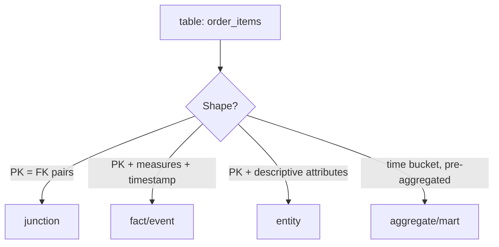

**V1 realisation:** entities are expressed through concepts (`Concept` with `kind='entity'`,
grounded via `DESCRIBES`) plus taxonomy roles and grain. A dedicated `Entity` label is a V1.x
addition (named in ADR-003, not yet projected) — deliberate, because entity inference quality
depends on validated semantics.

---

## 16. Relationships

The most valuable part of the graph: nodes are a catalogue, relationships are the reasoning surface.

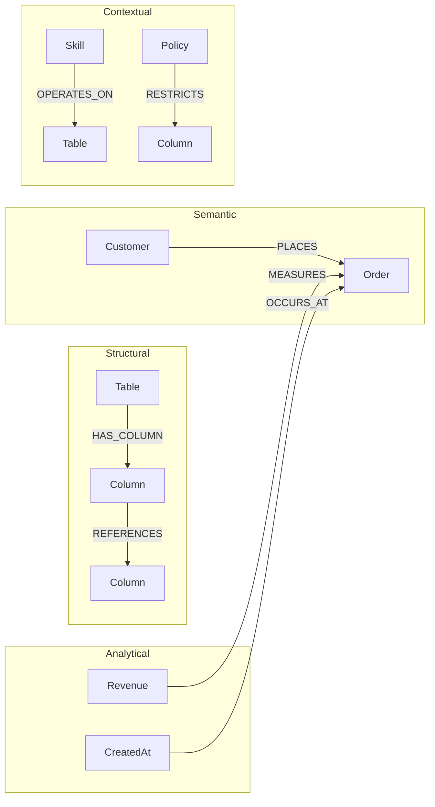

### 16.1 Controlled vocabulary — V1 (exactly 16, verbatim)

```python
KNOWN_RELATIONSHIP_TYPES = frozenset({
    "OWNS", "HAS_SCHEMA", "HAS_TABLE", "HAS_COLUMN", "HAS_METRIC", "HAS_DIMENSION",
    "REFERENCES", "JOINS_WITH", "INSTANCE_OF", "BELONGS_TO", "SEMANTICALLY_RELATED_TO",
    "MEASURES", "IDENTIFIES", "OCCURS_AT", "DESCRIBES", "VALIDATED_BY",
})
```

`assert_relationship_type(name)` raises `VALIDATION` for anything else. **Adding a type is an ADR
change.** The closed set is what makes relationship types safe to interpolate into Cypher at all.

| Type | Direction | Meaning | Carries |
|---|---|---|---|
| `OWNS` | Tenant → Connection | ownership | tenant fields |
| `HAS_SCHEMA` | Database → Schema | namespace containment | (planned) |
| `HAS_TABLE` | Connection → Table | contains table | confidence 1.0 |
| `HAS_COLUMN` | Table → Column | contains column | confidence 1.0 |
| `REFERENCES` | Column → Column | FK relationship | `p_kind`, `p_cardinality`, `p_fanout_risk` |
| `JOINS_WITH` | Column → Column | inferred joinable pair | same |
| `HAS_METRIC` | Table → Metric | exposes metric | metric definition |
| `HAS_DIMENSION` | Table → Dimension | exposes dimension | (planned) |
| `INSTANCE_OF` | Concept → Concept | specialization | (planned) |
| `BELONGS_TO` | Any → Category | classification membership | (planned) |
| `SEMANTICALLY_RELATED_TO` | Concept → Concept | business relationship | `p_kind`, `p_predicate` |
| `MEASURES` | Metric → Table | metric measures table | (planned) |
| `IDENTIFIES` | Column → Entity | identifies entity | (planned) |
| `OCCURS_AT` | Column → Table | temporal attribute | (planned) |
| `DESCRIBES` | Concept → Table | grounds concept to table | provenance `llm` |
| `VALIDATED_BY` | Any → Human action | validation provenance | (planned) |

> "Planned" types are in the vocabulary and ADR-003 but not yet projected by the builder's
> implemented label set (`Connection`, `Table`, `Column`, `Metric`, `Concept`).

---

## 17. Topology

Structural connectivity: what joins to what, with cardinality and **fanout risk**. Separate from
meaning; answers "is this join safe and how does data flow?".

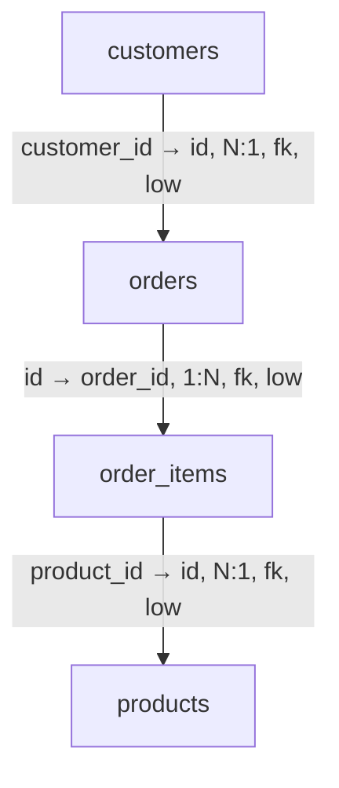

**Derivation:** declared FKs → `kind="fk"`; `<entity>_id` name patterns matched to a real table with
compatible type families → `kind="inferred"` (lower confidence). Cardinality and fanout risk come
from PK/uniqueness of the target column. Forks also produce **bounded join paths**.

**Fanout risk is a correctness guard**: joining `orders` to `order_items` multiplies `orders.amount`
unless aggregation happens first — the graph flags this so planning can avoid it.

**Enables:** join-path discovery, relationship traversal, relevant schema retrieval, multi-hop
reasoning, query planning, schema navigation.

---

## 18. Granularity / grain

**What one row represents** — the highest-leverage fact and the most common source of
plausible-but-wrong SQL.

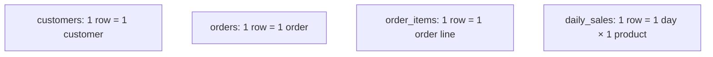

```sql
SELECT SUM(amount) FROM orders;        -- order-level total
SELECT SUM(amount) FROM order_items;   -- line-level total (different grain)

-- WRONG: orders.amount repeats per line → inflated
SELECT SUM(o.amount) FROM orders o JOIN order_items oi ON oi.order_id = o.id;

-- RIGHT: aggregate at the finer grain
SELECT SUM(oi.amount) FROM order_items oi;
```

**Derivation:** single-column PK or identifier profile (uniqueness ≈ 1.0) → entity grain; all-FK
composite PK → relationship occurrence; time-bucket/aggregate shape → aggregate grain; human
correction → authoritative.

`GrainStatement(table, statement, qualifier, entity, source=INFERRED, validation=PENDING,
confidence=0.5)`; `MetricGrain(metric, valid_at, caveat)` records at which grain(s) a metric is valid.

**In the graph (V1):** grain lives on the table node (`p_grain`, `p_grain_confidence`), keeping the
common retrieval case a single property read. A dedicated `Grain` node with
`MEASURES`/`OCCURS_AT`-style edges is the natural V1.x extension.

---

## 19. Semantic enrichment

The **only LLM stage**, combining three sources of truth.

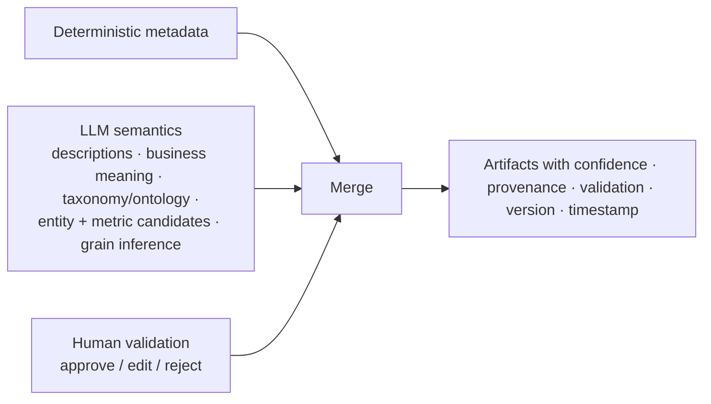

| Source | Trust | Validation | Example |
|---|---|---|---|
| Deterministic | `STRUCTURAL` | `NOT_REQUIRED` | "orders.customer_id is FK → customers.id" |
| LLM | `PROPOSED` | `PENDING` | "amount = monetary order value" |
| Human | `VALIDATED` | `APPROVED`/`EDITED` | "amount is net of tax; revenue uses total_amount" |

**Rules:** deterministic first and never overridden by the LLM; enrichment is opt-in; proposals are
never authoritative (and lower package trust to `PROPOSED`); validated priors are passed to the next
run as fixed; every concept must ground to real tables.

**Failure:** degradation only — the build continues without ontology (`ENRICH` stage `degraded` with
a warning), and the package trust floor remains `PROPOSED`/`STRUCTURAL` accordingly.

---

## 20. Provenance

Every semantic fact records where it came from; provenance drives trust floors, retrieval filtering,
review queues, and audit.

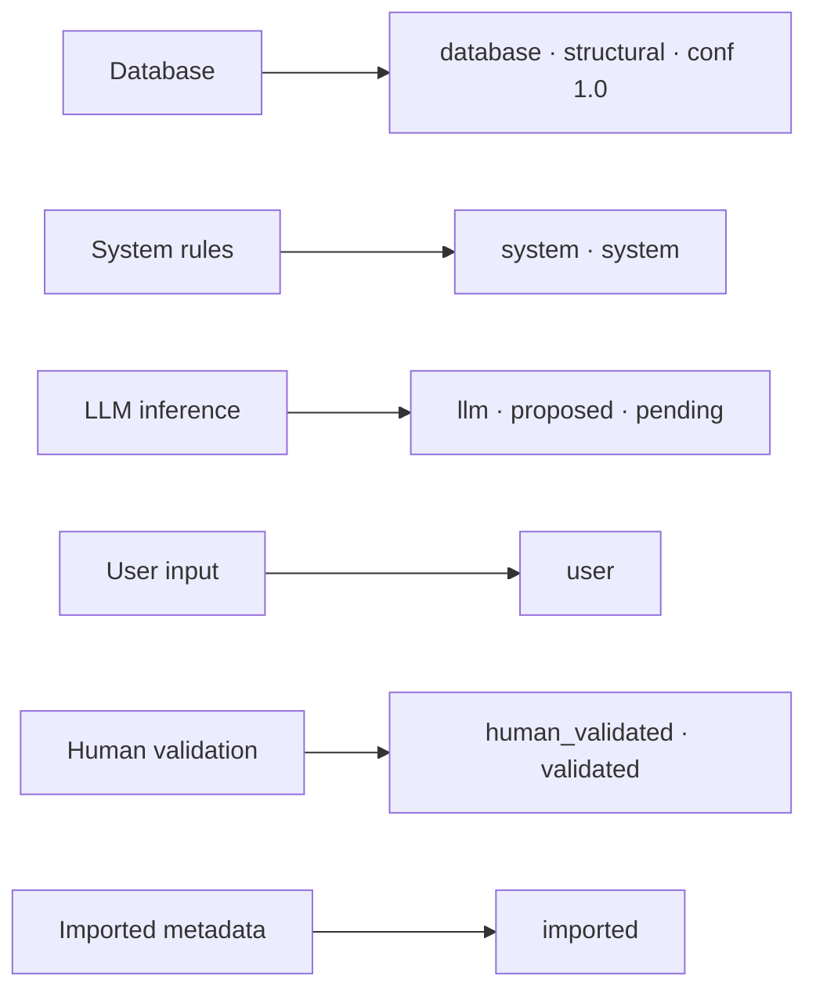

```json
{ "meaning": "monetary order value", "source": "llm", "confidence": 0.94, "status": "pending_validation" }
```
```json
{ "source": "human_validated", "status": "validated" }
```

**Trust ordering** (`effective_trust`): the minimum of included content decides the package level.
`system` / `validated` > `structural` > `proposed` > `untrusted`.

**Recorded at:** artifact envelopes (source/validation/confidence), per-column roles, per-edge
provenance/confidence, `ContextRecord.provenance_summary` (counts per source), and graph node/edge
`provenance` properties.

---

## 21. Human validation

The review gate between machine-generated and trusted context: the LLM proposes, deterministic rules
derive, **humans confirm**.

| Artifact | Section | Items | Editable fields |
|---|---|---|---|
| Ontology | `concepts` | LLM concepts | `description`, `synonyms` |
| Ontology | `relationships` | LLM relationships | `predicate` |
| Taxonomy | `nodes` | rule-derived nodes | — (approve/reject) |
| Granularity | `grains` | rule-derived grain statements | `statement`, `qualifier`, `entity` |

Items are addressed by `(kind, section, index)` against the ACTIVE version — versions are immutable,
so indices are stable within a review pass.

| Action | Result |
|---|---|
| `approve` | `validation=APPROVED`, provenance → `HUMAN_VALIDATED` |
| `edit` | whitelisted patch applied, `validation=EDITED`, provenance → `HUMAN_VALIDATED` |
| `reject` | `validation=REJECTED`, provenance unchanged (still traceable) |

Nothing is mutated in place: a reviewed version stays intact and a **new version** supersedes it.
`QualityReport.human_validation` counts **all reviewable items** (ontology, taxonomy, grain);
rejections count as reviewed, not validated. Validated items become fixed priors for the next
enrichment run.

**Surfaces:** `GET …/context/pending`, `POST …/context/validate`, and the OSS web page `/context`
(review inbox with approve / edit grain / reject).

---

## 22. Schema Knowledge Graph — the Neo4j model

### 22.1 Labels and properties

V1 uses **one physical Neo4j label** (`DataHekNode`) with a logical `label` property — uniform
indexes, no DDL churn, simple tenant filters.

| Class | Keys |
|---|---|
| Fixed | `id`, `label`, `org_id`, `project_id`, `context_version`, `schema_hash`, `provenance`, `created_at`, `updated_at` |
| User | `p_<name>` flattened to string: `p_name`, `p_connection_id`, `p_data_type`, `p_nullable`, `p_is_primary_key`, `p_is_foreign_key`, `p_references`, `p_null_ratio`, `p_distinct_count`, `p_uniqueness_ratio`, `p_roles`, `p_taxonomy_category`, `p_sensitive`, `p_row_count`, `p_grain`, `p_grain_confidence`, `p_kind`, `p_description`, `p_synonyms`, `p_validation`, `p_confidence`, `p_aggregate`, `p_column`, `p_filter` |
| Relationship fixed | `id`, `org_id`, `context_version`, `schema_hash`, `provenance`, `confidence` |
| Relationship user | `p_kind`, `p_cardinality`, `p_fanout_risk`, `p_predicate` |

Implemented logical labels: `Connection`, `Table`, `Column`, `Metric`, `Concept`.
Named in ADR-003 for future projection: `Tenant`, `Database`, `Schema`, `Entity`, `Dimension`,
`DataType`, `Constraint`, `Skill`, `Tool`, `ProfileSnapshot`.

### 22.2 Identity scheme (deterministic → idempotent)

```text
connection:<connection_id>
table:<connection_id>:<table>
column:<connection_id>:<table>.<column>
metric:<connection_id>:<metric_name>
concept:<connection_id>:<concept_name>
rel:<TYPE>:<source_id>-><target_id>          # concept edges append :<relationship_kind>
```

**Known improvement (V1.x):** ids embed `connection_id` but not `org_id`; ADR-012 asks for tenant ids
in stable keys. V1 relies on the `org_id` property filter (defense in depth) — adding `org_id` to ids
is a compatible change.

### 22.3 What the builder projects

| Artifact | Nodes | Edges |
|---|---|---|
| Connection (input) | `Connection` | — |
| Schema | `Table` (+ `p_row_count`), `Column` (+ types, PK/FK, roles, category, sensitive) | `HAS_TABLE`, `HAS_COLUMN` |
| Profile | properties on `Column`/`Table` | — |
| Topology | — | `REFERENCES` (fk), `JOINS_WITH` (inferred) |
| Granularity | `p_grain`, `p_grain_confidence` on `Table` | — |
| Taxonomy | `p_taxonomy_category` on `Column` | — |
| Metrics | `Metric` (+ aggregate/column/filter/description) | `HAS_METRIC` |
| Ontology | `Concept` (+ kind/description/synonyms/validation) | `DESCRIBES` (to tables), `SEMANTICALLY_RELATED_TO` (concept↔concept) |

**Write order:** all nodes first, then all relationships (endpoints before edges).
**Pruning:** per label, `find_nodes(label, {"connection_id": …})`; any node not in the fresh set is
`DETACH DELETE`d.
**Degraded:** if the repository is absent or `health_check()` is false →
`GraphBuildReport(degraded=True, warnings=("graph backend unavailable",))` with zero counts; the
build never raises for graph unavailability.

**Live evidence:** InsForge slice — 48 nodes, 47 edges, idempotent rebuild, ~30 ms reads.

---

## 23. Neo4j schema design and Cypher cookbook

### 23.1 Constraints and indexes (V1, verbatim from `init_schema`)

```cypher
CREATE CONSTRAINT datahek_node_id IF NOT EXISTS
FOR (n:DataHekNode) REQUIRE n.id IS UNIQUE;

CREATE INDEX datahek_node_org IF NOT EXISTS
FOR (n:DataHekNode) ON (n.org_id);

CREATE INDEX datahek_node_label IF NOT EXISTS
FOR (n:DataHekNode) ON (n.org_id, n.label);
```

| Object | Purpose |
|---|---|
| unique `id` | `MERGE` correctness + fast id lookups |
| `org_id` index | tenant-scoped scans |
| `(org_id, label)` composite | the dominant access pattern |

**Edition note:** range/unique constraints and range indexes exist on Community; **property-existence,
property-type, and key constraints are Enterprise-only** — V1 enforces shape in the app.

**Recommended as the graph grows (V1.x):**

```cypher
CREATE INDEX datahek_node_conn_name IF NOT EXISTS
FOR (n:DataHekNode) ON (n.org_id, n.p_connection_id, n.p_name);

CREATE FULLTEXT INDEX datahek_concept_text IF NOT EXISTS
FOR (n:DataHekNode) ON EACH [n.p_name, n.p_description, n.p_synonyms];
```

### 23.2 Create nodes and relationships (idempotent, tenant-guarded)

```cypher
// Node upsert
MERGE (n:DataHekNode {id: $id})
SET n += $props                       // label, org_id, project_id, context_version,
RETURN n.id AS id;                    // schema_hash, provenance, created_at, updated_at, p_*
```

```cypher
// Relationship upsert — endpoints must exist and belong to the tenant
MATCH (a:DataHekNode {id: $src}), (b:DataHekNode {id: $dst})
WHERE a.org_id = $org AND b.org_id = $org
MERGE (a)-[r:HAS_COLUMN {id: $id}]->(b)
SET r += $props
RETURN r.id AS id;
```

```cypher
// Bulk create from parameters (one plan, one round trip)
UNWIND $rows AS row
MERGE (n:DataHekNode {id: row.id})
SET n += row.props;
```

Use `MERGE … SET` for deterministic ids (idempotent rebuilds) and `UNWIND` for batches ≥ ~100.
Never `CREATE` for projected nodes: it duplicates on rebuild.

### 23.3 Read patterns

```cypher
// FIND one table with its columns and roles (tenant scoped)
MATCH (t:DataHekNode {label:'Table', org_id:$org, p_connection_id:$conn, p_name:$table})
OPTIONAL MATCH (t)-[:HAS_COLUMN]->(c:DataHekNode)
RETURN t.p_name AS table, t.p_grain AS grain, t.p_row_count AS rows,
       collect({name: c.p_name, type: c.p_data_type, roles: c.p_roles,
                category: c.p_taxonomy_category, sensitive: c.p_sensitive}) AS columns;
```

```cypher
// FIND safe join paths between two tables (bounded, structural only)
MATCH (a:DataHekNode {label:'Table', p_name:$from_table, org_id:$org, p_connection_id:$conn})
MATCH (b:DataHekNode {label:'Table', p_name:$to_table,   org_id:$org, p_connection_id:$conn})
MATCH p = allShortestPaths((a)-[:REFERENCES|JOINS_WITH*1..4]-(b))
RETURN [n IN nodes(p) | coalesce(n.p_name, n.id)] AS chain,
       [r IN relationships(p) | type(r) + ':' + coalesce(r.p_cardinality,'?')] AS edges,
       [r IN relationships(p) | r.p_fanout_risk] AS fanout
LIMIT 10;
```

```cypher
// FIND related metrics for a question's tables
MATCH (t:DataHekNode {label:'Table', org_id:$org, p_connection_id:$conn})-[:HAS_METRIC]->(m:DataHekNode)
WHERE t.p_name IN $tables
RETURN t.p_name AS table, m.p_name AS metric, m.p_aggregate AS agg, m.p_column AS column,
       m.p_description AS description;
```

```cypher
// FIND entity relationships via grounded concepts
MATCH (k:DataHekNode {label:'Concept', org_id:$org, p_connection_id:$conn})
      -[r:SEMANTICALLY_RELATED_TO]->(k2:DataHekNode)
WHERE toLower(k.p_name) IN $entities OR toLower(k2.p_name) IN $entities
RETURN k.p_name AS subject, r.p_predicate AS predicate, k2.p_name AS object, r.confidence AS confidence;
```

```cypher
// FIND applicable governance restrictions
MATCH (t:DataHekNode {label:'Table', org_id:$org, p_connection_id:$conn})-[:HAS_COLUMN]->(c:DataHekNode)
WHERE c.p_sensitive = 'True'
RETURN t.p_name AS table, collect(c.p_name) AS sensitive_columns;
```

```cypher
// FIND applicable skills/tools (V1.x vocabulary: OPERATES_ON / ACCESSES / USES)
MATCH (sk:DataHekNode {label:'Skill', org_id:$org})-[:OPERATES_ON]->(target:DataHekNode)
WHERE target.id IN $selected_ids
RETURN sk.p_name AS skill, collect(target.p_name) AS targets;
```

```cypher
// Version-aware read: node counts per context version
MATCH (n:DataHekNode {org_id:$org, p_connection_id:$conn})
WHERE n.context_version IN [$old, $new]
RETURN n.context_version AS version, n.label AS label, count(*) AS nodes
ORDER BY version, label;
```

```cypher
// Staleness drift check: mixed schema hashes ⇒ mid-rebuild
MATCH (n:DataHekNode {org_id:$org, p_connection_id:$conn})
WITH n.schema_hash AS hash, count(*) AS nodes
RETURN hash, nodes ORDER BY nodes DESC;
```

```cypher
// Rebuild/offboard: prune one connection or a whole tenant
MATCH (n:DataHekNode {org_id:$org, p_connection_id:$conn}) DETACH DELETE n;
MATCH (n:DataHekNode {org_id:$org}) DETACH DELETE n;
```

### 23.4 Performance rules (good vs bad)

```cypher
// ❌ BAD — unbounded traversal from a high-degree node
MATCH (c:DataHekNode {id:$id})-[*]-(m) RETURN m;

// ✅ GOOD — anchored, typed, depth-bounded, tenant-scoped, limited
MATCH (t:DataHekNode {label:'Table', id:$table_id, org_id:$org})
MATCH (t)-[r:REFERENCES|JOINS_WITH*1..3]-(o:DataHekNode)
WHERE o.org_id = $org RETURN DISTINCT o.p_name LIMIT 50;
```

```cypher
// ❌ BAD — full scan then filter
MATCH (n:DataHekNode) WHERE n.p_name = 'orders' RETURN n;

// ✅ GOOD — label + tenant anchored (uses composite index when present)
MATCH (n:DataHekNode {org_id:$org, label:'Table'})
WHERE n.p_connection_id = $conn AND n.p_name = 'orders' RETURN n LIMIT 1;
```

Checks: inspect plans with `EXPLAIN`/`PROFILE`; demand `NodeIndexSeek` (not `AllNodesScan`);
always `*1..N` bounded; declare direction when possible; batch writes with `UNWIND`; cap results with
`LIMIT`; prune by connection. The adapter clamps `limit ≤ 1000`, `depth ≤ 5`, paths `LIMIT 10`.

**Supernode awareness:** the `Connection` node is the obvious hub — always start traversals from a
specific table/column id, never from the connection. Value nodes are deliberately not materialised,
and categories are properties (not nodes) to keep breadth low. Scale reality: a 5,000-table warehouse
× 50 columns ≈ 250k nodes — small for Neo4j; the risk is query shape, not size.

---

## 24. Graph retrieval and the SQL agent

The agent must never receive the whole graph: the graph is a **retrieval substrate**, and a bounded
subgraph is compiled into a package.

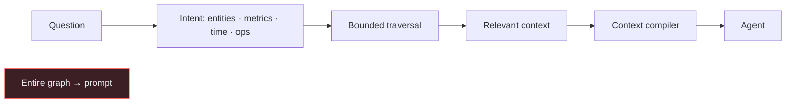

### 24.1 V1 vs graph-backed retrieval (explicit)

| Aspect | V1 (implemented) | Graph-backed (designed) |
|---|---|---|
| Source | registry + store artifacts | artifacts **+ Neo4j traversal evidence** |
| Seed selection | token scoring | same, plus graph expansion from matched seeds |
| Join discovery | `TopologyContext.join_paths` | `allShortestPaths` over `REFERENCES\|JOINS_WITH` |
| Governance | `GovernanceContext` in full | `RESTRICTS` traversal as an extra filter |
| Failure | stale flag / fallback | graph `DEGRADED` → identical to V1 |

The `RetrievedContext` contract does not change — the graph is an additional evidence source, which
is what keeps the migration safe.

### 24.2 Worked example — the double-counting trap

Question: *"What was the total revenue per customer last month?"*

```mermaid
sequenceDiagram
    participant U as Question
    participant G as Graph
    participant P as Planner
    U->>G: revenue + Customer + last month
    G-->>P: metric revenue = sum(orders.amount); orders grain = 1 order
    G-->>P: orders→customers via customer_id (N:1, low fanout)
    G-->>P: order_items grain = 1 line, fanout HIGH (warning)
    G-->>P: temporal = orders.created_at
    P->>P: filter created_at, join customers, sum orders.amount
    Note over P: order_items excluded → no inflation
```

```
✓ SELECT sum(o.amount) FROM orders o JOIN customers c ON o.customer_id = c.id
  WHERE o.created_at >= date_trunc('month', now() - interval '1 month')

✗ SELECT sum(o.amount) FROM orders o JOIN order_items oi ON oi.order_id = o.id
```

Each graph fact prevents a class of error:

| Graph fact | Prevents |
|---|---|
| Topology (+cardinality/fanout) | incorrect joins |
| Grain | incorrect aggregation |
| Metrics | wrong metric interpretation |
| Taxonomy roles | wrong table/column choice (e.g. summing a boolean) |
| Temporal role | wrong time field |
| Concept grounding | wrong table selection |
| Governance | policy/PII violations |
| Provenance/confidence | over-trusting LLM guesses |

---

## 25. Graph abstraction and backend replaceability

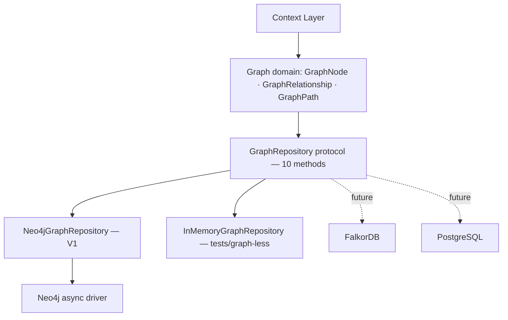

### 25.1 The contract (verbatim, 10 methods)

```python
@runtime_checkable
class GraphRepository(Protocol):
    async def create_node(self, ctx, node: GraphNode) -> str: ...
    async def update_node(self, ctx, node: GraphNode) -> None: ...
    async def delete_node(self, ctx, node_id: str) -> None: ...
    async def get_node(self, ctx, node_id: str) -> GraphNode | None: ...
    async def find_nodes(self, ctx, *, label: str, where: dict | None = None,
                         limit: int = 100) -> list[GraphNode]: ...
    async def create_relationship(self, ctx, rel: GraphRelationship) -> str: ...
    async def delete_relationship(self, ctx, rel_id: str) -> None: ...
    async def neighbors(self, ctx, node_id: str, *, rel_type: str | None = None,
                        depth: int = 1) -> list[GraphNode]: ...
    async def paths(self, ctx, *, from_id: str, to_id: str, max_depth: int = 3,
                    rel_types: list[str] | None = None) -> list[GraphPath]: ...
    async def health_check(self) -> bool: ...
```

### 25.2 Layers and rules

| Layer | Owns | Never contains |
|---|---|---|
| Graph domain (`contracts/context.py`) | `GraphNode`, `GraphRelationship`, `GraphPath` frozen dataclasses with typed `properties` | Cypher, Bolt, Neo4j types |
| `GraphRepository` protocol | the 10 async methods | query language |
| `context/graph/neo4j.py` | **all** Cypher, driver, labels, constraints | business rules |
| `context/graph/builder.py` | projection rules, ids, pruning | storage queries |
| Context services | retrieval/composition/compilation | engine types |

**Adapter rules (normative):** tenant-scoped reads; upsert by stable id (`update` missing →
`NOT_FOUND`); relationships validated against the closed vocabulary; idempotent deletes; bounded reads
(no unbounded traversal); **no engine leakage**.

### 25.3 Adding a backend

Implement the 10 methods → subclass `GraphRepositoryContract` (13 behaviour tests) → gate on
`DATAHEK_TEST_<BACKEND>_URL` → register behind env in the container. **No change** to contracts,
builder, or retrieval. PostgreSQL mapping (illustrative): nodes/edges tables with `properties jsonb`,
`WITH RECURSIVE` for `neighbors`/`paths` with a depth cap and cycle guard, `ON CONFLICT DO UPDATE`
for upserts.
---

## 26. Security

The layer stores **structure and semantics, never data or credentials**.

```mermaid
flowchart TB
    subgraph Threats
      T1[Cypher injection via metadata]
      T2[Cross-tenant reads]
      T3[Sensitive metadata / PII]
      T4[Prompt injection via descriptions]
      T5[Graph poisoning]
    end
    subgraph Controls
      C1[Closed vocabulary + parameterization]
      C2[org_id on every read/write]
      C3[p_sensitive filters + no row data]
      C4[LLM content = data, never instructions]
      C5[Provenance + human validation]
    end
    T1 --> C1
    T2 --> C2
    T3 --> C3
    T4 --> C4
    T5 --> C5
```

| Boundary | Rule | Evidence |
|---|---|---|
| Credentials | never enter artifacts; resolved at execution time | full build with a password-bearing connection; artifact JSON asserted clean |
| Sensitive values | counts only; no min/max/samples/hints for sensitive columns | profiler tests + `TestCredentialHygiene` |
| Tenant isolation | `org_id` on every read/write, at the storage layer | `TestTenantIsolation` (contract + service) |
| Untrusted content | LLM content is `PROPOSED`/`PENDING`; never raises the trust floor; prompt data only | `TestUntrustedInjection` |
| Cypher injection | relationship types validated against the frozen 16; property keys `^[A-Za-z0-9_]+$`; values always parameters; numeric bounds cast/clamped | adapter + vocabulary |
| Prompt injection via metadata | descriptions are data, never instructions; plan validation + read-only guardrails remain the enforcement point | planner prompt rules + guardrails |
| Graph poisoning | structural edges from the catalog; semantic edges carry provenance/confidence; retrieval can require structural-only; rebuilds are deterministic | builder + ADR-013 |
| LLM ↔ graph | an LLM never executes unrestricted Cypher; it proposes semantics, the adapter composes queries | ADR-005/013 |

**MCP boundary:** MCP is an interoperability surface, **not** a privileged bypass — every MCP call
produces the same normalized `RequestContext` and passes the same guardrails, policy (incl. enterprise
RLS `FILTER`), masking, and audit as API/UI calls.

**Hardening:** TLS (`neo4j+s://`/`bolt+s://`) off-localhost, dedicated least-privilege DB user, no
query passthrough (only the 10 adapter methods), secrets from env/secret manager, `DETACH DELETE`
scoped by tenant/connection, graph reads logged at debug without parameters.

---

## 27. Multi-tenancy

```mermaid
flowchart TD
    T[Tenant] -- OWNS --> C[Connection]
    C -- HAS_SCHEMA --> S[Schema]
    S -- HAS_TABLE --> TB[Table]
    TB -- HAS_COLUMN --> CO[Column]
```

| Option | Isolation | Cost | Verdict |
|---|---|---|---|
| **Label/property filtering** (`org_id` everywhere) | application-level (defense in depth) | lowest | ✅ **V1** |
| Database-per-tenant (Neo4j multi-database) | strong on one server | per-DB overhead, routing | V1.x / Enterprise |
| Instance-per-tenant | strongest | highest | Enterprise |
| Subgraph-per-tenant | medium | low | effectively property filtering |

**V1 rules (ADR-012):** every node/edge carries `org_id`/`project_id`; every read filters `org_id`;
**no reliance on the graph database for isolation** — authorization is the tenant resolver +
RBAC/policy. Adding per-tenant routing later is an **adapter concern** (same contract).

**Record isolation:** versions are monotonic per `(org, connection, scope)`; context REST endpoints
and checkpoints are tenant-aware; cross-tenant retrieval/validation returns nothing / `NOT_FOUND`.

---

## 28. Observability

| Metric | Type | Labels |
|---|---|---|
| `datahek_context_builds_total` | counter | `outcome` |
| `datahek_context_build_duration_seconds` | summary | — |
| `datahek_context_retrievals_total` | counter | `outcome=hit\|miss\|insufficient\|error` |
| `datahek_context_retrieval_duration_seconds` | summary | — |
| `datahek_context_tokens` | summary | — |
| `datahek_context_insufficient_total` | counter | — |
| `datahek_context_validations_total` | counter | `outcome` |
| `datahek_graph_*` (V1.x) | counter/summary/gauge | `op`, `label`, `rel_type` |

| Audit event | Emitted by | Payload |
|---|---|---|
| `context.build` | `POST …/context/build` | connection, state, enrichment, scope, tables |
| `context.validate` | `POST …/context/validate` | connection, decisions |
| `context.rebuild` | `POST …/context/rebuild` | job, enrichment |
| `guardrail.decision` | engine execute | guardrail reason, plan sources, applied filters |

**Rules:** no tenant ids in metric labels; no artifact contents or query parameters in spans/logs;
`/metrics` and `/audit` expose counters and events through the existing platform surfaces.

**Spans (recommended):** `context.retrieve` → `graph.seed` → `neo4j.query` → `graph.expand` →
`context.compose` → `context.compile` → `planner.plan`, with attributes `graph.depth`,
`graph.rel_types`, `graph.result_count`, `context.version`, `context.stale`, `graph.degraded`.

**Graph consistency checks:** version-drift query (mixed `schema_hash` ⇒ mid-rebuild), node/edge
counts vs `GraphBuildReport`, and `health_check()` driving the DEGRADED state.

---

## 29. Testing strategy

| Level | Scope | Examples |
|---|---|---|
| **Unit** | one service, temp SQLite/in-memory | retrieval (11), composition (15), contracts, lifecycle, hashing, provenance, taxonomy, topology, granularity, profiler (15), snapshot |
| **Contract** | one interface, every implementation | `GraphRepositoryContract` (13) for memory + Neo4j; serialization round-trips; PG store suite |
| **Integration** | multi-service flows | registry, build job, validation, quality/freshness, graph builder (7), rebuild queue (9), REST API (21) |
| **Hardening** | cross-cutting guarantees | security, degradation, observability |

**Conventions:** `unittest` only, run from the repo root
(`python -m unittest discover tests`); frozen dataclasses + `Protocol` contracts make fakes trivial;
tests seed state through real services; env-gated suites skip cleanly
(`DATAHEK_TEST_PG_URL`, `DATAHEK_TEST_NEO4J_URL` + `DATAHEK_TEST_NEO4J_PASSWORD`).

**Coverage map (FR → tests):** FR-004–008 → snapshot/profiler/topology/taxonomy/granularity/
enrichment; FR-009 → graph builder + contract; FR-010 → validation; FR-011 → registry + API;
FR-012–013 → retrieval/composition; FR-014–015 → freshness + build job + rebuild queue;
FR-016 → observability; FR-017 → graph contract (both adapters); FR-018 → security + PG store;
FR-019 → planner integration; FR-020 → degradation.

**Current totals:** OSS **767 tests OK** (54 env-gated skips; 16 skips with PostgreSQL enabled);
Enterprise **131 tests OK** (7 PG-gated).

---

## 30. Storage architecture

```mermaid
flowchart TB
    subgraph PG["PostgreSQL — canonical"]
      REG[Registry · versions · lifecycle · schema_hash]
      ART[Store · all artifacts]
      PKG[Persisted packages]
      MT[Tenant metadata · audit (Enterprise)]
    end
    subgraph NEO["Neo4j — semantic graph (projection)"]
      KG[Schema Knowledge Graph]
    end
    subgraph REDIS["Redis — runtime cache"]
      C[Hot packages · sessions · quotas]
    end
    subgraph OBJ["Object storage (future)"]
      S[Snapshots · exports · eval datasets]
    end
    ART -. projection .-> KG
    ART --> C
    REG --> ART
    ART -. archive .-> S
```

| Store | Responsibility | Why | Not for |
|---|---|---|---|
| **PostgreSQL** (SQLite default for OSS dev) | registry, versions, lifecycle, artifacts, packages, tenant metadata, audit | transactional, canonical, backup-friendly | graph traversal |
| **Neo4j** | taxonomy/ontology/topology/entity graph, join paths, capability links | index-free adjacency makes multi-hop reasoning fast | canonical state, row data, blobs |
| **Redis** | hot packages, session/approval state, quotas | sub-ms reuse of expensive compilation | durability |
| **Object storage** | large artifacts, snapshots, exports | cheap immutable blobs | querying |

**Justification:** PostgreSQL stays canonical (ADR-006/011) so a graph outage never loses knowledge;
Neo4j is earned by traversal (join paths, governance reachability, concept grounding — recursive CTEs
in SQL are awkward and depth-unbounded); Redis is derived and optional; object storage is a scale
valve. **Anti-pattern avoided:** making Neo4j the primary store.

---

## 31. Failure handling

| Scenario | Detection | Behavior | User impact |
|---|---|---|---|
| Neo4j unavailable | `health_check()` false / driver error | `GraphBuildReport(degraded=True)`; graph reads raise → caller falls back | none |
| Graph query timeout | driver timeout | treated as graph-absent | none in V1 |
| Partial graph build | mixed `schema_hash` counts | context `stale`; rebuild queued | possibly less precise retrieval |
| Schema changed during build | new hash on projection | prune + publish v+1 (supersede) | none |
| LLM enrichment failure | stage exception | `ENRICH` degraded; publish without ontology | fewer hints; may clarify |
| Invalid semantic inference | `PENDING`, low confidence | excluded from authoritative semantics; trust `PROPOSED` | planner may clarify |
| Graph inconsistency | drift check | rebuild from the registry | none |
| Context stale | `schema_hash` mismatch | `stale=true`; rebuild; live-catalog fallback | none |
| Permission changed | `permission_version` mismatch | freshness `STALE`; governance fail-closed | denied until refreshed |
| Store down (retrieval) | exception | live-catalog fallback | none |
| Insufficient package | `insufficient_reason` | clarification (no guessing) | clarification |

> **Principle:** fail **safely** — degrade to less context or ask for clarification, never silently
> provide incorrect semantic context. The registry/store remain authoritative.

---

## 32. REST API surface

| Method | Path | Purpose |
|---|---|---|
| GET | `/connections/{id}/context` | Active record summary (`{"context": null}` when none) |
| POST | `/connections/{id}/context/build` | Run the staged build (`enrichment`, `scope`, `tables`) |
| POST | `/connections/{id}/context/rebuild` | Queue a background rebuild (202, deduplicated) |
| GET | `/context/rebuilds[?job_id=]` | Rebuild queue status for the caller's organization |
| GET | `/connections/{id}/context/versions?limit=20` | Version history, newest first |
| GET | `/connections/{id}/context/pending` | Reviewable items awaiting validation |
| POST | `/connections/{id}/context/validate` | Apply decisions → new version |
| POST | `/connections/{id}/context/preview` | Retrieve → compose → compile summary (`budget_tokens`, `persist`) |
| GET | `/contexts/{context_id}` | Record summary + artifact kinds |
| GET | `/contexts/{context_id}/package` | Persisted compiled package (404 when none) |

All routes accept `?scope=connection|schema|table` and are **tenant-aware** (they read/write the
caller's organization). Errors use the standard status map
(`NOT_FOUND` 404, `VALIDATION` 422, `CONTEXT_UNAVAILABLE` 503, `RATE_LIMITED` 429). Audit:
`context.build`, `context.validate`, `context.rebuild`.

---

## 33. Operations and configuration

### 33.1 Environment

| Variable | Default | Effect |
|---|---|---|
| `DATAHEK_NEO4J_URL` | *(empty)* | empty ⇒ graph disabled (`GRAPH_BUILD` `skipped`) |
| `DATAHEK_NEO4J_USER` | `neo4j` | Neo4j user |
| `DATAHEK_NEO4J_PASSWORD` | *(empty)* | Neo4j password (compose default `datahek-graph`) |
| `DATAHEK_NEO4J_DATABASE` | *(default)* | target database |
| `DATAHEK_CONTEXT_DOMAIN` | `General` | taxonomy domain root |
| `DATAHEK_CONTEXT_BUDGET_TOKENS` | `4000` | composer default budget |
| `DATAHEK_CONTEXT_TABLE_CAP` / `_COLUMN_CAP` | `8` / `40` | retrieval caps |
| `DATAHEK_PROFILE_VALUE_HINTS` | `on` | value hints on/off |
| `DATAHEK_PROFILE_HINT_MAX_COLUMNS` | `6` | hinted columns per table |
| `DATAHEK_PROFILE_HINT_TOP_K` | `5` | values per hint |
| `DATAHEK_PROFILE_HINT_MAX_DISTINCT` | `25` | hint eligibility threshold |
| `DATAHEK_CONTEXT_AUTO_REBUILD` | `off` | stale preview enqueues a rebuild |

### 33.2 Deployment

```bash
# Optional graph backend (OSS compose profile)
docker compose --profile graph up -d neo4j        # bolt://127.0.0.1:7687, password datahek-graph

# Graph extra (the core runs without it)
pip install "datahek-core[graph]"                 # adds neo4j>=5.20

# Tests (env-gated)
DATAHEK_TEST_NEO4J_URL=bolt://127.0.0.1:7687 \
DATAHEK_TEST_NEO4J_PASSWORD=datahek-graph \
  python -m unittest discover tests -p "test_graph_neo4j.py"
```

**Operational notes:** one driver per process (async drivers are event-loop-affine); on Windows use
`bolt://127.0.0.1:7687` (IPv6 `localhost` stalls); the graph is a projection and can be rebuilt at
any time; Neo4j Community is GPLv3 as a separate process, the driver Apache-2.0 (FalkorDB SSPLv1 is an
internal-only option).

---

## 34. V1 vs future

```mermaid
flowchart LR
    subgraph V1[V1 — shipped]
      A1[Schema · profile · taxonomy · ontology · topology · granularity]
      A2[Schema KG in Neo4j (projection)]
      A3[Registry-backed retrieval → composition → compilation]
      A4[Planner integration + REST + review inbox]
      A5[Async rebuild queue · scoped records · package persistence]
      A6[Value hints · configurable caps/budget]
    end
    subgraph FUT[Future — designed, not built]
      B1[Graph-backed retrieval expansion]
      B2[Dedicated Entity / Skill / Tool / Policy labels]
      B3[Vector / hybrid retrieval]
      B4[Data-level KG · lineage · glossary · catalog]
      B5[Per-version projections · temporal graph]
      B6[FalkorDB / PostgreSQL backends]
      B7[Cross-database / federated graph]
      B8[Database-per-tenant routing]
    end
    V1 --> FUT
```

| Area | V1 | Future (additive, ADR-gated) |
|---|---|---|
| Retrieval | registry + token scoring | + bounded graph traversal; hybrid vector search |
| Entities | concept-grounded + heuristic shapes | dedicated `Entity` label, richer inference |
| Capabilities | `SkillRef`/`ToolRef` in the package | `Skill`/`Tool` nodes + `OPERATES_ON`/`REQUIRES`/`USES` |
| Governance | `p_sensitive` + full `GovernanceContext` | `Policy —RESTRICTS→ Column`, role rules in graph |
| Graph versions | single live projection + version props | per-version projections / temporal graph |
| Knowledge | schema semantics | data entities, lineage, glossary, catalog sync |
| Overrides | application-level | database-per-tenant; clustering/read replicas |
| Plans | no window functions/self-joins | window functions; subquery/HVAC support |

**Rule:** future features must not complicate V1; each is a new label/vocabulary term (ADR change), an
additive protocol method, or a new adapter — never a rewrite of the domain or compiler.

---

## 35. Decision digest (ADR-001 … ADR-013)

The full records live in `ADR/` (immutable). This is the operational digest.

| ADR | Decision | Consequence |
|---|---|---|
| **001** | Context Layer is a first-class subsystem with its own contracts, services, and adapters | request path `retrieve → compose → compile`; no logic in agent code |
| **002** | Persistent vs runtime context are separated | persistent includes the Schema KG (durable/versioned); runtime is not persisted by default |
| **003** | Schema Knowledge Graph with a controlled vocabulary | 16 relationship types; new types require an ADR; graph stores metadata/semantics only |
| **004** | Neo4j is the initial backend (optional service) | `[graph]` extra, compose profile, core installs without the driver |
| **005** | Graph Repository abstraction | domain dataclasses + 10-method protocol; Cypher only in the adapter; shared contract suite |
| **006** | Context Registry is authoritative | `ContextRecord` per `(org, project, connection, scope, version)`; graph rebuildable from it |
| **007** | Immutable, deterministic `ContextPackage` | byte-identical outputs; governance/grain never dropped (insufficient ⇒ fail closed) |
| **008** | Human semantic validation | approve/edit/reject → `HUMAN_VALIDATED`; humans outrank LLM permanently until superseded |
| **009** | Freshness policies per artifact class | schema event-driven; governance never stale; compiler fails closed on stale governance |
| **010** | Schema change detection via canonical `schema_hash` | mismatch → `STALE`, audit `schema_changed`, queue rebuild; hash on every node/edge |
| **011** | Storage responsibilities: registry/store canonical, graph projection | graph failure ⇒ `DEGRADED`, never blocks state transitions |
| **012** | Multi-tenancy by tenant-stamped records + defense-in-depth graph filters | authorization is app-level; stable keys should incorporate tenant ids (V1.x) |
| **013** | Deterministic before LLM; LLM is optional and proposal-only | enrichment opt-in; proposals `PENDING`/`PROPOSED`; validated priors prevent re-asking |

---

## 36. Evidence and reproduction

### 36.1 Live evidence

| Claim | Evidence |
|---|---|
| Build works on real data | InsForge `unified_events`: 730,962 rows / 40 columns; deterministic build ~29 s |
| Retrieval is cheap | retrieve p50 **36.5 ms** (parallel artifact reads) |
| Composition/compilation are trivial | compose 0.06 ms, compile 0.03 ms |
| Graph projection works | 48 nodes / 47 edges, idempotent rebuild, ~30 ms reads |
| Graph contract holds | 13/13 contract tests against Neo4j; same suite passes in-memory |
| End-to-end answers | 215-query campaign: **215/215 correct-or-safe** (179 match, 26 clarification, 6 expected rejections, 4 approvals) |
| Human validation | 9 pending → approve/edit → v2 with `human_validation` rising |
| Enterprise enforcement integration | policy DENY → 422; RLS `FILTER` in executed SQL; exception → ALLOW with audit reason |

### 36.2 Reproduction

```bash
# Full suite
K:/DataHek/.venv/Scripts/python.exe -m unittest discover tests

# Graph contract against live Neo4j
DATAHEK_TEST_NEO4J_URL=bolt://127.0.0.1:7687 DATAHEK_TEST_NEO4J_PASSWORD=datahek-graph \
  K:/DataHek/.venv/Scripts/python.exe -m unittest discover tests -p "test_graph_neo4j.py"

# Component latency + API contract + E2E campaign (scripts/e2e/)
K:/DataHek/.venv/Scripts/python.exe scripts/e2e/bench_components.py
K:/DataHek/.venv/Scripts/python.exe scripts/e2e/api_contract_check.py
K:/DataHek/.venv/Scripts/python.exe scripts/e2e/run_parallel.py --workers 3
```

### 36.3 Reading order

1. This document (§1–§4) for the mental model.
2. §5–§11 for build and runtime sequencing.
3. §12–§21 for semantics and validation.
4. §22–§25 for the Knowledge Graph and Neo4j.
5. `ADR/` for the immutable rationale behind any decision above.

### 36.4 Change control

| Change | Requires |
|---|---|
| Add/rename a graph label or relationship type | ADR update + builder + this document + tests |
| Add a `GraphRepository` method | additive protocol change + ADR note + contract test |
| Add a backend | new adapter + contract-suite subclass + container registration behind env |
| Change the id scheme | migration note + rebuild (ids are projections) |
| Store more properties in the graph | privacy review (no row data) + property budget check |
| Change artifact shape | `ARTIFACT_SCHEMA_VERSION` bump + serialization tests + this document |

---

*Single source of truth for the DataHek Context Layer and its Schema Knowledge Graph.
Decision records: `ADR/`. Presentation: `context-layer-deck.html`.*
