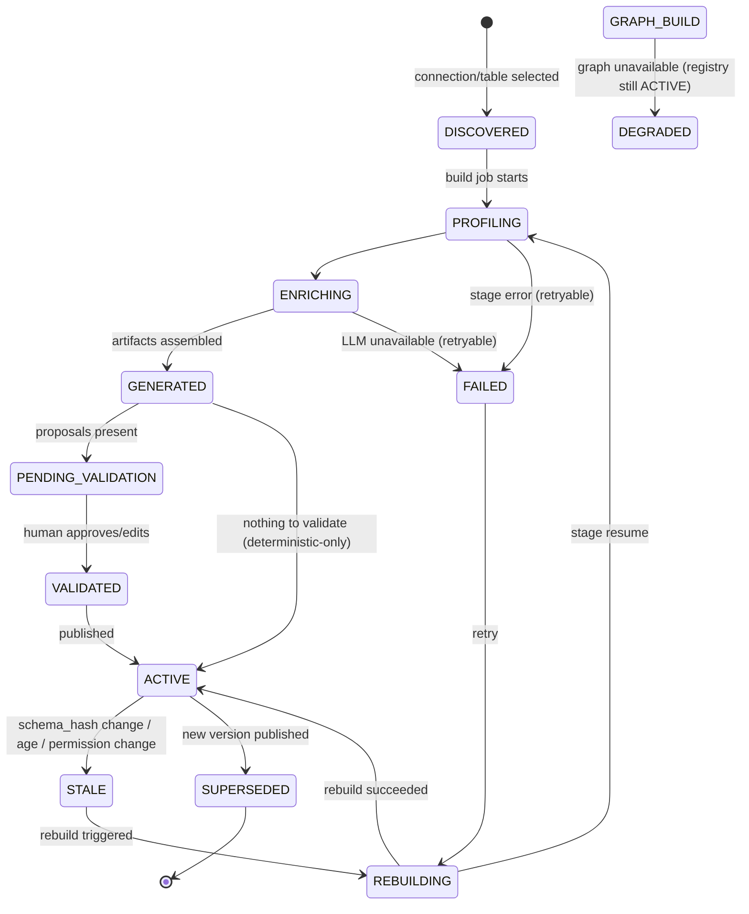
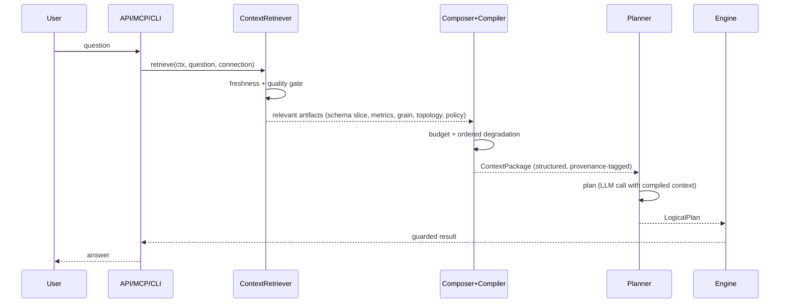
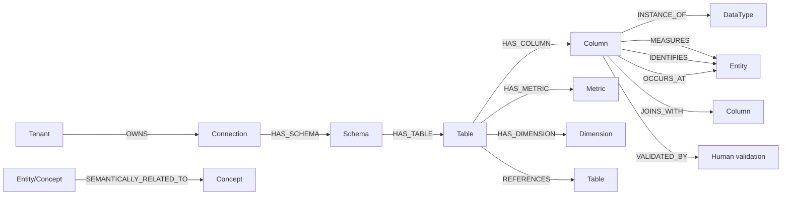
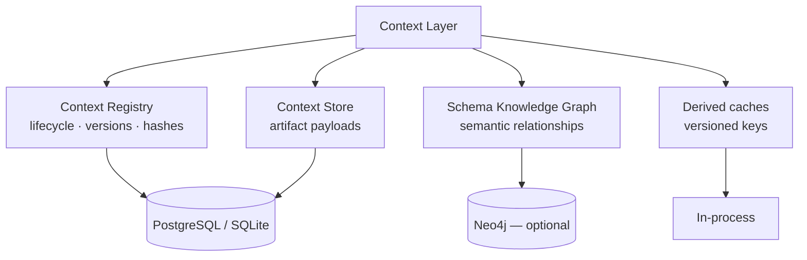
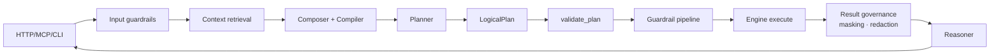
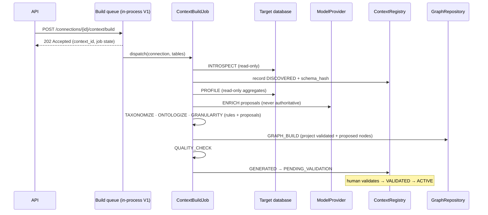

# Context Layer — Architecture

**Status:** Milestone 2 deliverable — proposed for review
**Depends on:** [repository-analysis.md](repository-analysis.md), [research.md](research.md)

---

## 1. Position in DataHek

The Context Layer is a **control-plane subsystem** of the data engine: it builds, versions, and
serves the semantic/structural knowledge about connected data sources. It is **not** an agent and
not a prompt builder. The planner (data plane) is its first consumer.

```
                    Experience plane
        Web UI · REST API · CLI · MCP
                        │
                        ▼
══════════════════ Data plane (existing engine) ══════════════════
  SchemaService → Planner → validate_plan → Guardrails → Engine
       ▲                ▲                        ▲
       │                │  compiled Context Package
       │                │
══════════════════ Context Layer (control plane) ═════════════════
  Build path:    Sources → Profiler → Enrichment → Taxonomy →
                 Ontology → Topology → Granularity → Quality →
                 Human validation → Registry → Schema KG
  Request path:  Retriever → Composer → Compiler → ContextPackage
═════════════════════════════════════════════════════════════════
  Storage:  Registry/Artifacts → PostgreSQL (SQLite default)
            Semantic graph     → Neo4j (optional, replaceable)
```

Core principle: **agents reason, deterministic services decide, engines execute, verifiers
challenge.** Context services are deterministic wherever possible; the LLM only proposes semantics
that a human validates.

## 2. Components

### 2.1 Build path (asynchronous, per connection/table scope)

| Component | Responsibility | Deterministic? |
|---|---|---|
| `ContextBuildJob` | Staged orchestration: INTROSPECT → PROFILE → TAXONOMIZE → ONTOLOGIZE → RELATIONSHIP_DISCOVERY → GRANULARITY_ANALYSIS → GRAPH_BUILD → QUALITY_CHECK → VALIDATION → PUBLISH. Retryable, idempotent per stage, resumable | Orchestration |
| `SchemaIntrospector` (wraps existing `SchemaService`) | Canonical schema snapshot + `schema_hash` | Yes |
| `SchemaProfiler` | Safe statistics, candidate identifiers/dimensions/measures/temporal/flag columns | Yes |
| `SemanticEnricher` | LLM proposals: descriptions, meanings, taxonomy/ontology candidates, grain hypotheses | LLM (proposals only) |
| `TaxonomyService` | Domain → Subdomain → Entity → Attribute classification of tables/columns | Rules + proposals |
| `OntologyService` | Concepts/entities and typed relationships | Proposals |
| `TopologyService` | FK edges, inferred join candidates with confidence, join paths, cardinality estimates | Yes (inference scored) |
| `GranularityService` | Table/entity/metric/temporal/dimensional grain statements | Rules + proposals |
| `GraphBuilder` | Projects validated context into the Schema Knowledge Graph via `GraphRepository` | Yes |
| `QualityEvaluator` | Per-dimension quality + overall state (`INSUFFICIENT` possible) | Yes |
| `HumanValidator` | Approve/edit/reject proposals; corrections become `HUMAN_VALIDATED` | Human |

### 2.2 Request path (synchronous, budgeted)

| Component | Responsibility |
|---|---|
| `ContextRetriever` | Exact retrieval by `(org, project, connection, table)`; graph retrieval for related concepts, metrics, join paths; freshness/quality gate; never returns the whole graph |
| `ContextComposer` | Merges persistent + runtime context under a token/structure budget, with ordered degradation |
| `ContextCompiler` | Emits the deterministic `ContextPackage` for a `purpose` (`sql.planner` first), with trust levels and provenance attached |
| Consumers | `Planner` now; `Verifier`, `Explainer`, `MultiStepAnalyst`, MCP tools later |

### 2.3 Registry and storage

| Component | Responsibility | Backend |
|---|---|---|
| `ContextRegistry` | Identity, version, lifecycle state, `schema_hash`, provenance summary, quality, freshness; invalidation + rebuild triggers | PostgreSQL (SQLite default) |
| `ContextStore` | Durable artifact payloads (versioned, immutable snapshots) | PostgreSQL (SQLite default) |
| `GraphRepository` | Engine-independent graph contract for the Schema KG | **Neo4j** (optional) |
| Caches | Derived retrieval/compiled results keyed by `(org, project, connection, artifact, version, permission_version)` | In-process, versioned |

## 3. Contracts (all in `contracts/context.py`, dataclasses + Protocols)

```python
class ContextRegistry(Protocol):
    async def register(ctx, record: ContextRecord) -> str: ...
    async def get(ctx, context_id: str) -> ContextRecord | None: ...
    async def find(ctx, *, connection_id: str, table: str | None = None) -> list[ContextRecord]: ...
    async def set_state(ctx, context_id: str, state: LifecycleState, reason: str) -> None: ...
    async def invalidate(ctx, *, connection_id: str, reason: str) -> int: ...
    async def versions(ctx, context_id: str) -> list[ContextRecord]: ...

class ContextStore(Protocol):
    async def put(ctx, context_id: str, artifact: ContextArtifact) -> None: ...
    async def get_artifact(ctx, context_id: str, kind: ArtifactKind) -> ContextArtifact | None: ...
    async def get_package(ctx, context_id: str) -> ContextPackage | None: ...

class GraphRepository(Protocol):
    async def create_node(ctx, node: GraphNode) -> str: ...
    async def update_node(ctx, node: GraphNode) -> None: ...
    async def delete_node(ctx, node_id: str) -> None: ...
    async def get_node(ctx, node_id: str) -> GraphNode | None: ...
    async def find_nodes(ctx, *, label: str, where: dict | None = None, limit: int = 100) -> list[GraphNode]: ...
    async def create_relationship(ctx, rel: GraphRelationship) -> str: ...
    async def delete_relationship(ctx, rel_id: str) -> None: ...
    async def neighbors(ctx, node_id: str, *, rel_type: str | None = None, depth: int = 1) -> list[GraphNode]: ...
    async def paths(ctx, *, from_id: str, to_id: str, max_depth: int = 3, rel_types: list[str] | None = None) -> list[GraphPath]: ...
    async def health_check() -> bool: ...

class ContextRetriever(Protocol): ...
class ContextComposer(Protocol): ...
class ContextCompiler(Protocol): ...
```

Rules: `context/` imports **only** these contracts; Cypher and Neo4j types appear exclusively in
`context/graph/neo4j.py`. Every method takes `RequestContext` and filters by tenant.

## 4. Package layout (convention-fit — accepted)

```
src/datahek/
├── contracts/
│   └── context.py              # Protocols + frozen dataclasses (this file's §3 + model)
├── context/                    # domain services (no engine imports of Neo4j/PG)
│   ├── lifecycle.py            # state machine + legal transitions
│   ├── hashing.py              # canonical schema hashing
│   ├── profiler.py             # deterministic, privacy-aware profiling
│   ├── enrichment.py           # LLM proposals (pending_validation)
│   ├── taxonomy.py
│   ├── ontology.py
│   ├── topology.py
│   ├── granularity.py
│   ├── registry.py             # in-package registry service over contracts
│   ├── retriever.py
│   ├── composer.py
│   ├── compiler.py
│   ├── quality.py
│   ├── freshness.py
│   ├── provenance.py
│   ├── graph/
│   │   ├── protocol.py         # re-export of GraphRepository contract + graph models
│   │   ├── models.py           # GraphNode, GraphRelationship, GraphPath (engine-independent)
│   │   └── neo4j.py            # Neo4jGraphRepository — Cypher lives here only
│   └── jobs/
│       └── build_context.py    # staged ContextBuildJob
├── defaults/
│   ├── context_store.py        # SQLite ContextStore
│   ├── context_store_pg.py     # PostgreSQL ContextStore (versioned migrations)
│   └── context_bootstrap.py    # container wiring (OSS composition)
└── api/                        # routes per api.md (M11)
```

The `[graph]` extra installs the Neo4j driver; the core package still installs with zero
dependencies and runs without any graph backend.

## 5. Diagrams

### 5.1 Context lifecycle



`DEGRADED` is a partial-failure state: registry and store are healthy, graph projection is not;
graph-dependent features report unavailable, everything else works.

### 5.2 Runtime context flow



### 5.3 Schema knowledge graph



### 5.4 Storage architecture



### 5.5 Agent integration



### 5.6 Context build sequence



## 6. Error handling and degradation

| Failure | Behavior |
|---|---|
| Schema introspection fails | Job stage `FAILED` with retry; registry keeps previous ACTIVE version; API reports status |
| Profiling partially fails | Per-column failures are skipped and recorded in `quality.profiling_coverage`; job continues |
| LLM unavailable during enrichment | Deterministic artifacts still publish (GENERATED → ACTIVE without proposals); enrichment retryable |
| Graph backend unavailable | Registry/store unaffected; context state `DEGRADED`; retrieval answers without graph-derived enrichment |
| Stale context at request time | If schema changed: retrieval triggers rebuild and returns the stale version **only** with a freshness warning; planning may clarify; governance never uses stale permissions |
| Quality insufficient | Compiler marks the package `INSUFFICIENT`; caller decides (planner clarifies rather than guessing) |
| Partial build | Stages are checkpointed; resume from last completed stage; version not published until PUBLISH |
| Prompt injection in metadata | Artifacts carry trust levels; instruction/data separation; input guardrails apply before prompt inclusion |

## 7. Security boundaries

```
Trusted system instructions        (code-owned prompts)
        ▲
Trusted validated context          (HUMAN_VALIDATED artifacts)
        ▲
Deterministic database metadata    (names, types, statistics — structural)
        ▲
LLM proposals                      (pending_validation; never instructions)
        ▲
Untrusted content                  (comments, sample values, tool output)
```

- Database comments and LLM descriptions are **data**, never instructions.
- No credentials, secrets, or raw sensitive values in any artifact (enforced at build time; reuse
  `defaults/guardrails.py` detection patterns for sensitive-looking values).
- Tenant filtering at the service layer in every contract method; the graph is queried with tenant
  scope, never cross-tenant.
- Cypher is constructed only in `Neo4jGraphRepository` from typed inputs (no string interpolation
  of user/model text).

## 8. Observability

Reuse `LocalMetrics` + JSON logs + `AuditSink`:

- Events: `context_build_started/completed/failed`, `context_validation_requested`, `context_validated`,
  `context_invalidated`, `context_rebuilt`, `context_retrieved`, `context_compiled`,
  `context_cache_hit/miss`, `schema_changed`.
- Metrics: `context_build_duration_seconds`, `context_retrieval_latency_seconds`,
  `context_compile_latency_seconds`, `context_quality_score`, `context_freshness_age_seconds`,
  `graph_query_latency_seconds`, `context_cache_hit_rate`.
- Tenant identifiers stay out of metric labels (logs/traces carry them), matching the existing
  metrics posture.

## 9. V1 scope boundaries

**In:** Schema, Profile, Taxonomy, Ontology, Topology, Granularity, Governance, Capability
artifacts; registry + store + versioning; Schema KG in Neo4j; human validation; retrieval,
composition, compilation for `sql.planner`; build jobs; observability; tests.

**Out (documented non-goals):** data-level KG, vector/semantic retrieval, autonomous agents,
unrestricted Cypher/SQL from LLM output, credentials in context, whole-graph prompt injection,
Neo4j-specific domain types, full job-queue infrastructure (`JobStore` remains a contract; V1
build jobs follow the in-process scheduler pattern with durable registry state).
