# Schema Knowledge Graph — Neo4j Architecture & Implementation Guide

**Status:** Architecture + implementation reference (V1)
**Audience:** DataHek engineers, architects, and operators
**Scope:** How DataHek OSS builds, stores, retrieves, and operationalizes the Context Layer's
**Schema Knowledge Graph** using **Neo4j** as the V1 graph backend — end to end, from database
connection to agent context.

**Related documents**

| Document | Purpose |
|---|---|
| [`README.md`](README.md) | Context Layer milestone map and subsystem index |
| [`architecture.md`](architecture.md) | Context Layer component architecture |
| [`context-model.md`](context-model.md) | Artifact and package schemas |
| [`knowledge-graph-schema.md`](knowledge-graph-schema.md) | M7 node/edge catalogue and idempotency rules |
| [`graph-abstraction.md`](graph-abstraction.md) | The replaceable `GraphRepository` contract |
| [`neo4j.md`](neo4j.md) | Neo4j deployment and safety rules |
| [`context-layer-srd.md`](context-layer-srd.md) | Functional/non-functional requirements (FR-009, FR-017, FR-018) |
| `ADR/` | 13 ADRs; ADR-003/004/005/011/012 are the graph-critical ones |

This document is the **single source of truth** for how the Context Layer uses Neo4j to build,
store, retrieve, and operationalize its Schema Knowledge Graph.

---

## Table of contents

1. [Core objective](#1-core-objective)
2. [Architectural principle: graph ≠ context layer](#2-architectural-principle-graph--context-layer)
3. [Neo4j first, backend agnostic](#3-neo4j-first-backend-agnostic)
4. [Knowledge graph fundamentals](#4-knowledge-graph-fundamentals)
5. [Taxonomy](#5-taxonomy)
6. [Ontology](#6-ontology)
7. [Entities](#7-entities)
8. [Relationships](#8-relationships)
9. [Topology](#9-topology)
10. [Granularity / grain](#10-granularity--grain)
11. [Schema profiling](#11-schema-profiling)
12. [Semantic enrichment](#12-semantic-enrichment)
13. [Provenance](#13-provenance)
14. [Neo4j graph model](#14-neo4j-graph-model)
15. [Neo4j schema design](#15-neo4j-schema-design)
16. [Schema Knowledge Graph example](#16-schema-knowledge-graph-example)
17. [Context retrieval from Neo4j](#17-context-retrieval-from-neo4j)
18. [Graph + SQL agent](#18-graph--sql-agent)
19. [Graph + context engineering](#19-graph--context-engineering)
20. [Graph + agent skills](#20-graph--agent-skills)
21. [Graph + tools / MCP](#21-graph--tools--mcp)
22. [Graph + governance](#22-graph--governance)
23. [Graph + multi-tenancy](#23-graph--multi-tenancy)
24. [Graph versioning](#24-graph-versioning)
25. [Graph lifecycle](#25-graph-lifecycle)
26. [Performance & scalability](#26-performance--scalability)
27. [Security](#27-security)
28. [Observability](#28-observability)
29. [Storage architecture](#29-storage-architecture)
30. [Graph abstraction](#30-graph-abstraction)
31. [Failure handling](#31-failure-handling)
32. [End-to-end example](#32-end-to-end-example)
33. [V1 vs future](#33-v1-vs-future)
34. [Final recommended architecture](#34-final-recommended-architecture)

---

## 1. Core objective

DataHek turns a natural-language question into a validated, read-only SQL plan. To do that well it
must know far more than table and column names: it must know what tables *mean*, how they connect,
what one row represents, which columns are identifiers vs measures, which joins are safe, what
governance applies, and which capabilities may operate on the data.

The **Context Layer** produces that knowledge. The **Schema Knowledge Graph** is the part of the
Context Layer that models it as a graph of entities, concepts, columns, metrics, and typed
relationships — so that semantic questions become *traversals* instead of prompt dumps.

### 1.1 End-to-end flow

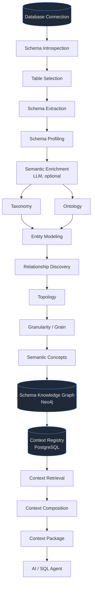

### 1.2 What each stage does, why it exists, what it produces

| # | Stage | Why it exists | Produces | Consumed by |
|---|---|---|---|---|
| 1 | **Database connection** | Establish a guarded, credential-resolved session to the source | Live provider + connection metadata | Introspection |
| 2 | **Schema introspection** | Discover *what exists* before reasoning about it | Catalog: tables, columns, types, PK/FK, indexes, nullability | Extraction, profiling |
| 3 | **Table selection** | Bound cost and relevance; never model a 5,000-table warehouse blindly | Selected table set (`tables=…`) | Extraction, profiling |
| 4 | **Schema extraction** | Canonicalize the catalog into a deterministic artifact | `SchemaContext` + `schema_hash` | Everything downstream |
| 5 | **Schema profiling** | Turn *structure* into *statistics* | `ProfileContext`: null ratio, distinct, uniqueness, min/max, roles, hints | Taxonomy, granularity, graph |
| 6 | **Semantic enrichment** | Add business *meaning* the database does not carry | `OntologyContext`: concepts, synonyms, relationships (all `PENDING`) | Graph, validation |
| 7 | **Taxonomy** | Classify columns deterministically by role | `TaxonomyContext`: Domain → Subdomain → Category | Semantics summary, graph |
| 8 | **Ontology** | Model meaning and semantic relationships | Concepts/relationships | Entity modeling, graph |
| 9 | **Entity modeling** | Decide "what is the noun here?" — entity vs event vs fact | Entity candidates mapped to tables | Relationship discovery, graph |
| 10 | **Relationship discovery** | Recover structure (FK) and meaning (placing, containing) | Typed relationships | Topology, graph |
| 11 | **Topology** | Make joins *safe and findable* | `TopologyContext`: FK/inferred edges, cardinality, fanout risk, join paths | Retrieval, SQL planning |
| 12 | **Granularity / grain** | The single biggest source of silently wrong SQL | `GranularityContext`: "1 row of X = 1 Y" | SQL planning, metrics |
| 13 | **Semantic concepts** | Bind everything to business vocabulary | Concept nodes + `DESCRIBES` edges | Graph queries |
| 14 | **Schema Knowledge Graph** | Represent all of the above as a traversable network | Nodes + typed relationships in Neo4j | Retrieval (future), governance, tooling |
| 15 | **Context Registry** | The authoritative, versioned record of context | `ContextRecord` + artifacts in Postgres/SQLite | Retrieval |
| 16 | **Context retrieval** | Select the *minimum relevant* slice for a question | `RetrievedContext` | Composition |
| 17 | **Context composition** | Fit it in a token budget with ordered degradation | `ComposedContext` | Compilation |
| 18 | **AI / SQL agent** | Produce and validate the answer | `LogicalPlan` → SQL → rows → answer | User |

### 1.3 Where the graph sits (V1 reality vs intent)

V1 is honest about sequencing: **the Schema KG is currently a projection written by the build job;
retrieval reads the registry/store.** The graph is *built and queried* (contract suite, builder
tests, live Neo4j), and it is the intended substrate for graph-backed retrieval (see
[§17](#17-context-retrieval-from-neo4j) and [§33](#33-v1-vs-future)). Its absence never changes
answers — `GRAPH_BUILD` reports `skipped`/`degraded` and the registry remains the source of truth
(ADR-011).

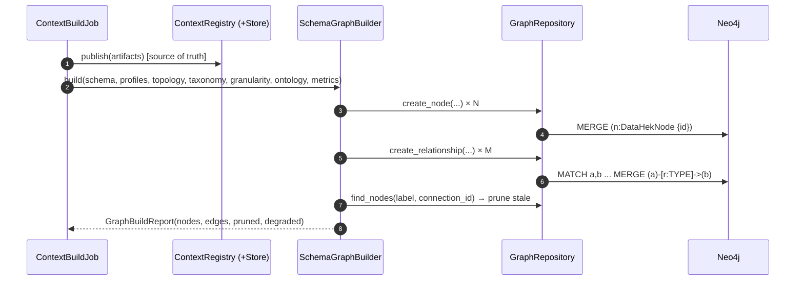

---

## 2. Architectural principle: graph ≠ context layer

> **The Knowledge Graph is a representation of the Context Layer's semantic knowledge — it is not
> the Context Layer itself.**

The Context Layer is a subsystem with its own contracts, services, storage adapters, and lifecycle.
The graph is **one representation/storage mechanism inside it**. Deleting Neo4j would degrade
performance and foreclose traversal-based features, but it would not change the meaning of context:
the registry + store remain canonical and the graph can be rebuilt at any time.

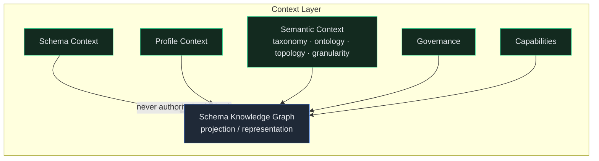

**Consequences (normative):**

1. **Registry authority.** `ContextRegistryService` owns versions and lifecycle; the graph mirrors
   a version (ADR-006, ADR-011).
2. **Projection, not primary storage.** Writes flow `registry → store → graph`; a graph failure
   marks `DEGRADED` and never blocks a state transition.
3. **No row data.** The graph stores metadata and semantics, never row values or raw columns
   (ADR-003).
4. **Rebuildable.** `SchemaGraphBuilder.build(...)` can reconstruct the graph from artifacts alone.

---

## 3. Neo4j first, backend agnostic

**Neo4j is the V1 graph database** (ADR-004). The architecture is designed so it can be replaced by
FalkorDB, PostgreSQL graph capabilities, or a future DataHek backend **without touching the context
domain** (ADR-005, ADR-017/FR-017).

### 3.1 Layered architecture

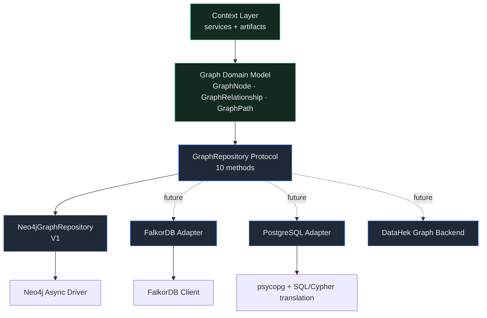

### 3.2 Backend-agnostic rules

| Layer | Owns | Must never contain |
|---|---|---|
| **Graph Domain Model** (`contracts/context.py`) | `GraphNode`, `GraphRelationship`, `GraphPath` as frozen dataclasses with typed `properties: dict[str,str]` | Cypher, Bolt, Neo4j types |
| **GraphRepository** (Protocol) | 10 async methods: create/update/delete/get node, `find_nodes`, create/delete relationship, `neighbors`, `paths`, `health_check` | Query language, storage semantics |
| **Neo4j adapter** (`context/graph/neo4j.py`) | The *only* module allowed to know Cypher, the driver, labels, constraints | Context business rules, registry logic |
| **Builder** (`context/graph/builder.py`) | Projection rules: which artifact becomes which node/edge, id scheme, pruning | Storage queries |
| **Context Layer services** | Retrieval/composition/compilation over the domain model | Any engine-specific type |

> **Dependency rule:** `Context Layer → Graph Domain → GraphRepository → Adapter → Driver`.
> No arrow ever points back. `assert_relationship_type()` and property-key validation live in the
> adapter/vocabulary, not in the domain.

### 3.3 Migration readiness checklist (future backends)

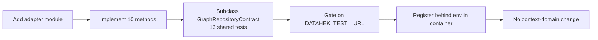

The shared contract suite (`tests/graph_repository_contract.py`) is the compatibility proof:
in-memory and Neo4j already both pass it. A new backend is "done" when it passes unchanged.

---

## 4. Knowledge graph fundamentals

Precise vocabulary prevents expensive confusion. These are the terms DataHek uses, with the
concrete artifact each maps to.

| Term | Definition | DataHek realization |
|---|---|---|
| **Knowledge Graph (KG)** | A graph of typed entities and relationships carrying meaning | The Schema KG in Neo4j (V1), plus future data KG |
| **Schema Knowledge Graph** | A KG whose nodes describe *database structure, semantics, grain, governance, capabilities* — not rows | `SchemaGraphBuilder` output (ADR-003) |
| **Data Knowledge Graph** | A KG whose nodes are *data values/entities* (customers, orders) | Explicitly **out of scope for V1** |
| **Entity** | A business noun a table (or view) represents | `Entity` concept inferred from tables/PKs/FKs/enrichment |
| **Concept** | A named piece of meaning, possibly spanning attributes/tables | `OntologyConcept` (`Concept` node) |
| **Node** | A graph vertex | `GraphNode` (one physical label `DataHekNode`) |
| **Relationship** | A typed, directed edge | `GraphRelationship` (16-type controlled vocabulary) |
| **Property** | A key/value on a node/edge | Flattened strings prefixed `p_` in Neo4j |
| **Ontology** | Meaning: concepts, attributes, semantic relationships | `OntologyContext`; `Concept` + `SEMANTICALLY_RELATED_TO`/`DESCRIBES` |
| **Taxonomy** | Classification hierarchy: Domain → Subdomain → Category | `TaxonomyContext`; column categories (Identifier, Measure, …) |
| **Topology** | Structural connectivity: what joins to what, safely | `TopologyContext`; `REFERENCES`/`JOINS_WITH` edges |
| **Granularity (grain)** | What one row represents | `GranularityContext`; grain property + grain nodes |
| **Semantic type** | The role/type inferred for a column (identifier, dimension, measure, temporal, flag) | `ColumnProfile.role_candidates` + `TaxonomyCategory` |
| **Metadata** | Descriptive structure (types, nullability, PK/FK, indexes) | `SchemaContext` |
| **Provenance** | Where a fact came from | `ProvenanceSource` (+ `ProvenanceEntry`) |
| **Confidence** | How strongly a fact is believed | `confidence` on artifacts/edges |
| **Context** | The minimum relevant, governed, versioned information an agent needs | `ContextPackage` |

### 4.1 Taxonomy ≠ Ontology ≠ Topology ≠ Granularity

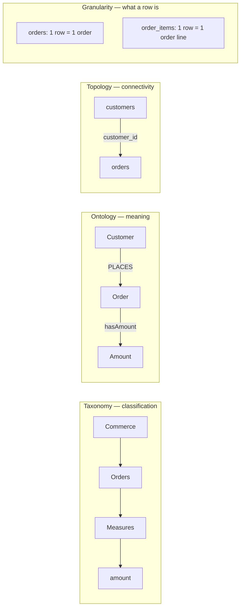

| | Answers | Unit | Changes when | Trust source |
|---|---|---|---|---|
| **Taxonomy** | "What kind of thing is this column?" | column/category | profiling rules change | deterministic (`SYSTEM`) |
| **Ontology** | "What does it mean, and how do concepts relate?" | concept | LLM/human proposal reviewed | `LLM` → `HUMAN_VALIDATED` |
| **Topology** | "Can I join these, and is it safe?" | table/column edge | schema changes (FKs) | `DATABASE`/`INFERRED` |
| **Granularity** | "What does one row represent?" | table | PK/identifier drift, human correction | `INFERRED`/human |

A column can be a taxonomy **Measure** without being an ontology **Amount** concept; a topology edge
can exist without an ontology relationship; grain is orthogonal to all three. Conflating them is the
most common modeling error, and it produces SQL that runs but is wrong.

---

## 5. Taxonomy

Taxonomy is DataHek's **deterministic classification** of database objects. It is rule-derived
(never LLM) and produces a three-level hierarchy: **Domain → Subdomain → Category**, with columns
attached as members.

### 5.1 Example hierarchy

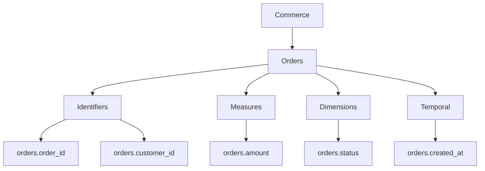

Roles DataHek derives (`ColumnProfile.role_candidates`):
`identifier`, `measure`, `dimension`, `temporal`, `flag`, `text`. The classifier uses type family,
uniqueness ratio, distinct count, null ratio, sensitive detection, and name markers — all
deterministic (see `_role_candidates` in `context/profiler.py`).

### 5.2 Taxonomy in the graph

Taxonomy arrives as `TaxonomyContext.nodes: tuple[TaxonomyNode, ...]`, where each node has
`path: tuple[str, ...]` and `members: tuple[str, ...]` (e.g. `("Commerce","Orders","Measures")` →
`("orders.amount",)`). The builder projects the **category label onto the column node** as
`taxonomy_category`, and (V1) does not create separate category nodes; the category is a property so
traversals stay shallow and cheap.

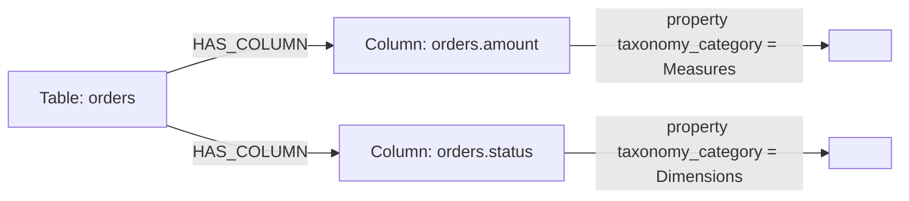

### 5.3 Cypher — create taxonomy-shaped nodes and edges

**What it does.** Creates/updates a table node and its column nodes, then wires `HAS_COLUMN`,
recording the taxonomy category and inferred roles as prefixed properties.

**Why DataHek needs it.** It is the deterministic backbone every later query starts from: find
measures, find identifiers, find temporal columns — per table, per connection, per tenant.

**Result.** Idempotent upserts; re-running changes nothing (`nodes_pruned = 0`).

```cypher
// 1) Table node
MERGE (t:DataHekNode {id: $table_id})
SET t += $table_props            // label:'Table', org_id, project_id, schema_hash, p_name, p_row_count, p_grain

// 2) Column nodes
UNWIND $columns AS col
MERGE (c:DataHekNode {id: col.id})
SET c += col.props               // p_name, p_data_type, p_roles, p_taxonomy_category, p_sensitive, ...

// 3) Structural edges
WITH t
UNWIND $columns AS col
MATCH (c:DataHekNode {id: col.id})
MERGE (t)-[r:HAS_COLUMN {id: 'rel:HAS_COLUMN:' + t.id + '->' + c.id}]->(c)
SET r += {org_id: t.org_id, context_version: $version, schema_hash: $schema_hash,
          provenance: 'database', confidence: 1.0}
```

**Performance.** `MERGE` on an indexed unique `id` is a constant-time lookup per row; batching with
`UNWIND` avoids one round trip per column. **Security.** Labels, types, and property keys are never
interpolated from user text: `HAS_COLUMN` is closed vocabulary, and property keys are validated
against `^[A-Za-z0-9_]+$`.

**Taxonomy queries DataHek runs**

```cypher
// Which category do this table's columns fall into?
MATCH (t:DataHekNode {label:'Table'})-[r:HAS_COLUMN]->(c:DataHekNode)
WHERE t.org_id = $org AND t.p_connection_id = $conn AND t.p_name = $table
RETURN c.p_name AS column, c.p_data_type AS type, c.p_taxonomy_category AS category,
       c.p_roles AS roles
ORDER BY column
```

```cypher
// Every measure-like column across the connection (for metric grounding)
MATCH (t:DataHekNode {label:'Table'})-[:HAS_COLUMN]->(c:DataHekNode)
WHERE t.org_id = $org AND t.p_connection_id = $conn AND c.p_roles CONTAINS 'measure'
RETURN t.p_name AS table, c.p_name AS measure, c.p_data_type AS type
```

---

## 6. Ontology

Ontology is the Context Layer's model of **meaning**: concepts, their attributes, and semantic
relationships. Unlike taxonomy (classification) and topology (connectivity), ontology is
*interpretation* — it may come from an LLM and must be validated before it is authoritative.

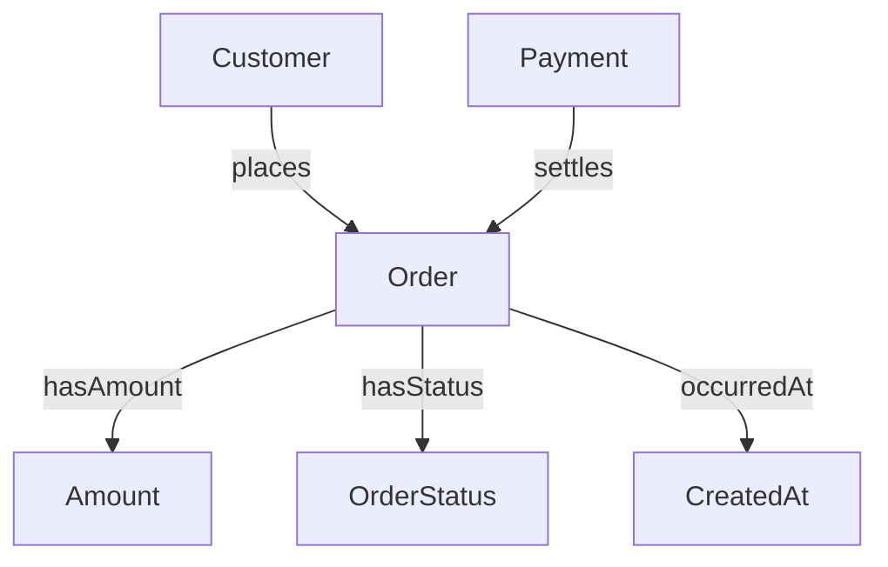

### 6.1 Ontology vs foreign keys

| | Foreign key | Ontology relationship |
|---|---|---|
| Source | Database DDL | LLM proposal → human validation |
| Meaning | "column value must exist in that table" | "an Order is *placed by* a Customer" |
| Direction | `orders.customer_id → customers.id` | `Customer ─PLACES→ Order` (semantic subject→object) |
| Cardinality | N:1 enforced | Business cardinality, may be many-to-many |
| Trust | `DATABASE` (structural, confidence 1.0) | `LLM` (`PROPOSED`) until `HUMAN_VALIDATED` |
| Use | Join safety | Metric interpretation, entity modeling, prompt grounding |

A FK tells you a join is *legal*; ontology tells you it is *meaningful* — and often reveals
relationships with no FK at all.

### 6.2 DataHek ontology artifact

```python
OntologyConcept(name, kind, maps_to, attributes, provenance, validation, confidence,
                description="", synonyms=())
OntologyRelationship(subject, predicate, object, kind, provenance, validation, confidence)
```

`kind` is a controlled vocabulary (e.g. `entity`, `attribute`, `metric_candidate`); `predicate` is
validated against a controlled list; `maps_to` grounds a concept to concrete tables (this is what
keeps the LLM honest and lets a concept be *retrieved*).

### 6.3 Ontology in Neo4j

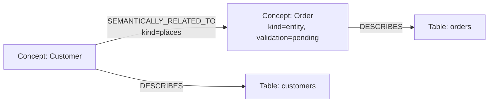

**Cypher — create a concept and ground it to tables**

```cypher
// Concept node
MERGE (k:DataHekNode {id: $concept_id})            // 'concept:<conn>:Order'
SET k += {label:'Concept', org_id:$org, project_id:$project, context_version:$version,
          schema_hash:$schema_hash, provenance:'llm',
          p_name:$name, p_kind:$kind, p_description:$description,
          p_synonyms:$synonyms, p_validation:'pending', p_confidence:$confidence}

// Ground each concept to the tables it maps to (DESCRIBES), only if the table exists
UNWIND $maps_to AS table_name
MATCH (t:DataHekNode {id: 'table:' + $conn + ':' + table_name, org_id: $org})
MERGE (k)-[r:DESCRIBES {id: 'rel:DESCRIBES:' + k.id + '->' + t.id}]->(t)
SET r += {org_id:$org, context_version:$version, schema_hash:$schema_hash,
          provenance:'llm', confidence:$confidence}
```

**Why.** `DESCRIBES` is the bridge from business vocabulary to physical tables — the edge that lets
a question about "revenue from customers" reach `orders`/`customers` without guessing.

**Cypher — concept-to-concept semantics**

```cypher
MATCH (s:DataHekNode {label:'Concept', p_name:$subject, org_id:$org}),
      (o:DataHekNode {label:'Concept', p_name:$object,  org_id:$org})
MERGE (s)-[r:SEMANTICALLY_RELATED_TO {id: 'rel:SEMANTICALLY_RELATED_TO:' + s.id + '->' + o.id + ':' + $kind}]->(o)
SET r += {org_id:$org, context_version:$version, schema_hash:$schema_hash,
          provenance:'llm', confidence:$confidence, p_kind:$kind, p_predicate:$predicate}
```

**Performance.** Concept counts are small (tens), so these are cheap. **Security.** `p_description`
is untrusted text: it is data, never executed, and never concatenated into a query.

---

## 7. Entities

An **entity** is a business noun (Customer, Order, Product, Invoice, Payment, Transaction). The
central modeling insight:

> **A database table is not automatically a semantic entity.**

A table may represent an entity, an event, a relationship (junction), a fact, an aggregation, or a
transaction. DataHek infers candidates and records the distinction rather than assuming.

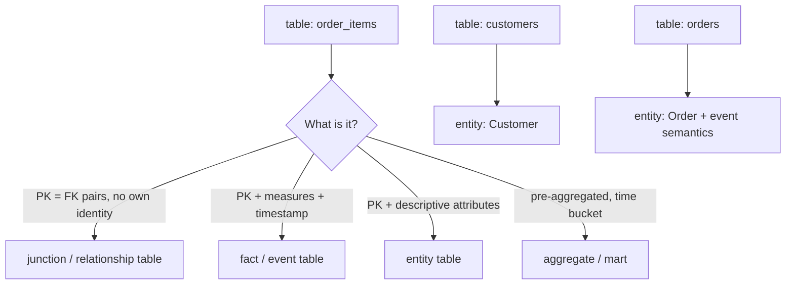

### 7.1 Signals used for entity inference

| Signal | Strength | Example |
|---|---|---|
| Table name | strong | `customers` → Customer |
| Single-column PK, high uniqueness | strong | `customer_id` unique, non-null |
| Descriptive non-key columns | medium | `name`, `email`, `signup_date` |
| All-FK composite PK | strong *junction* signal | `order_items(order_id, product_id)` |
| FK fan-in/fan-out shape | medium | `orders` N:1 `customers` |
| Ontology concept | strong (LLM, pending) | `Concept: Customer` maps to `customers` |
| Profiling roles | medium | identifiers + measures + temporal mix |
| Timestamps + many measures | medium | fact/event table |
| Row grain statement | strong | "1 row = 1 order" |

### 7.2 Distinguishing table kinds

| Kind | Typical shape | Graph modeling |
|---|---|---|
| **Entity** | surrogate PK, attributes, referenced by others | `Entity` concept + `DESCRIBES` |
| **Event / fact** | PK, measures, `*_at` timestamp, FKs | `Entity` with `occurredAt` semantics |
| **Relationship / junction** | composite PK = two FKs | edge-like concept; high `BELONGS_TO` centrality |
| **Aggregate / mart** | pre-computed, time bucket, no natural FK | flagged; **excluded from metric grounding** |
| **Reference / lookup** | tiny, low-cardinality codes | `Dimension` / taxonomy `Dimensions` |

### 7.3 Entity modeling in the graph

V1 projects entity information through **concepts** (`Concept` nodes with `kind='entity'`,
grounded via `DESCRIBES`) plus **taxonomy roles** and **grain**. A dedicated `Entity` label is a
V1.x/future addition (ADR-003 names it; the builder's `_LABELS` is the implemented subset). This is
deliberate: entity inference quality depends on enriched semantics, and V1 prefers provable
structure over speculative labels.

**Cypher — find candidate entities in a connection**

```cypher
MATCH (t:DataHekNode {label:'Table'})-[:HAS_COLUMN]->(c:DataHekNode)
WHERE t.org_id = $org AND t.p_connection_id = $conn
WITH t, collect(c) AS cols
WITH t,
     size([x IN cols WHERE x.p_is_primary_key = 'True']) AS pk_cols,
     size([x IN cols WHERE x.p_is_foreign_key = 'True']) AS fk_cols,
     size([x IN cols WHERE x.p_roles CONTAINS 'identifier']) AS id_cols
WHERE pk_cols >= 1
RETURN t.p_name AS table, pk_cols, fk_cols, id_cols,
       CASE WHEN fk_cols >= 2 AND pk_cols >= 2 THEN 'junction'
            WHEN fk_cols >= 1 THEN 'fact/child'
            ELSE 'entity' END AS shape
ORDER BY table
```

**Why.** The `shape` heuristic is exactly the entity-vs-junction-vs-fact triage. **Result.** A short
list an enrichment pass or a human can confirm. **Performance.** Single-label scan bounded by
`connection_id`; add a composite index `(org_id, label, p_connection_id)` if needed.

---

## 8. Relationships

Relationships are the **most valuable part of the Knowledge Graph**. Nodes are a catalogue;
relationships are the reasoning surface. DataHek separates four classes.

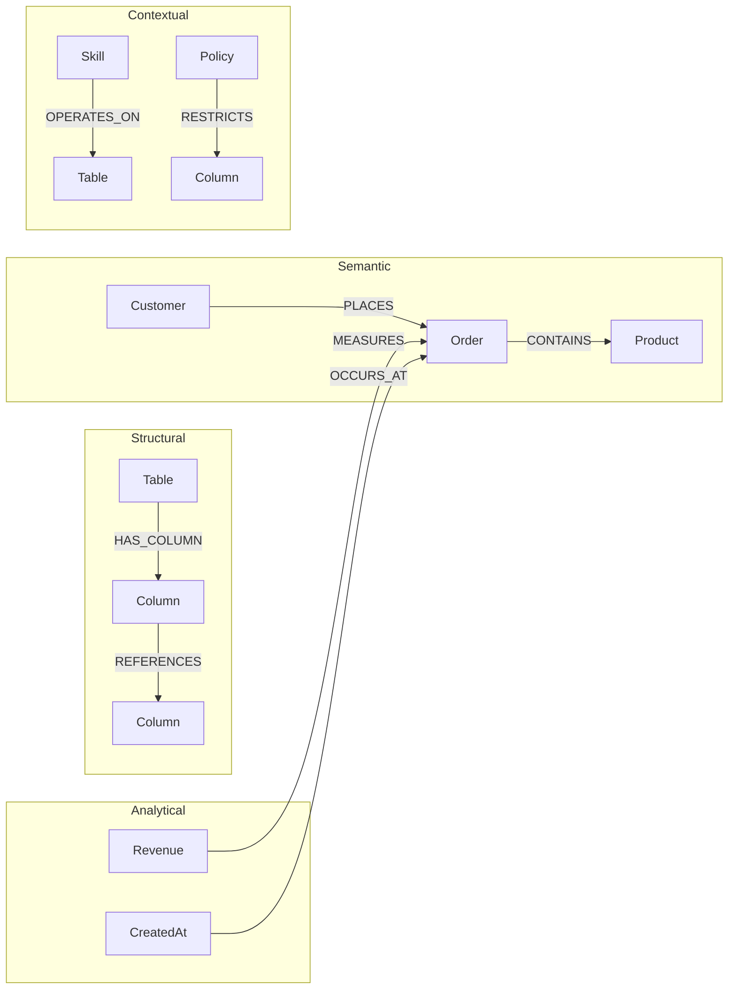

| Class | Examples | Provenance | Trust |
|---|---|---|---|
| **Structural** | `HAS_TABLE`, `HAS_COLUMN`, `REFERENCES` | Database (`DATABASE`) | `STRUCTURAL`, confidence 1.0 |
| **Semantic** | `DESCRIBES`, `SEMANTICALLY_RELATED_TO`, `INSTANCE_OF`, `BELONGS_TO` | LLM/human | `PROPOSED` → `VALIDATED` |
| **Analytical** | `MEASURES`, `IDENTIFIES`, `OCCURS_AT`, `HAS_METRIC`, `HAS_DIMENSION` | System/LLM | mixed |
| **Contextual** | `OWNS`, `HAS_SCHEMA`, `VALIDATED_BY`, and future `OPERATES_ON`/`RESTRICTS` | System/human | `SYSTEM` |

### 8.1 The controlled vocabulary (V1, verbatim)

Adding a type is an **ADR-level change** (ADR-003). The implemented set is exactly 16:

```python
KNOWN_RELATIONSHIP_TYPES = frozenset({
    "OWNS", "HAS_SCHEMA", "HAS_TABLE", "HAS_COLUMN", "HAS_METRIC", "HAS_DIMENSION",
    "REFERENCES", "JOINS_WITH", "INSTANCE_OF", "BELONGS_TO", "SEMANTICALLY_RELATED_TO",
    "MEASURES", "IDENTIFIES", "OCCURS_AT", "DESCRIBES", "VALIDATED_BY",
})
```

`assert_relationship_type(name)` raises `ErrorCode.VALIDATION` with `details={"known": [...]}` for
anything else. This is not bureaucracy — it is the mechanism that makes relationship types safe to
interpolate into Cypher at all (parameterization cannot cover labels/types; see [§27](#27-security)).

### 8.2 Relationship semantics reference

| Type | Direction | Meaning | Carries |
|---|---|---|---|
| `OWNS` | Tenant → Connection | Tenant ownership | tenant fields |
| `HAS_TABLE` | Connection → Table | Connection contains table | confidence 1.0 |
| `HAS_COLUMN` | Table → Column | Table contains column | confidence 1.0 |
| `REFERENCES` | Column → Column | FK relationship | `kind`, `cardinality`, `fanout_risk` |
| `JOINS_WITH` | Column → Column | Inferred joinable pair | `kind`, `cardinality`, `fanout_risk` |
| `HAS_METRIC` | Table → Metric | Table exposes metric | metric definition props |
| `HAS_DIMENSION` | Table → Dimension | Table exposes dimension | (planned) |
| `MEASURES` | Metric → Table | Metric measures table | (planned) |
| `IDENTIFIES` | Column → Entity | Column identifies entity | (planned) |
| `OCCURS_AT` | Column → Table | Temporal attribute of table | (planned) |
| `DESCRIBES` | Concept → Table | Concept grounds to table | `provenance=llm` |
| `SEMANTICALLY_RELATED_TO` | Concept → Concept | Business relationship | `kind`, `predicate` |
| `INSTANCE_OF` | Concept → Concept | Subtype/specialization | (planned) |
| `BELONGS_TO` | Any → Category | Classification membership | (planned) |
| `HAS_SCHEMA` | Database → Schema | Namespace containment | (planned) |
| `VALIDATED_BY` | Any → Human action | Provenance of validation | (planned) |

> "Planned" rows are in the vocabulary and ADR-003 but not yet projected by the builder's
> `_LABELS`/edge code. Documenting them here keeps the vocabulary and the roadmap consistent.

### 8.3 Cypher — create a semantic relationship (idempotent)

```cypher
MATCH (s:DataHekNode {label:'Concept', p_name:$subject, org_id:$org}),
      (o:DataHekNode {label:'Concept', p_name:$object,  org_id:$org})
MERGE (s)-[r:SEMANTICALLY_RELATED_TO {id: $rel_id}]->(o)
SET r += {org_id:$org, context_version:$version, schema_hash:$schema_hash,
          provenance:'llm', confidence:$confidence, p_predicate:$predicate}
RETURN r.id AS id
```

**Performance.** `MATCH` uses the `(org_id, label)` composite index plus a property filter on
`p_name`; consider a composite index on `(org_id, label, p_name)` for large graphs. **Security.**
`MERGE` matches on `{id: $rel_id}` — the *builder-generated* deterministic id, never user text.

---

## 9. Topology

Topology is **structural connectivity**: which tables/columns can be joined, with what cardinality
and fanout risk. It is deliberately separate from ontology (meaning) and answers a narrower, sharper
question — *"is this join safe and how does data flow?"*

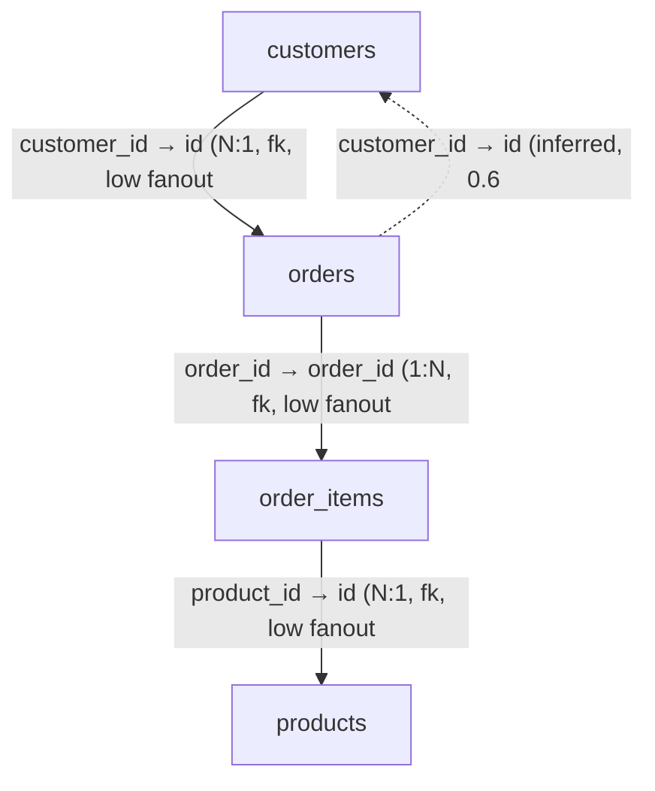

### 9.1 What topology enables

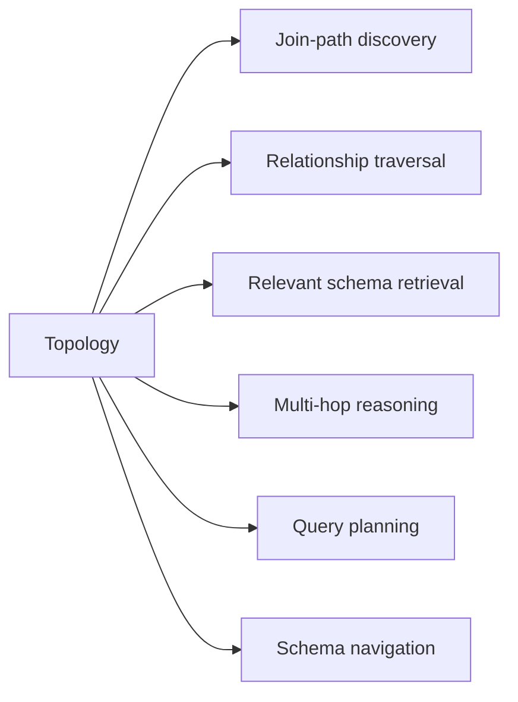

### 9.2 DataHek topology artifact

`JoinEdge(left, right, kind, cardinality, fanout_risk, provenance, confidence)` where `kind` is
`fk` (declared) or `inferred` (`<entity>_id` pattern with type-family compatibility), `cardinality`
is `1:1 | 1:N | N:1 | N:M`, and `fanout_risk` flags joins that multiply rows (`high`). Forks also
produce bounded `join_paths`.

Fanout risk is the difference between a correct `SUM` and a silently inflated one:
joining `orders` to `order_items` multiplies `orders.amount` unless aggregated first.

### 9.3 Topology in Neo4j

FK edges become `REFERENCES`; inferred edges become `JOINS_WITH`. Both are column-to-column, which
keeps the graph precise and makes path queries expressible.

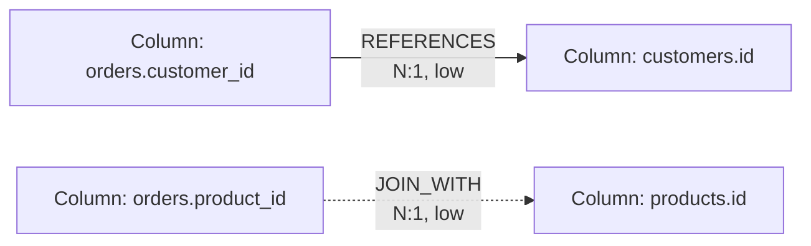

**Cypher — find safe join paths between two tables**

```cypher
// Shortest joins between two tables, restricted to structural edge types, depth-bounded
MATCH (a:DataHekNode {label:'Table', p_name:$from_table, org_id:$org, p_connection_id:$conn})
MATCH (b:DataHekNode {label:'Table', p_name:$to_table,   org_id:$org, p_connection_id:$conn})
MATCH p = allShortestPaths( (a)-[:REFERENCES|JOINS_WITH*1..4]-(b) )
RETURN [n IN nodes(p) | coalesce(n.p_name, n.id)] AS chain,
       [r IN relationships(p) | type(r)] AS edge_types,
       [r IN relationships(p) | r.p_fanout_risk] AS fanout,
       length(p) AS hops
ORDER BY hops, chain
LIMIT 10
```

**Why.** This is the join-discovery query: it returns only structural paths, bounded depth, capped
results — never an unbounded traversal. **Result.** Candidate chains with their edge types and
fanout risk so the planner can prefer lower-risk joins. **Performance.** `allShortestPaths` stops at
the first matching path per pair; `*1..4` bounds work; `LIMIT` caps output. **Security.** Only the
closed structural vocabulary is traversed.

**Cypher — fanout-risk warning for a proposed join**

```cypher
MATCH (a:DataHekNode {label:'Column', p_name:$left,  org_id:$org, p_connection_id:$conn})
      -[r:REFERENCES|JOINS_WITH]->
      (b:DataHekNode {label:'Column', p_name:$right, org_id:$org, p_connection_id:$conn})
RETURN type(r) AS kind, r.p_cardinality AS cardinality, r.p_fanout_risk AS fanout_risk
```

---

## 10. Granularity / grain

Grain is **what one row represents** — the highest-leverage fact in the graph and the most common
source of plausible-but-wrong SQL.

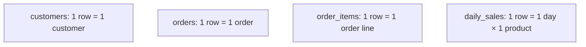

### 10.1 Why grain matters

```sql
-- Two queries, same-looking column, different meaning
SELECT SUM(amount) FROM orders;        -- order-level totals: correct
SELECT SUM(amount) FROM order_items;   -- line-level totals: correct but different granularity
```

Joining then summing is where it breaks:

```sql
-- WRONG: orders.amount is repeated per order line → double counting
SELECT SUM(o.amount)
FROM orders o JOIN order_items oi ON oi.order_id = o.id;

-- RIGHT: aggregate at the finer grain, or sum the line measure
SELECT SUM(oi.amount) FROM order_items oi;
```

Grain is also what makes *averages* and *ratios* correct: `AVG(order.amount)` at order grain ≠
`AVG(item.amount)` at line grain.

### 10.2 How DataHek derives grain

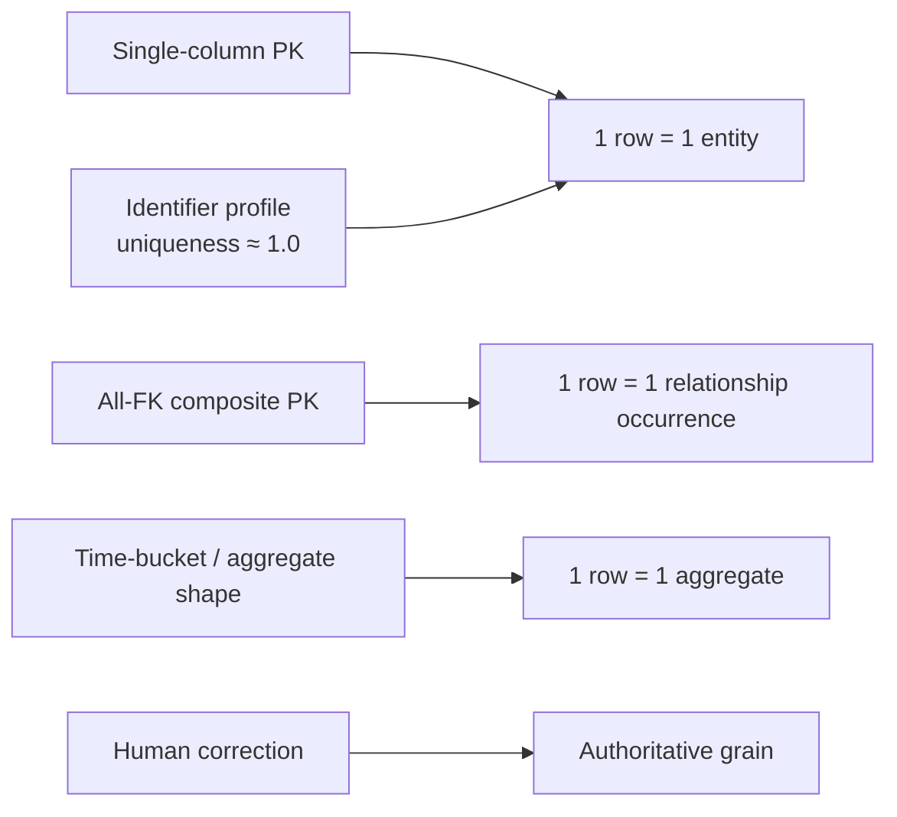

`GrainStatement(table, statement, qualifier, entity, source, validation, confidence)`; default
`source=INFERRED`, `validation=PENDING`, `confidence=0.5`. `MetricGrain(metric, valid_at, caveat)`
records at which grain(s) a metric is valid and any caveat (e.g. "requires pre-aggregation").

### 10.3 Grain in the graph

The builder writes grain onto the **table node** (`p_grain`, `p_grain_confidence`), which keeps the
common retrieval case a single property read. A dedicated `Grain` node with
`MEASURES_VALID_AT`/`OCCURS_AT`-style edges is the natural V1.x extension when metric grains become
first-class nodes.

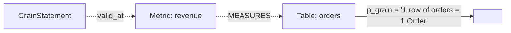

**Cypher — grain for a table and its metrics**

```cypher
MATCH (t:DataHekNode {label:'Table', p_name:$table, org_id:$org, p_connection_id:$conn})
OPTIONAL MATCH (t)-[:HAS_METRIC]->(m:DataHekNode {label:'Metric'})
RETURN t.p_grain AS grain, t.p_grain_confidence AS confidence,
       collect({metric: m.p_name, aggregate: m.p_aggregate, column: m.p_column}) AS metrics
```

**Cypher — find tables whose grain could inflate a SUM (fanout + measures)**

```cypher
MATCH (t:DataHekNode {label:'Table', p_connection_id:$conn, org_id:$org})
WHERE toLower(coalesce(t.p_grain,'')) CONTAINS 'line'
   OR t.p_name ENDS WITH '_items'
OPTIONAL MATCH (t)-[:HAS_COLUMN]->(c:DataHekNode)
WHERE c.p_roles CONTAINS 'measure'
RETURN t.p_name AS fine_grain_table, collect(c.p_name) AS measures
```

**Why.** This is the double-counting tripwire surfaced to the planner/validator. **Performance.**
Property scan bounded by connection; fine at V1 scale.

---

## 11. Schema profiling

Profiling converts structure into statistics and **candidate roles**. It is the evidence base for
taxonomy, grain, and entity inference — and a first-class graph input.

### 11.1 What profiling produces, and where it lives

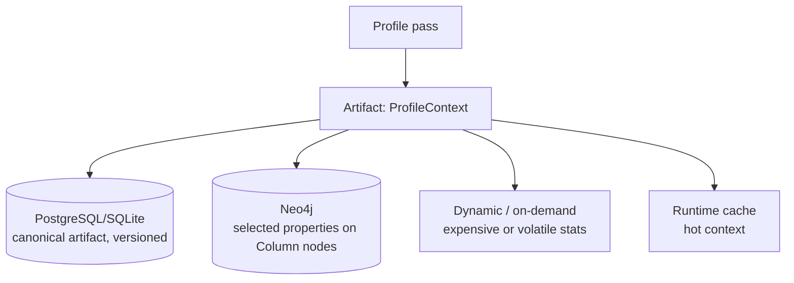

| Information | PostgreSQL | Neo4j | Dynamic | Notes |
|---|---|---|---|---|
| data type, nullability, PK/FK, indexes | ✅ canonical | ✅ `p_*` on Column | — | small, stable |
| row_count (table) | ✅ | ✅ `p_row_count` | — | refreshed per build |
| null_ratio, distinct_count, uniqueness | ✅ | ✅ (`p_null_ratio`, `p_distinct_count`, `p_uniqueness_ratio`) | — | curated subset |
| min/max/avg | ✅ | ❌ | ✅ | numeric noise; keep for planners, not graph |
| role candidates / confidence | ✅ | ✅ `p_roles` | — | drives taxonomy queries |
| sensitive flag | ✅ | ✅ `p_sensitive` | — | governance input |
| low-cardinality **value hints** | ✅ `top_values` | ⚠️ optional | — | only non-sensitive, ≤6/table |
| distributions / histograms | ✅ (future) | ❌ | ✅ | too large for a graph |
| exact cardinality on huge tables | ✅ | ❌ | ✅ | avoid graph bloat |

> **Do not store unnecessary raw data in the graph.** No row values, no full histograms, no sample
> rows. The graph holds the *semantics and statistics needed for traversal and grounding*.

### 11.2 Cypher — profiled columns worth surfacing

```cypher
MATCH (t:DataHekNode {label:'Table', p_connection_id:$conn, org_id:$org})-[:HAS_COLUMN]->(c:DataHekNode)
WHERE c.p_sensitive = 'False'
RETURN t.p_name AS table, c.p_name AS column, c.p_data_type AS type,
       c.p_null_ratio AS null_ratio, c.p_distinct_count AS distinct,
       c.p_uniqueness_ratio AS uniqueness, c.p_roles AS roles,
       coalesce(t.p_grain, '') AS grain
ORDER BY table, column
LIMIT $limit
```

**Why.** This single query feeds the planning prompt's schema block with statistics that prevent
type/grain mistakes. **Performance.** One scan per connection; `LIMIT` always applied. **Security.**
`sensitive` columns are excluded from any value-bearing projection.

---

## 12. Semantic enrichment

Enrichment is the **only LLM stage** in the Context Layer. It combines three sources of truth, each
with distinct trust.

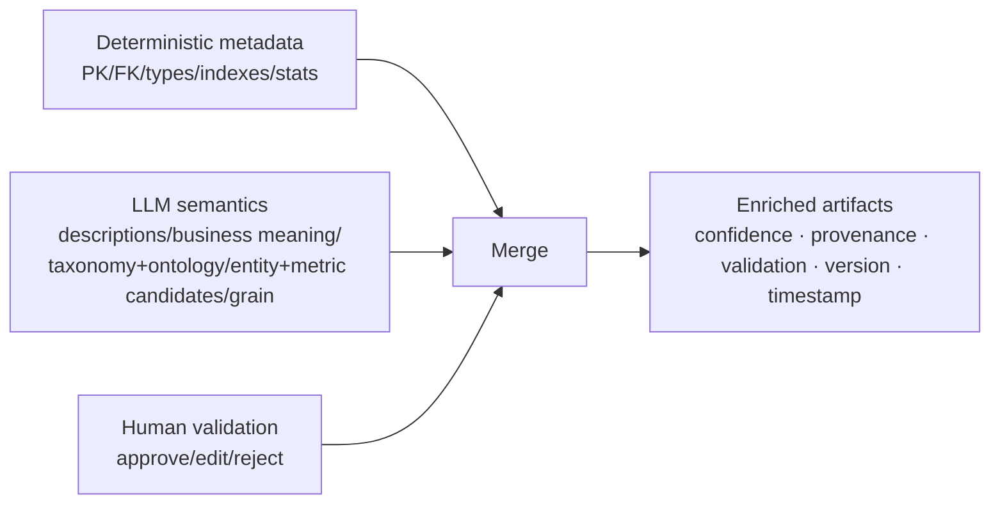

| Source | Trust | Validation | Example |
|---|---|---|---|
| Deterministic | `STRUCTURAL` | `NOT_REQUIRED` | "orders.customer_id is an FK to customers.id" |
| LLM | `PROPOSED` | `PENDING` | "amount = monetary order value" |
| Human | `VALIDATED` | `APPROVED`/`EDITED` | "amount is net of tax; revenue uses total_amount" |

### 12.1 Rules (normative)

1. **Deterministic first.** Rules run before the LLM and are never overridden by it (ADR-013).
2. **LLM is opt-in.** `enrichment=True` is explicit; automated builds default to `False`.
3. **Proposals, not facts.** LLM output enters as `PENDING`/`PROPOSED`, lowers package trust to
   `PROPOSED`, and is excluded from authoritative semantics until validated.
4. **Validated priors.** Approved/edited items are fed back to the next enrichment run as fixed —
   humans are never asked twice (ADR-008).
5. **Grounding.** Every concept must map to real tables; ungrounded concepts are dropped.

### 12.2 Enrichment → graph flow

```mermaid
sequenceDiagram
    participant J as BuildJob
    participant E as OntologyEnricher
    participant R as Registry
    participant G as GraphBuilder

    J->>R: active_artifact(ONTOLOGY) → validated priors
    J->>E: propose(schema, taxonomy, metrics, validated=priors)
    E-->>J: OntologyContext (provenance=LLM, validation=PENDING)
    J->>G: build(..., ontology=ontology)
    G->>G: Concept nodes (provenance=llm) + DESCRIBES + SEMANTICALLY_RELATED_TO
    Note over G: Package trust floor → PROPOSED while pending
```

**Cypher — list unvalidated LLM content (review queue)**

```cypher
MATCH (n:DataHekNode {org_id:$org, p_connection_id:$conn})
WHERE n.provenance = 'llm' AND (n.p_validation = 'pending' OR n.p_validation = '')
RETURN n.label AS label, n.p_name AS name, n.p_kind AS kind, n.p_confidence AS confidence
ORDER BY confidence DESC
```

**Why.** The graph becomes the fastest way to see "what did the model assert that no human has
confirmed?". **Security.** Confidence/validation are properties, so review never requires reading
description text.

---

## 13. Provenance

Every semantic fact records **where it came from**. Provenance is not decoration: it drives trust
floors, retrieval filtering, review queues, and audit.

```mermaid
flowchart LR
    DB[Database] --> PV1[provenance=database, trust=structural, conf=1.0]
    SYS[System rules] --> PV2[provenance=system, trust=system]
    LLM[LLM inference] --> PV3[provenance=llm, trust=proposed, validation=pending]
    USR[User input] --> PV4[provenance=user]
    HUM[Human validation] --> PV5[provenance=human_validated, trust=validated]
    IMP[Imported metadata] --> PV6[provenance=imported]
```

`ProvenanceSource` (verbatim): `database`, `system`, `llm`, `user`, `human_validated`, `inferred`,
`imported`. `TrustLevel`: `system`, `validated`, `structural`, `proposed`, `untrusted`.

### 13.1 The provenance lifecycle of one fact

```mermaid
sequenceDiagram
    participant L as LLM
    participant S as Store
    participant H as Human
    participant G as Graph
    L->>S: meaning="monetary order value", source=llm, confidence=0.94, status=pending_validation
    H->>S: approve/edit → source=human_validated, status=validated
    S->>G: rebuild projects provenance=human_validated (trust rises)
    Note over G: package trust floor stops being PROPOSED
```

```json
{ "meaning": "monetary order value", "source": "llm", "confidence": 0.94, "status": "pending_validation" }
```
```json
{ "source": "human_validated", "status": "validated" }
```

### 13.2 Cypher — provenance inventory per connection

```cypher
MATCH (n:DataHekNode {org_id:$org, p_connection_id:$conn})
RETURN n.label AS label, n.provenance AS provenance, count(*) AS nodes
ORDER BY label, provenance
```

```cypher
// Edges by provenance and confidence (spot low-trust joins before they influence planning)
MATCH (a:DataHekNode {org_id:$org, p_connection_id:$conn})-[r]->(b)
RETURN type(r) AS rel, r.provenance AS provenance,
       round(avg(r.confidence) * 100) / 100 AS avg_confidence, count(*) AS n
ORDER BY n DESC
```

**Why.** Retrieval can require "structural only" while enrichment is unvalidated; audit can prove
which human blessed which fact. **Performance.** Grouped scans bounded by connection.

---

## 14. Neo4j graph model

### 14.1 Node labels

V1 uses **one physical Neo4j label** (`DataHekNode`) with a **logical `label` property**. This is a
deliberate decision:

| Approach | Pros | Cons | DataHek V1 |
|---|---|---|---|
| One label + `label` property | uniform indexes; vocabulary changes need no DDL; easy multi-tenant filters | one big node space | ✅ chosen |
| A label per kind (`:Table`, `:Column`) | label scans by kind | DDL per kind; churn; multi-label proliferation | ✗ |

Logical labels in V1 (implemented: `Connection`, `Table`, `Column`, `Metric`, `Concept`; named in
ADR-003 for future projection: `Tenant`, `Database`, `Schema`, `Entity`, `Dimension`, `DataType`,
`Constraint`, `Skill`, `Tool`, `ProfileSnapshot`).

```mermaid
classDiagram
    class DataHekNode {
      +string id
      +string label
      +string org_id
      +string project_id
      +int context_version
      +string schema_hash
      +string provenance
      +string created_at
      +string updated_at
      +string p_name
      +string p_connection_id
      ... p_* kind-specific
    }
    class Connection
    class Table
    class Column
    class Metric
    class Concept
    class Entity
    class Policy
    class Skill
    class Tool
    DataHekNode <|-- Connection
    DataHekNode <|-- Table
    DataHekNode <|-- Column
    DataHekNode <|-- Metric
    DataHekNode <|-- Concept
    DataHekNode <|-- Entity
    DataHekNode <|-- Policy
    DataHekNode <|-- Skill
    DataHekNode <|-- Tool
```

### 14.2 Relationship types

The 16-type controlled vocabulary from [§8.1](#81-the-controlled-vocabulary-v1-verbatim). In the
graph they are real relationship types (required for `[:TYPE]` patterns and index-free adjacency),
validated before interpolation.

### 14.3 Property conventions

| Class | Keys | Notes |
|---|---|---|
| Fixed | `id`, `label`, `org_id`, `project_id`, `context_version`, `schema_hash`, `provenance`, `created_at`, `updated_at` | written for every node |
| User | `p_<name>` (flattened to string) | e.g. `p_name`, `p_data_type`, `p_roles`, `p_grain`, `p_sensitive`, `p_is_primary_key` |
| Rel fixed | `id`, `org_id`, `context_version`, `schema_hash`, `provenance`, `confidence` | every relationship |
| Rel user | `p_kind`, `p_cardinality`, `p_fanout_risk`, `p_predicate` | edge-specific |

**Why the `p_` prefix?** It guarantees reserved names can never collide with user/model-influenced
keys, and it makes property-key validation a single regex (`^[A-Za-z0-9_]+$`). Booleans/numbers are
flattened to strings for uniform storage; typed reconstruction happens in the adapter.

### 14.4 Identity scheme (deterministic, idempotent)

```text
connection:<connection_id>
table:<connection_id>:<table>
column:<connection_id>:<table>.<column>
metric:<connection_id>:<metric_name>
concept:<connection_id>:<concept_name>
rel:<TYPE>:<source_id>-><target_id>          # concept edges append :<relationship_kind>
```

Determinism is what makes rebuilds idempotent: `MERGE {id: …}` is a no-op the second time.

```mermaid
flowchart LR
    ID[Deterministic id] --> M[MERGE upsert]
    M --> I1[Rebuild: no duplicates]
    M --> I2[Stable relationship ids]
    M --> P[Prune by connection_id]
```

> **Noted improvement (V1.x):** ids embed `connection_id` but not `org_id`; ADR-012 calls for tenant
> ids in stable keys. V1 relies on the `org_id` property filter for isolation (defense in depth).
> Adding `org_id` to the id scheme is a compatible future change.

---

## 15. Neo4j schema design

### 15.1 Constraints and indexes (V1, verbatim from `init_schema`)

```cypher
CREATE CONSTRAINT datahek_node_id IF NOT EXISTS
FOR (n:DataHekNode) REQUIRE n.id IS UNIQUE;

CREATE INDEX datahek_node_org IF NOT EXISTS
FOR (n:DataHekNode) ON (n.org_id);

CREATE INDEX datahek_node_label IF NOT EXISTS
FOR (n:DataHekNode) ON (n.org_id, n.label);
```

| Object | Purpose | Why |
|---|---|---|
| Unique `id` constraint | `MERGE` correctness + fast `MATCH (n {id})` | idempotent upserts require uniqueness |
| Index `org_id` | tenant-scoped scans | every read filters the tenant |
| Composite `(org_id, label)` | label scans within a tenant | the dominant access pattern |

**Neo4j edition note.** Range/unique constraints and range indexes are available on Community.
Property-existence, property-type, and key constraints are **Enterprise-only** (per the Cypher
manual). V1 therefore enforces presence/shape in the application (adapter + builder), not the
database.

### 15.2 Recommended indexes as the graph grows (V1.x)

```cypher
// Property-driven lookups (find a table/column by name inside a tenant+connection)
CREATE INDEX datahek_node_conn_name IF NOT EXISTS
FOR (n:DataHekNode) ON (n.org_id, n.p_connection_id, n.p_name);

// Full-text search over concept names/synonyms (semantic retrieval)
CREATE FULLTEXT INDEX datahek_concept_text IF NOT EXISTS
FOR (n:DataHekNode) ON EACH [n.p_name, n.p_description, n.p_synonyms];

// Optional token-lookup for the logical label
CREATE LOOKUP INDEX datahek_lookup_label IF NOT EXISTS FOR (n:DataHekNode) ON EACH labels(n);
```

Rules of thumb: index the **leading filters** (`org_id`, then `p_connection_id`, then `p_name`),
prefer composite over many single-property indexes, and remember that relationship type filters are
free (index-free adjacency) while property filters are not.

### 15.3 Node creation (idempotent upsert with all fixed props)

```cypher
MERGE (n:DataHekNode {id: $id})
SET n += $props
RETURN n.id AS id
```

`$props` always includes `label, org_id, project_id, context_version, schema_hash, provenance,
created_at, updated_at` plus `p_*` user properties.

### 15.4 Relationship creation (idempotent, tenant-guarded)

```cypher
MATCH (a:DataHekNode {id: $src}), (b:DataHekNode {id: $dst})
WHERE a.org_id = $org AND b.org_id = $org
MERGE (a)-[r:HAS_TABLE {id: $id}]->(b)
SET r += $props
RETURN r.id AS id
```

The `WHERE` clause is the tenant guard: an endpoint from another tenant cannot be linked even if an
id is guessed.

### 15.5 MERGE vs CREATE

| Use | Clause | Reason |
|---|---|---|
| Nodes/edges with deterministic ids | `MERGE … SET` | idempotent rebuilds |
| Bulk creation from parameters | `UNWIND $rows AS row` + `MERGE` | one round trip, one plan |
| Ephemeral/append-only events | `CREATE` | no natural key (not used in V1 graph) |

### 15.6 Filtering and aggregation patterns

```cypher
// Filter by label + connection, aggregate edge counts per relationship type
MATCH (t:DataHekNode {label:'Table', org_id:$org, p_connection_id:$conn})-[r]->()
RETURN type(r) AS rel, count(*) AS n ORDER BY n DESC
```

```cypher
// Tenant + version aware read: only the current context version
MATCH (n:DataHekNode {org_id:$org, p_connection_id:$conn})
WHERE n.context_version = $version
RETURN labels(n) AS physical, n.label AS logical, count(*) AS n
```

### 15.7 Multi-hop traversal (bounded) and relationship filtering

```cypher
// Two-hop neighbourhood, structural edges only, exclude the origin
MATCH (n:DataHekNode {id:$id, org_id:$org})
      -[r:REFERENCES|JOINS_WITH*1..2]-
      (m:DataHekNode)
WHERE m.org_id = $org AND m.id <> $id
RETURN DISTINCT m.label AS label, m.p_name AS name
ORDER BY name
LIMIT 100
```

```cypher
// Neighbours filtered by relationship type and property
MATCH (n:DataHekNode {id:$id, org_id:$org})-[r:HAS_COLUMN]->(c:DataHekNode)
WHERE c.p_roles CONTAINS $role
RETURN c.p_name AS column, c.p_data_type AS type
```

### 15.8 Deleting/rebuilding graph sections (pruning)

The adapter has **no prune method**; pruning is a builder responsibility using `find_nodes` +
`delete_node`, which detaches relationships (cascade). At Cypher level that is `DETACH DELETE`.

```cypher
// Remove one connection's projection for a tenant (rebuild or decommission)
MATCH (n:DataHekNode {org_id:$org, p_connection_id:$conn})
DETACH DELETE n
```

```cypher
// Remove every node for a tenant (offboarding)
MATCH (n:DataHekNode {org_id:$org}) DETACH DELETE n
```

**Why `DETACH DELETE`?** It removes relationships automatically, so no dangling edges survive a
prune. **Performance.** Large deletes should be **batched** (see [§26](#26-performance--scalability)).

### 15.9 Version-aware queries

```cypher
// Compare node counts between two context versions
MATCH (n:DataHekNode {org_id:$org, p_connection_id:$conn})
WHERE n.context_version IN [$old, $new]
RETURN n.context_version AS version, n.label AS label, count(*) AS nodes
ORDER BY version, label
```

```cypher
// Stale nodes: projection of an older schema hash
MATCH (n:DataHekNode {org_id:$org, p_connection_id:$conn})
WHERE n.schema_hash <> $current_schema_hash
RETURN n.label AS label, count(*) AS stale_nodes
```

---

## 16. Schema Knowledge Graph example

A complete, realistic commerce slice, then its Neo4j representation, then the Cypher, then how the
Context Layer would use it for an agent.

### 16.1 Business model

```mermaid
erDiagram
    CUSTOMERS ||--o{ ORDERS : places
    ORDERS ||--o{ ORDER_ITEMS : contains
    PRODUCTS ||--o{ ORDER_ITEMS : "appears in"
    ORDERS ||--o{ PAYMENTS : "settled by"
    CUSTOMERS {
      uuid id PK
      text name
      text email
      timestamp created_at
    }
    ORDERS {
      uuid id PK
      uuid customer_id FK
      numeric amount
      text status
      timestamp created_at
    }
    ORDER_ITEMS {
      uuid order_id PK,FK
      uuid product_id PK,FK
      int quantity
      numeric amount
    }
    PRODUCTS {
      uuid id PK
      text title
      numeric price
    }
    PAYMENTS {
      uuid id PK
      uuid order_id FK
      numeric amount
      text method
      timestamp paid_at
    }
```

### 16.2 The graph

```mermaid
flowchart TD
    Conn[Connection: shop] -- HAS_TABLE --> T1[Table: customers]
    Conn -- HAS_TABLE --> T2[Table: orders]
    Conn -- HAS_TABLE --> T3[Table: order_items]
    Conn -- HAS_TABLE --> T4[Table: products]
    Conn -- HAS_TABLE --> T5[Table: payments]

    T1 -- HAS_COLUMN --> C1[Column: customers.id]
    T1 -- HAS_COLUMN --> C2[Column: customers.name]
    T2 -- HAS_COLUMN --> O1[Column: orders.customer_id]
    T2 -- HAS_COLUMN --> O2[Column: orders.amount]
    T2 -- HAS_COLUMN --> O3[Column: orders.status]
    T2 -- HAS_COLUMN --> O4[Column: orders.created_at]
    T3 -- HAS_COLUMN --> I1[Column: order_items.amount]

    O1 -- REFERENCES --> C1
    O1 -- JOINS_WITH --> C1

    K1[Concept: Customer] -- DESCRIBES --> T1
    K2[Concept: Order] -- DESCRIBES --> T2
    K3[Concept: Amount] -- DESCRIBES --> T2
    K1 -- SEMANTICALLY_RELATED_TO "places" --> K2

    T2 -- HAS_METRIC --> M1[Metric: revenue]
    T2 -. "p_grain = 1 row of orders = 1 Order" .-> G1[ ]
    T3 -. "p_grain = 1 row of order_items = 1 order line" .-> G2[ ]
```

### 16.3 The Cypher that builds it

```cypher
// ── Connection + tables ────────────────────────────────────────────────
MERGE (x:DataHekNode {id: 'connection:shop'})
SET x += {label:'Connection', org_id:$org, project_id:'default', context_version:$v,
          schema_hash:$hash, provenance:'system', p_name:'shop'};

UNWIND $tables AS t
MERGE (n:DataHekNode {id: 'table:shop:' + t.name})
SET n += {label:'Table', org_id:$org, project_id:'default', context_version:$v,
          schema_hash:$hash, provenance:'database', p_name:t.name,
          p_connection_id:'shop', p_row_count:t.row_count, p_grain:t.grain,
          p_grain_confidence:t.grain_confidence}
WITH n, t
MATCH (c:DataHekNode {id:'connection:shop'})
MERGE (c)-[r:HAS_TABLE {id:'rel:HAS_TABLE:connection:shop->' + n.id}]->(n)
SET r += {org_id:$org, context_version:$v, schema_hash:$hash, provenance:'database', confidence:1.0};

// ── Columns ────────────────────────────────────────────────────────────
UNWIND $columns AS col
MERGE (n:DataHekNode {id: 'column:shop:' + col.table + '.' + col.name})
SET n += {label:'Column', org_id:$org, project_id:'default', context_version:$v,
          schema_hash:$hash, provenance:'database', p_name:col.name, p_connection_id:'shop',
          p_data_type:col.type, p_nullable:col.nullable, p_is_primary_key:col.pk,
          p_is_foreign_key:col.fk, p_references:col.refs, p_null_ratio:col.null_ratio,
          p_distinct_count:col.distinct, p_uniqueness_ratio:col.uniqueness,
          p_roles:col.roles, p_taxonomy_category:col.category, p_sensitive:col.sensitive}
WITH n, col
MATCH (t:DataHekNode {id:'table:shop:' + col.table})
MERGE (t)-[r:HAS_COLUMN {id:'rel:HAS_COLUMN:' + t.id + '->' + n.id}]->(n)
SET r += {org_id:$org, context_version:$v, schema_hash:$hash, provenance:'database', confidence:1.0};

// ── Topology (FK → REFERENCES, inferred → JOINS_WITH) ──────────────────
UNWIND $joins AS j
MATCH (a:DataHekNode {id:'column:shop:' + j.left}), (b:DataHekNode {id:'column:shop:' + j.right})
WHERE a.id <> b.id
MERGE (a)-[r:REFERENCES {id:'rel:REFERENCES:' + a.id + '->' + b.id}]->(b)
SET r += {org_id:$org, context_version:$v, schema_hash:$hash, provenance:j.provenance,
          confidence:j.confidence, p_kind:j.kind, p_cardinality:j.cardinality,
          p_fanout_risk:j.fanout_risk};

// ── Metric ─────────────────────────────────────────────────────────────
MERGE (m:DataHekNode {id:'metric:shop:revenue'})
SET m += {label:'Metric', org_id:$org, context_version:$v, schema_hash:$hash, provenance:'system',
          p_name:'revenue', p_table:'orders', p_aggregate:'sum', p_column:'amount',
          p_description:'total order value'}
WITH m MATCH (t:DataHekNode {id:'table:shop:orders'})
MERGE (t)-[r:HAS_METRIC {id:'rel:HAS_METRIC:' + t.id + '->' + m.id}]->(m)
SET r += {org_id:$org, context_version:$v, schema_hash:$hash, provenance:'system', confidence:1.0};

// ── Concepts (LLM, pending) ────────────────────────────────────────────
UNWIND $concepts AS c
MERGE (k:DataHekNode {id:'concept:shop:' + c.name})
SET k += {label:'Concept', org_id:$org, context_version:$v, schema_hash:$hash, provenance:'llm',
          p_name:c.name, p_kind:c.kind, p_description:c.description, p_synonyms:c.synonyms,
          p_validation:'pending', p_confidence:c.confidence}
WITH k, c
UNWIND c.maps_to AS tname
MATCH (t:DataHekNode {id:'table:shop:' + tname})
MERGE (k)-[r:DESCRIBES {id:'rel:DESCRIBES:' + k.id + '->' + t.id}]->(t)
SET r += {org_id:$org, context_version:$v, schema_hash:$hash, provenance:'llm', confidence:c.confidence};
```

### 16.4 How the Context Layer would retrieve this for an agent

Question: **"What was our revenue from customers last month?"**

```mermaid
sequenceDiagram
    participant U as User
    participant R as Retriever
    participant G as Graph (Neo4j)
    participant C as Composer/Compiler
    participant P as Planner

    U->>R: "revenue from customers last month"
    R->>G: tokens → metric/concept/table traversal
    G-->>R: revenue(orders), Customer(customers), orders.created_at, grain, joins, policies
    R->>C: RetrievedContext (bounded)
    C-->>P: ContextPackage (schema+grain+joins+metrics+governance)
    P-->>U: LogicalPlan → SQL → rows
```

```cypher
// 1) Metric + its table + grain
MATCH (m:DataHekNode {label:'Metric', p_name:'revenue', org_id:$org, p_connection_id:$conn})
MATCH (t:DataHekNode {label:'Table'})-[:HAS_METRIC]->(m)
RETURN t.p_name AS table, t.p_grain AS grain, m.p_aggregate AS agg, m.p_column AS column;

// 2) Concept grounding for the entities in the question
MATCH (k:DataHekNode {label:'Concept', org_id:$org, p_connection_id:$conn})-[:DESCRIBES]->(t:DataHekNode)
WHERE toLower(k.p_name) IN $entity_names OR any(s IN split(coalesce(k.p_synonyms,''), ',') WHERE toLower(trim(s)) IN $entity_names)
RETURN k.p_name AS concept, collect(t.p_name) AS tables;

// 3) Safe joins from the metric table to the entity tables
MATCH (a:DataHekNode {label:'Table', p_name:'orders', org_id:$org, p_connection_id:$conn})
MATCH (b:DataHekNode {label:'Table', p_name:'customers', org_id:$org, p_connection_id:$conn})
MATCH p = allShortestPaths((a)-[:REFERENCES|JOINS_WITH*1..3]-(b))
RETURN [r IN relationships(p) | type(r) + ':' + coalesce(r.p_fanout_risk,'?')] AS path_edges;

// 4) Temporal column to bucket "last month"
MATCH (t:DataHekNode {label:'Table', p_name:'orders', org_id:$org, p_connection_id:$conn})-[:HAS_COLUMN]->(c:DataHekNode)
WHERE c.p_roles CONTAINS 'temporal'
RETURN c.p_name AS temporal_column;
```

The compiler then emits a compact package: `orders` (grain: 1 row = 1 order), `customers` with the
`orders.customer_id = customers.id` join, `sum(orders.amount)` as the `revenue` metric, and
`orders.created_at` for the month filter — with fanout risk attached so a join to `order_items`
would be flagged. That is exactly the context a correct plan needs, and nothing more.

---

## 17. Context retrieval from Neo4j

The agent must **never receive the entire Knowledge Graph**. Retrieval converts a question into a
**bounded traversal** whose output is a small, governed slice.

```mermaid
flowchart LR
    Q[User Query] --> I[Intent<br/>entities · metrics · time · operations]
    I --> RT[Context Retrieval<br/>token scoring + graph traversal]
    RT --> RG[Relevant Graph Traversal<br/>depth-bounded, type-filtered]
    RG --> RC[Relevant Context<br/>tables · columns · joins · grain · metrics · governance]
    RC --> CP[Context Compiler]
    CP --> AG[Agent]

    classDef bad fill:#3b1f24,stroke:#ff6b6b,color:#e6e9ee
    X[Entire graph → prompt]:::bad
```

### 17.1 V1 vs graph-backed retrieval (be explicit)

| Aspect | V1 (implemented) | Graph-backed (designed) |
|---|---|---|
| Source | Registry + store artifacts | Registry + store artifacts **+ Neo4j traversal** |
| Table scoring | token overlap, taxonomy/ontology/metric boosts | the same, plus `neighbors`/`paths` expansion from matched seeds |
| Join discovery | `TopologyContext.join_paths` | `allShortestPaths` over `REFERENCES|JOINS_WITH`, depth ≤ 4 |
| Governance | `GovernanceContext` attached in full | `RESTRICTS` traversal from matched columns |
| Failure mode | stale flag + fallback | graph `DEGRADED` → identical behavior to V1 |

The retriever's contract (`RetrievedContext`) does not change: the graph is an **additional
evidence source**, not a new output shape. That is what keeps the migration safe.

### 17.2 Retrieval algorithm (graph-augmented)

```mermaid
flowchart TB
    A[Tokenize question] --> B[Seed: match tables/columns/metrics/concepts]
    B --> C{Graph available?}
    C -- no --> D[Artifact-only selection — V1 path]
    C -- yes --> E[Expand seeds via typed, depth-bounded traversal]
    E --> F[Merge: union of seeds + expansions, scored]
    F --> G[Cap: 8 tables / 40 columns]
    G --> H[Filter slices: profiles, grain, taxonomy, ontology, topology]
    H --> I[Attach governance in full]
    I --> J[RetrievedContext]
    D --> J
```

### 17.3 Cypher — resolve a question's entities and metrics

```cypher
// Seeds from the question's nouns
UNWIND $tokens AS token
MATCH (n:DataHekNode {org_id:$org, p_connection_id:$conn})
WHERE (n.label IN ['Metric','Concept','Table'] AND toLower(coalesce(n.p_name,'')) CONTAINS token)
   OR (n.label = 'Column' AND toLower(coalesce(n.p_name,'')) CONTAINS token)
RETURN DISTINCT n.label AS label, n.p_name AS name, n.id AS id
LIMIT 50
```

**Why.** Seeds ground the question in real objects before any expansion; `LIMIT` prevents a common
word from scanning the world. **Performance.** Property filters are the expensive part — the
`(org_id, label)` index helps label pruning, and `p_name` matching is a bounded scan at V1 scale
(add the composite `p_name` index as the graph grows). **Security.** Tokens are parameters, never
interpolated.

```cypher
// Depth-2 neighbourhood of a seed, restricted to the relationship classes we trust
MATCH (seed:DataHekNode {id:$seed_id, org_id:$org})
MATCH (seed)-[r:REFERENCES|JOINS_WITH|HAS_COLUMN|HAS_METRIC|DESCRIBES*1..2]-(m:DataHekNode)
WHERE m.org_id = $org
RETURN DISTINCT m.label AS label, m.p_name AS name,
       [rel IN r | type(rel)] AS via
LIMIT 200
```

**Why.** One/two hops capture the structural and semantic neighbourhood of a seed (its columns,
its metric, the tables its concepts describe, its joinable partners) without exploding. **Result.**
A scored candidate set that feeds the same caps as V1. **Performance.** Depth capped at 2–3; the
`*1..2` bound is mandatory, never `*`.

### 17.4 Governance-aware retrieval

```cypher
// Restrict the candidate set: exclude tables touching restricted columns for this role
MATCH (pol:DataHekNode {label:'Policy', org_id:$org})-[:RESTRICTS]->(c:DataHekNode {label:'Column'})
MATCH (t:DataHekNode {label:'Table'})-[:HAS_COLUMN]->(c)
WHERE $role NOT IN split(coalesce(pol.p_allowed_roles,''), ',')
RETURN DISTINCT t.p_name AS restricted_table, c.p_name AS restricted_column
```

**Why.** Governance is applied during *selection*, not after generation — a restricted table never
reaches the prompt. **Security.** This is defense in depth; authoritative enforcement is the
Enterprise policy engine + engine guardrails, never the graph (ADR-012).

---

## 18. Graph + SQL agent

The graph improves SQL generation by supplying **grounded facts** the model cannot reliably infer.

```mermaid
flowchart TB
    Q[User Question] --> KG[Knowledge Graph Retrieval]
    KG --> SC[Semantic Context<br/>tables · grain · joins · metrics · policies]
    SC --> LQP[Logical Query Plan]
    LQP --> V[Validation]
    V --> SQL[SQL Compilation]
    SQL --> EX[Execution]
    EX --> AN[Answer]
```

### 18.1 How each graph fact prevents a class of error

| Graph fact | Prevents | Failure without it |
|---|---|---|
| **Topology** (`REFERENCES`/`JOINS_WITH`, cardinality, fanout) | incorrect joins | joining on lookalike columns; missing the only safe path |
| **Grain** (`p_grain`) | incorrect aggregation | `SUM(orders.amount)` after joining to `order_items` → double counting |
| **Metric** (`HAS_METRIC`, aggregate/column) | wrong metric interpretation | "revenue" mapped to `unit_price` or to the wrong table |
| **Taxonomy roles** (`p_roles`) | wrong table/column choice | summing a boolean; treating a label as a measure |
| **Temporal role** (`p_roles` contains `temporal`) | wrong temporal field | filtering "orders last month" on `customers.created_at` |
| **Entity/concept grounding** (`DESCRIBES`) | wrong table selection | "customers" mapped to a marketing table |
| **Governance** (`RESTRICTS`) | policy violations | selecting masked/PII columns |
| **Provenance/confidence** | over-trusting LLM guesses | encoding assumptions presented as fact |

### 18.2 Worked example — the double-counting trap

```mermaid
sequenceDiagram
    participant U as "revenue from customers last month"
    participant G as Graph
    participant P as Planner
    U->>G: revenue + Customer + last month
    G-->>P: metric revenue = sum(orders.amount); orders grain = 1 order;
    G-->>P: orders→customers via customer_id (N:1, low fanout);
    G-->>P: order_items grain = 1 line, fanout high (warning);
    G-->>P: temporal = orders.created_at
    P->>P: plan filters orders.created_at, joins customers, aggregates orders.amount
    Note over P: joining order_items would be flagged high-fanout → excluded
```

```
✓ SELECT sum(o.amount) FROM orders o JOIN customers c ON o.customer_id = c.id
  WHERE o.created_at >= date_trunc('month', now() - interval '1 month')

✗ SELECT sum(o.amount) FROM orders o JOIN order_items oi ON oi.order_id = o.id
  -- inflated by line-item multiplicity (grain mismatch)
```

The graph does not write the SQL; it **removes the ambiguity** that makes the wrong SQL look right.

---

## 19. Graph + context engineering

The graph is a **retrieval substrate**, not a prompt bulk-transfer mechanism.

```mermaid
flowchart LR
    KG[Knowledge Graph] --> RF[Relevant Facts<br/>bounded, governed, versioned]
    RF --> CP[Context Package]
    CP --> PS[Prompt / Agent State]

    KG2[Knowledge Graph]:::bad --> BAD[Entire graph dumped into prompt]:::bad
    classDef bad fill:#3b1f24,stroke:#ff6b6b,color:#e6e9ee
```

### 19.1 What the graph contributes

| Contribution | Mechanism | Consumer |
|---|---|---|
| **Selection** | seed matching + bounded expansion | retriever |
| **Ranking** | graph distance from seeds; provenance/confidence; fanout risk | retriever scoring |
| **Compression** | selects a subgraph, then composer applies a token budget with ordered drops | composer |
| **Enrichment** | adds grain, joins, synonyms, concept grounding the flat schema lacks | compiler |
| **Grounding** | every fact carries table/column anchors and provenance | planner prompt |
| **Tool/skill selection** | capability traversals (`OPERATES_ON`/`REQUIRES`) | supervisor (V1.x) |
| **Query planning** | join-path pre-computation + fanout warnings | planner validation |

### 19.2 Budget interaction (deterministic, fail-closed)

```mermaid
flowchart TB
    S[Subgraph selected] --> M[Mandatory: schema + governance + granularity]
    M --> O[Optional drop order: profiles → taxonomy → topology → ontology → metrics]
    O --> B{tokens ≤ budget?}
    B -- yes --> P[ContextPackage]
    B -- "mandatory do not fit" --> I[INSUFFICIENT → clarification, fail closed]
```

The graph changes **what** is selected, never **whether** governance/grain are protected. Those
guarantees live in the composer/compiler, independent of backend.

---

## 20. Graph + agent skills

Skills are reusable analytical procedures (`sql.aggregate`, `sql.join`, `sql.time_bucket`, …). Wiring
them into the graph makes skill selection **evidence-based**.

```mermaid
flowchart TD
    SK[Skill: sql.aggregate] -- OPERATES_ON --> ME[Metric: revenue]
    ME -- HAS_METRIC --> T[Table: orders]
    T -- BELONGS_TO --> CAT[TaxonomyCategory: Measures]
    J[Skill: sql.join] -- REQUIRES --> R[Relationship: REFERENCES]
    TB[Skill: sql.time_bucket] -- OPERATES_ON --> TP[Temporal column]
```

### 20.1 Vocabulary for capability edges (V1.x, ADR-gated)

`OPERATES_ON`, `REQUIRES`, and `USES` are **proposed** additions to the controlled vocabulary (they
belong to ADR-003's capability set but are not in the implemented 16). Adding them is an ADR change
with a migration note; this document defines the target shape so the addition is mechanical.

### 20.2 Dynamic skill selection

```mermaid
sequenceDiagram
    participant R as Retriever
    participant G as Graph
    participant S as SkillRegistry
    R->>G: selected tables/metrics/temporal columns
    G-->>R: capabilities that OPERATE_ON those nodes
    R->>S: match(question, catalog) + graph-required skills (e.g. sql.join when a path exists)
    S-->>R: ordered skill prompt additions
```

```cypher
// Skills applicable to the metrics/tables selected for this question
MATCH (sk:DataHekNode {label:'Skill', org_id:$org})-[:OPERATES_ON]->(target:DataHekNode)
WHERE target.id IN $selected_ids
RETURN sk.p_name AS skill, sk.p_version AS version, collect(target.p_name) AS targets
ORDER BY skill
```

**Why.** A high-fanout join or a fine-grain measure should *summon* the aggregation/pre-aggregation
skill automatically. **Security.** Skills remain advisory prompt content; guardrails still gate
execution.

---

## 21. Graph + tools / MCP

Tools (`schema.inspect`, `sql.validate`, `sql.execute`, MCP tools) are capabilities with scopes.

```mermaid
flowchart LR
    TOOL[Tool: sql.execute] -->|ACCESSES| T[Table]
    TOOL2[Tool: schema.inspect] -->|ACCESSES| S[Schema/Connection]
    SK[Skill: sql.join] -->|USES| TOOL3[Tool: sql.validate]
    MCP[MCP Client] -->|invokes| TOOL
```

| Relationship | Meaning | Enforcement |
|---|---|---|
| `Tool —ACCESSES→ Table/Schema` | what a tool can touch | scopes checked by the tool, not the graph |
| `Skill —USES→ Tool` | tooling a skill depends on | supervision/selection |

```cypher
// Relevant tools for the selected tables
MATCH (tool:DataHekNode {label:'Tool', org_id:$org})-[:ACCESSES]->(t:DataHekNode)
WHERE t.id IN $selected_ids
RETURN DISTINCT tool.p_name AS tool, tool.p_kind AS kind, collect(t.p_name) AS tables
```

> **Boundary rule.** The graph may *recommend* tools, but **MCP remains an interoperability boundary,
> not a privileged bypass around DataHek security**. Every MCP call produces the same normalized
> `RequestContext` and passes the same guardrails, policy, and audit as API/UI calls (tenant
> resolution, RLS filters, masking). The graph never grants authority.

---

## 22. Graph + governance

Governance facts (sensitive columns, restrictions, masking policy refs, permission version) are
projected so selection can exclude or flag them before generation.

```mermaid
flowchart TD
    PII[Policy: PII] -- RESTRICTS --> E["Column: customers.email"]
    MASK[Policy: masking] -- RESTRICTS --> PH["Column: customers.phone"]
    PII -- VALIDATED_BY --> H[Human: dpo_2026-09]
    T[Table: customers] -- HAS_COLUMN --> E
```

| Governance artifact | Graph projection | Retrieval use |
|---|---|---|
| `sensitive_columns` | `p_sensitive = True` on Column (+ future `RESTRICTS`) | exclude from value-bearing context |
| `restricted_columns` | `Policy —RESTRICTS→ Column` | block/warn at selection |
| `allowed_operations` | property on a `Governance` node (future) | gate operation kinds |
| `permission_version` | `p_permission_version` | freshness/staleness signal |
| `masking_policy_refs` | `Policy —RESTRICTS→ Column` | inform masking expectations |

```cypher
// Selection-time exclusion of sensitive columns for a non-privileged role
MATCH (t:DataHekNode {label:'Table', p_connection_id:$conn, org_id:$org})-[:HAS_COLUMN]->(c:DataHekNode)
WHERE c.p_sensitive = 'False' OR $role IN ['admin','auditor']
RETURN t.p_name AS table, collect(c.p_name) AS columns
```

**Normative.** The graph is a fast filter, not the authority. `GovernanceContext` is always attached
in full, and enforcement remains in the engine guardrails/policy (stale governance is fail-closed).

---

## 23. Graph + multi-tenancy

```mermaid
flowchart TD
    T[Tenant: org] -- OWNS --> C[Connection]
    C -- HAS_SCHEMA --> S[Schema]
    S -- HAS_TABLE --> TB[Table]
    TB -- HAS_COLUMN --> CO[Column]
```

### 23.1 Options and the V1 recommendation

| Option | Isolation | Cost | Ops | Verdict |
|---|---|---|---|---|
| **Label/property filtering** (`org_id` on every node/edge, every query) | application-level (defense in depth) | lowest | simplest | ✅ **V1** |
| **Database-per-tenant** (Neo4j multi-database) | strongest on one server | per-database overhead; routing | moderate | V1.x for large tenants; Enterprise |
| **Instance-per-tenant** | strongest | highest | heavy | Enterprise only |
| **Subgraph-per-tenant** (label + application rules) | medium | low | medium | effectively property filtering |

**V1 rule (ADR-012):** all nodes/edges carry `org_id`/`project_id`; every read filters `org_id`;
**no reliance on the graph database for isolation** — filters are defense in depth, never the
authorization mechanism. Authorization is the tenant resolver + RBAC/policy.

```cypher
// Every read is tenant-scoped — this is the non-negotiable shape
MATCH (n:DataHekNode {org_id:$org}) RETURN n LIMIT 1
```

```cypher
// A cross-tenant edge is impossible even with a guessed id (endpoint guard)
MATCH (a:DataHekNode {id:$src}), (b:DataHekNode {id:$dst})
WHERE a.org_id = $org AND b.org_id = $org
MERGE (a)-[r:HAS_TABLE {id:$id}]->(b)
```

### 23.2 Migration path to database-per-tenant

```mermaid
flowchart LR
    A[V1: shared DB, org_id filter] --> B[Add per-tenant routing in the adapter]
    B --> C[Neo4j multi-database or separate instance]
    C --> D[Same GraphRepository contract]
```

Because the adapter owns connection/database selection, tenant routing is an **adapter concern** —
the context domain and builder are unchanged.

---

## 24. Graph versioning

Semantic knowledge evolves; the graph must answer "as of which context version?" and "is this
stale?".

```mermaid
flowchart LR
    V1[Context v1<br/>schema_hash h1] --> V2[Context v2<br/>schema_hash h2] --> V3[Context v3]
    V1 -. superseded .-> V2 -. superseded .-> V3
```

| Version axis | Where | Semantics |
|---|---|---|
| **schema_hash** | record + every node/edge | detects structural change; mismatch ⇒ `STALE` |
| **context_version** | record + every node/edge | monotonic per `(org, connection, scope)`; ACTIVE immutable |
| **graph version** | `context_version` property | graph mirrors one context version at a time |
| **semantic version** | artifact `schema_version` + policy rules version | artifact-shape and ruleset evolution |
| **created_at / updated_at** | node/edge props | temporal audit |
| **source / validation** | provenance + validation status | trust evolution |
| **permission_version** | governance artifact | entitlement-change detection |

```mermaid
sequenceDiagram
    participant DB as Source DB
    participant J as BuildJob
    participant R as Registry
    participant G as Graph
    DB-->>J: new column (schema_hash changes)
    J->>R: publish v+1 (supersede v)
    J->>G: rebuild → MERGE new nodes, prune removed (DETACH DELETE)
    R-->>J: ACTIVE v+1
    Note over G: nodes carry the new schema_hash + context_version
```

**Cypher — version drift check before serving**

```cypher
MATCH (n:DataHekNode {org_id:$org, p_connection_id:$conn})
WITH n.schema_hash AS hash, count(*) AS nodes
RETURN hash, nodes ORDER BY nodes DESC
```

If more than one hash is present for a tenant+connection, the projection is mid-rebuild or partially
pruned — retrieval should treat context as `stale` until the rebuild completes.

---

## 25. Graph lifecycle

```mermaid
stateDiagram-v2
    [*] --> DISCOVERED: introspect ok
    DISCOVERED --> PROFILED: profile ok
    PROFILED --> ENRICHED: taxonomy (+ optional ontology)
    ENRICHED --> GRAPH_BUILT: builder writes nodes/edges
    GRAPH_BUILT --> VALIDATED: human approve/edit
    VALIDATED --> ACTIVE: publish
    ACTIVE --> STALE: schema_hash mismatch
    STALE --> REBUILDING: rebuild queued
    REBUILDING --> ACTIVE: v+1 published
    ACTIVE --> SUPERSEDED: v+1 published
    REBUILDING --> DEGRADED: graph/enrichment failure
    DEGRADED --> ACTIVE: retry ok
```

### 25.1 What happens in Neo4j at every stage

| Stage | Neo4j activity | Failure behavior |
|---|---|---|
| DISCOVERED / PROFILED / ENRICHED | none (artifacts only) | — |
| **GRAPH_BUILT** | `init_schema()`; nodes first, then edges; prune by `connection_id` | `health_check` false ⇒ `GraphBuildReport(degraded=True)`; publish still happens |
| VALIDATED | rebuild projects `human_validated` provenance | — |
| ACTIVE | graph mirrors the ACTIVE record's artifacts | — |
| STALE | nothing until rebuild; reads may still serve with `stale=true` | — |
| REBUILDING | new projection MERGEs; old ids pruned | a partial prune leaves an orphan hash ⇒ caught by the drift check |
| DEGRADED | stale nodes remain until a successful rebuild | registry remains authoritative; retrieval unaffected |
| SUPERSEDED | nodes updated in place to the new version (single live projection) | — |

**Design choice (V1):** the graph holds **one live projection per connection**, not one per version.
History lives in the registry/store. This keeps traversals fast and avoids per-version graph bloat;
version-aware queries work because nodes carry `context_version`/`schema_hash` and remain readable
until overwritten by the next rebuild.
---

## 26. Performance & scalability

Neo4j is a **graph**, not a document store. The performance model is: cheap pointer-chasing along
relationships (index-free adjacency), expensive property scans, and lethal unbounded traversals.

### 26.1 The rules DataHek follows

```mermaid
flowchart TB
    R1[Anchor every query with an indexed id or label+org] --> R2[Bound every traversal with *1..N]
    R2 --> R3[Filter on relationship types, not post-filtering]
    R3 --> R4[Batch writes with UNWIND]
    R4 --> R5[Cap result sets with LIMIT]
    R5 --> R6[Prune by connection, never globally]
```

| Concern | Rule | Why |
|---|---|---|
| **Indexes** | unique `id`; `(org_id)`; `(org_id, label)`; add `(org_id, p_connection_id, p_name)` | the query planner starts at an index seek, not a scan |
| **Constraints** | unique `id` (Community) | `MERGE` correctness + speed |
| **Query planning** | inspect with `EXPLAIN`/`PROFILE`; demand `NodeIndexSeek`, not `AllNodesScan` | catches regressions before they hit users |
| **Traversal depth** | always `*1..N` with N ≤ 4 (structural), ≤ 3 (semantic) | unbounded patterns explode combinatorially |
| **Relationship direction** | declare direction in patterns; traverse undirected only when topology requires | direction is an index; ignoring it loses pruning |
| **Cardinality** | expect fan-out on `HAS_COLUMN`; never join "all columns of all tables" in one pattern | supernode arithmetic |
| **Batching** | `UNWIND $rows` for ≥ ~100 writes | one plan, one round trip |
| **Transactions** | one transaction per logical unit (node batch + its edges) | partial writes are worse than slow writes |
| **Bulk ingestion** | `UNWIND` batches of ~1k; consider `CALL {} IN TRANSACTIONS` for very large loads | avoids giant single transactions |
| **Caching** | cache hot `ContextPackage`s in process/Redis, keyed by `(context_id, version, digest)` | the graph is a build artifact; retrieval repeats |
| **Connection pooling** | one driver per process, `AsyncGraphDatabase.driver` pooling | driver creation is expensive; loops are loop-affine |
| **Read/write separation** | Neo4j routing/cluster in future; V1 single instance | scale-out is an ops concern |
| **Supernodes** | avoid patterns that make a single node central to everything (see below) | a hot node serialises traversal |
| **Unnecessary relationships** | only project edges that answer a question | every edge costs write time and traversal breadth |

### 26.2 Supernode awareness in this model

The natural supernode candidates are the **Connection** node (all tables), a **common dimension**
(e.g. `status` values if materialised as nodes), and **categories**. DataHek's mitigations:

1. **Keep the connection node shallow** — tables hang off it, but traversals start at a
   *specific table/column* via its indexed id, not from the connection.
2. **Do not materialise value nodes** in V1 (values stay hints/properties), so no `(Value)` supernode.
3. **Property-based categories** (not category nodes) keep taxonomy out of traversal breadth.
4. **Bounded expansion** from a seed, never "all tables".

### 26.3 Good vs bad Cypher

```cypher
// ✅ BAD — unbounded variable-length traversal from a node with high degree
MATCH (c:DataHekNode {label:'Connection', id:$id})-[*]-(m) RETURN m;
```

```cypher
// ✅ GOOD — anchored, typed, depth-bounded, tenant-scoped, limited
MATCH (t:DataHekNode {label:'Table', id:$table_id, org_id:$org})
MATCH (t)-[r:REFERENCES|JOINS_WITH*1..3]-(other:DataHekNode)
WHERE other.org_id = $org
RETURN DISTINCT other.p_name AS name
LIMIT 50;
```

```cypher
// ✅ BAD — post-filtering a full scan (no index usage, huge intermediate set)
MATCH (n:DataHekNode) WHERE n.p_name = 'orders' RETURN n;
```

```cypher
// ✅ GOOD — label + tenant anchored; name filter uses the composite index when present
MATCH (n:DataHekNode {org_id:$org, label:'Table'})
WHERE n.p_connection_id = $conn AND n.p_name = 'orders'
RETURN n LIMIT 1;
```

```cypher
// ✅ BAD — one query per node (N+1 round trips)
// (driver loop creating a node at a time)
```

```cypher
// ✅ GOOD — one UNWIND batch
UNWIND $nodes AS n
MERGE (x:DataHekNode {id: n.id}) SET x += n.props;
```

### 26.4 Verifying a plan

```cypher
EXPLAIN MATCH (n:DataHekNode {org_id:$org, label:'Table'})
WHERE n.p_connection_id = $conn AND n.p_name = 'orders'
RETURN n;
```

Look for `NodeIndexSeek` on `datahek_node_label`. If you see `AllNodesScan` or
`NodeByLabelScan` without an index seek, add or fix an index before shipping the query.

### 26.5 Scale expectations (why V1 is comfortable)

The Schema KG is tiny relative to the data: a 5,000-table warehouse with 50 columns each is
~250k column nodes + ~255k edges — comfortably within a single Neo4j instance. The scaling risk is
**not** size but **query shape**: bad traversals and per-row writes. Hence the rules above.

---

## 27. Security

The graph holds metadata and semantics — still sensitive: schema names can leak business structure,
and descriptions are **untrusted text**.

```mermaid
flowchart TB
    subgraph Threats
      T1[Cypher injection via metadata]
      T2[Cross-tenant reads]
      T3[Sensitive metadata exposure]
      T4[Prompt injection via descriptions]
      T5[Graph poisoning]
    end
    subgraph Controls
      C1[Closed vocabulary + parameterization]
      C2[org_id on every read/write]
      C3[p_sensitive filters + no row data]
      C4[LLM content = data, never instructions]
      C5[Human validation + provenance]
    end
    T1 --> C1
    T2 --> C2
    T3 --> C3
    T4 --> C4
    T5 --> C5
```

### 27.1 Cypher injection

Cypher cannot parameterize labels, relationship types, or property keys (per the Cypher manual), so
the adapter **validates before interpolation**:

- Relationship types: `assert_relationship_type()` against the frozen 16-type vocabulary.
- Property keys: `_assert_property_key()` matching `^[A-Za-z0-9_]+$`.
- Values/ids: always parameters (`$org`, `$id`, `$props`).
- Numeric bounds: int-cast and clamped (`limit ≤ 1000`, `depth ≤ 5`).

> **Never** allow an LLM to execute unrestricted Cypher against the graph. The LLM proposes
> *semantics* (concepts, descriptions); the adapter composes queries; the vocabulary and parameter
> rules make injection structurally impossible.

### 27.2 Tenant isolation

Covered in [§23](#23-graph--multi-tenancy): `org_id` on every node and edge, in every read, plus an
endpoint guard on relationship creation. **Not** the authorization mechanism — defense in depth.

### 27.3 Authentication and authorization

- Neo4j auth: username/password from env (`DATAHEK_NEO4J_USER`/`DATAHEK_NEO4J_PASSWORD`); TLS
  (`neo4j+s://`/`bolt+s://`) for anything non-local; credentials never logged.
- Application authz: RBAC/policy in the Enterprise control plane; the graph has no authority.
- MCP: same `RequestContext`, same guardrails — never a privileged path ([§21](#21-graph--tools--mcp)).

### 27.4 Sensitive metadata and PII

Rules: **no row data, no raw values** in the graph (ADR-003); sensitive columns carry
`p_sensitive = True` and are excluded from value-bearing projections; hints only ever contain
non-sensitive, low-cardinality values (≤ 6 columns/table, 24-char truncation); profiling runs
counts-only for sensitive columns.

### 27.5 Prompt injection through schema metadata

Table/column comments and LLM descriptions are **attacker-influenced** if a source DB is shared.

1. Descriptions enter as `LLM`/`PROPOSED` with `validation=PENDING`.
2. They are rendered into prompts **as data**, never as system instructions.
3. They can never raise a package's trust floor (minimum trust of included content).
4. Human validation is required before they are authoritative.
5. Plan validation and read-only guardrails remain the enforcement point regardless of text.

### 27.6 Graph poisoning

Injection of false structure/semantics is mitigated by provenance discipline: structural edges come
from the catalog (confidence 1.0), semantic edges from LLM/human (confidence + validation), and
retrieval can require "structural only". Rebuilds are deterministic from the registry, so poisoning
the graph alone cannot survive a rebuild.

### 27.7 Operational hardening

| Control | Practice |
|---|---|
| Network | Neo4j bound to a private network; not exposed publicly |
| TLS | `neo4j+s://`/`bolt+s://` with CA validation outside local dev |
| Least privilege | dedicated DB user; no `admin` procedures from the app |
| Query surface | adapter exposes 10 methods only; no generic query passthrough |
| Secrets | env/secret manager; `.env` gitignored; never in graph properties |
| Audit | every graph build recorded (`context.build`); graph reads logged at debug |
| Deletion | `DETACH DELETE` scoped by `org_id`/`p_connection_id`; batch for large deletes |

---

## 28. Observability

```mermaid
flowchart LR
    subgraph Signals
      Q[Graph queries]
      TL[Traversal latency]
      RL[Context retrieval latency]
      BL[Graph build latency]
      NE[Neo4j errors]
      CH[Context cache hit/miss]
      GC[Graph consistency]
      RB[Graph rebuilds]
    end
    Signals --> M[LocalMetrics / Prometheus]
    Signals --> O[OpenTelemetry spans]
    Signals --> A[Audit trail]
```

### 28.1 Metrics

| Metric | Type | Labels | Meaning |
|---|---|---|---|
| `datahek_context_build_duration_seconds` | summary | — | includes GRAPH_BUILD |
| `datahek_graph_build_nodes_total` | counter | `label` | nodes written per build |
| `datahek_graph_build_edges_total` | counter | `rel_type` | edges written per build |
| `datahek_graph_pruned_nodes_total` | counter | `label` | pruning per rebuild |
| `datahek_graph_operations_total` | counter | `op`, `outcome` | adapter calls |
| `datahek_graph_operation_duration_seconds` | summary | `op` | per-method latency |
| `datahek_graph_errors_total` | counter | `op`, `code` | failures by error code |
| `datahek_graph_health` | gauge | — | 1 healthy / 0 unavailable |
| `datahek_context_retrievals_total` | counter | `outcome` | hit/miss/insufficient/error |
| `datahek_context_cache_hits_total` | counter | `kind` | package/context cache |

Rules: no tenant ids in metric labels; no node names; cardinality-safe labels only.

### 28.2 OpenTelemetry spans

```mermaid
sequenceDiagram
    participant API as API
    participant RET as retriever
    participant GV as graph (future)
    participant N as Neo4j

    API->>RET: span context.retrieve
    RET->>GV: span graph.seed
    GV->>N: span neo4j.query (db.statement summary, no params)
    N-->>GV: rows
    GV->>GV: span graph.expand (depth, rel_types)
    GV-->>RET: candidates
    RET-->>API: RetrievedContext
    API->>API: span context.compose / context.compile
    API->>API: span planner.plan
```

Recommended span attributes: `db.system=neo4j`, `db.operation` (method name), `graph.depth`,
`graph.rel_types`, `graph.result_count`, `context.version`, `context.stale`, `graph.degraded`.
**Never** attach node properties or query parameters containing tenant data to spans.

### 28.3 Consistency and rebuilds

- **Consistency check:** the version-drift query ([§24](#24-graph-versioning)) plus a
  node/edge count comparison against the builder report.
- **Rebuild telemetry:** `context.rebuild` audit event (job id, enrichment, scope) and
  `GraphBuildReport` (nodes/edges/pruned/degraded) surfaced in the build API response.
- **Health:** `health_check()` drives `datahek_graph_health` and the build's DEGRADED state.

---

## 29. Storage architecture

```mermaid
flowchart TB
    subgraph PostgreSQL["PostgreSQL — canonical metadata"]
      REG[Context Registry<br/>versions · lifecycle · schema_hash]
      ART[Context Store<br/>schema · profile · taxonomy · ontology ·<br/>topology · granularity · governance]
      PKG[Persisted packages]
      LIFE[Tenant/user metadata, audit (Enterprise)]
    end
    subgraph Neo4j["Neo4j — semantic graph (projection)"]
      KG[Schema Knowledge Graph<br/>nodes · typed relationships]
    end
    subgraph Redis["Redis — runtime cache"]
      CACHE[Hot packages<br/>session state · quotas]
    end
    subgraph Object["Object storage (future)"]
      SNAP[Large artifacts / snapshots / exports]
    end
    REG --> ART
    ART -. projection .-> KG
    KG -. traversal evidence .-> CACHE
    ART --> CACHE
    ART -. archive .-> SNAP
```

| Store | Responsibility | Why | Not for |
|---|---|---|---|
| **PostgreSQL** (or SQLite default) | registry, versions, lifecycle, artifacts, packages, tenant metadata, audit | transactional, canonical, queryable, backup-friendly; single source of truth | graph traversal |
| **Neo4j** | taxonomy/ontology/topology/entity graph, join paths, capability links | index-free adjacency makes multi-hop reasoning fast; natural model for relationships | canonical storage, row data, large text blobs |
| **Redis** | hot context packages, session/approval state, quotas/rate limits | sub-ms reuse of expensive compilation | durability |
| **Object storage** | large artifacts, snapshots, exports, eval datasets | cheap immutable blobs | querying |

**Justification (researched, not assumed):**

1. **PostgreSQL stays canonical.** The Context Layer already treats the registry as the source of
   truth (ADR-006/011); graph failures must never lose knowledge. Transactional guarantees and a
   stable relational model win for versioned metadata.
2. **Neo4j is earned by traversal.** Join-path discovery, governance reachability, and concept
   grounding are graph-shaped. In relational storage these become recursive CTEs with awkward
   depth control; in Neo4j they are native and bounded.
3. **Redis is optional and derived.** It caches compiled packages; losing it costs latency only.
4. **Object storage is a scale valve** for artifacts that should not live in either database.

**Anti-pattern avoided:** making Neo4j the primary store. If it were canonical, a graph outage would
stop answer generation; as a projection it degrades cleanly.

---

## 30. Graph abstraction

### 30.1 The contract (verbatim, 10 methods)

```python
@runtime_checkable
class GraphRepository(Protocol):
    async def create_node(self, ctx: RequestContext, node: GraphNode) -> str: ...
    async def update_node(self, ctx: RequestContext, node: GraphNode) -> None: ...
    async def delete_node(self, ctx: RequestContext, node_id: str) -> None: ...
    async def get_node(self, ctx: RequestContext, node_id: str) -> GraphNode | None: ...
    async def find_nodes(self, ctx: RequestContext, *, label: str,
                         where: dict | None = None, limit: int = 100) -> list[GraphNode]: ...
    async def create_relationship(self, ctx: RequestContext,
                                  rel: GraphRelationship) -> str: ...
    async def delete_relationship(self, ctx: RequestContext, rel_id: str) -> None: ...
    async def neighbors(self, ctx: RequestContext, node_id: str, *,
                        rel_type: str | None = None, depth: int = 1) -> list[GraphNode]: ...
    async def paths(self, ctx: RequestContext, *, from_id: str, to_id: str,
                    max_depth: int = 3,
                    rel_types: list[str] | None = None) -> list[GraphPath]: ...
    async def health_check(self) -> bool: ...
```

### 30.2 Domain model (no engine types)

```python
GraphNode(id, org_id, project_id, label, properties: dict[str,str],
          context_version, schema_hash, provenance, created_at, updated_at)
GraphRelationship(id, org_id, project_id, type, source_id, target_id,
                  context_version, schema_hash, provenance, confidence,
                  properties: dict[str,str] = {})
GraphPath(nodes: tuple[GraphNode,...], relationships: tuple[GraphRelationship,...], length)
```

### 30.3 Responsibilities and boundaries

```mermaid
flowchart TB
    CL[Context Layer<br/>retrieve/compose/compile] --> GD[Graph Domain Model<br/>dataclasses only]
    GD --> GR[GraphRepository<br/>10-method contract]
    GR --> NEO[Neo4jGraphRepository]
    GR --> MEM[InMemoryGraphRepository]
    GR -. future .-> FAL[FalkorDB]
    GR -. future .-> PG[PostgreSQL]
    NEO --> CY[Cypher layer<br/>vocabulary + params + bounds]
    CY --> DRV[Async driver]
```

| Concern | Belongs to | Rationale | Never in |
|---|---|---|---|
| Projection rules (artifact → node/edge, ids, pruning) | **Builder** | domain logic, backend-neutral | adapter |
| Storage/query mechanics (Cypher, driver, constraints) | **Adapter** | backend-specific | domain/builder |
| Relationship vocabulary validation | **Adapter + vocabulary** | safety at the query boundary | context services |
| Retrieval/composition/compilation | **Context Layer** | independent of graph availability | graph modules |
| Domain dataclasses | **Contracts** | stable API | anywhere with Cypher |

### 30.4 Adding a backend (e.g. FalkorDB, PostgreSQL)

```mermaid
sequenceDiagram
    participant Dev as Engineer
    participant Suite as GraphRepositoryContract
    participant Impl as NewAdapter
    participant CI as CI
    Dev->>Impl: implement 10 methods
    Dev->>Suite: subclass + env gate (DATAHEK_TEST_<X>_URL)
    Suite->>Impl: 13 behavioural tests
    CI-->>Dev: green ⇒ contract-compatible
    Dev->>Dev: register behind env in container (override pattern)
    Note over Dev: no change to contracts, builder, or retrieval
```

PostgreSQL mapping (illustrative): nodes/edges as two tables with `properties jsonb`, `neighbors`
as a recursive CTE with a depth cap, `paths` via `WITH RECURSIVE` + cycle guard, `MERGE` by
`INSERT … ON CONFLICT DO UPDATE`. The domain never learns this happened.

---

## 31. Failure handling

```mermaid
flowchart TB
    F1[Neo4j unavailable] --> D1[health_check false → build DEGRADED; retrieval = V1 path]
    F2[Query timeout] --> D2[bounded queries; surface error; graph treated as absent]
    F3[Partial graph build] --> D3[rebuild; drift check detects mixed hashes; stale until fixed]
    F4[Schema changed mid-build] --> D4[builder writes new hash; old nodes pruned; record v+1]
    F5[LLM enrichment failure] --> D5[stage DEGRADED; publish without ontology]
    F6[Invalid semantic inference] --> D6[PENDING + low confidence; human review; excluded from trust]
    F7[Graph inconsistency] --> D7[drift check; rebuild from registry]
    F8[Context stale] --> D8[stale=true; auto/queued rebuild; planner still works]
    F9[Permission changed] --> D9[permission_version mismatch → freshness STALE; fail closed on governance]
```

| Scenario | Detection | Behavior | User impact |
|---|---|---|---|
| Neo4j unavailable | `health_check()` false / driver error | `GraphBuildReport(degraded=True, warnings=("graph backend unavailable",))`; graph reads raise→caller falls back | **none** (V1 retrieval is registry-based) |
| Graph query timeout | driver timeout; adapter raises | operation fails; treated as graph-absent | none in V1 |
| Partial graph build | mixed `schema_hash` counts | context marked `stale`; rebuild queued | possibly slower/less-precise retrieval until fixed |
| Schema changed during build | new `schema_hash` on projection | prune + publish v+1 (supersede) | none |
| LLM enrichment failure | stage exception | `ENRICH` degraded; build continues without ontology | fewer semantic hints |
| Invalid inference | validation `PENDING`, low confidence | excluded from authoritative semantics; trust floor `PROPOSED` | planner may clarify |
| Graph inconsistency | drift check | rebuild from registry | none |
| Context stale | `schema_hash` mismatch | `stale=true`; rebuild; live-catalog fallback | none |
| Permission changed | `permission_version` mismatch | freshness `STALE`; governance fail-closed | query denied until refreshed |

> **Principle:** the system fails **safely** — it degrades to less context or asks for clarification,
> and **never** silently provides incorrect semantic context. Registry/store remain authoritative;
> graph absence is never fatal.

---

## 32. End-to-end example

A single realistic walkthrough, from a PostgreSQL connection to a validated answer.

```mermaid
flowchart TB
    PG[(PostgreSQL<br/>orders, order_items, products, customers)] --> SI[Introspect]
    SI --> SE[Schema extraction<br/>+ schema_hash]
    SE --> PR[Profiling]
    PR --> TX[Taxonomy]
    TX --> ON[Ontology<br/>LLM, PENDING]
    ON --> EN[Entities]
    EN --> RL[Relationships]
    RL --> TP[Topology]
    TP --> GR[Granularity]
    GR --> KG[(Neo4j Schema KG)]
    KG --> CR[Context Retrieval]
    Q[User query] --> CR
    CR --> CP[Context Package]
    CP --> AG[SQL Agent]
    AG --> LQP[Logical Plan]
    LQP --> VAL[Validation]
    VAL --> SQL[SQL]
    SQL --> EXE[Execution]
    EXE --> ANS[Answer]
```

### 32.1 Source schema

```sql
CREATE TABLE customers (
  id          uuid PRIMARY KEY,
  name        text NOT NULL,
  email       text NOT NULL,
  created_at  timestamptz NOT NULL DEFAULT now()
);
CREATE TABLE orders (
  id          uuid PRIMARY KEY,
  customer_id uuid NOT NULL REFERENCES customers(id),
  amount      numeric(12,2) NOT NULL,
  status      text NOT NULL,
  created_at  timestamptz NOT NULL DEFAULT now()
);
CREATE TABLE products (
  id    uuid PRIMARY KEY,
  title text NOT NULL,
  price numeric(12,2) NOT NULL
);
CREATE TABLE order_items (
  order_id   uuid NOT NULL REFERENCES orders(id),
  product_id uuid NOT NULL REFERENCES products(id),
  quantity   int NOT NULL,
  amount     numeric(12,2) NOT NULL,
  PRIMARY KEY (order_id, product_id)
);
```

### 32.2 What each stage produces (concrete)

| Stage | Output (excerpt) |
|---|---|
| Introspection | tables, columns, types, PK/FK, indexes |
| Schema extraction | `SchemaContext(schema_hash="h1", tables=…)` |
| Profiling | `orders.amount` → null_ratio 0.0, distinct 48k, roles `measure`; `orders.created_at` → `temporal`; `order_items` → composite PK → junction signal |
| Taxonomy | Commerce → Orders → Measures/Dimensions/Identifiers/Temporal |
| Ontology | `Customer` (entity, maps_to customers), `Order` (entity, maps_to orders), `Amount` (attribute); `Customer —places→ Order` — all `PENDING` |
| Entities | `customers` → entity; `orders` → entity/event; `order_items` → junction; `products` → entity |
| Relationships | `orders.customer_id —REFERENCES→ customers.id` (N:1, low fanout); `order_items.{order_id,product_id}` FKs |
| Topology | join path `orders → customers` (hop 1), `orders → order_items → products`; fanout: orders→order_items is **high** for order-level measures |
| Granularity | `orders`: 1 row = 1 order; `order_items`: 1 row = 1 order line; `customers`: 1 row = 1 customer |
| Neo4j KG | ~40 nodes / ~45 edges for this slice (tables, columns, metric, concepts, connection) |

### 32.3 A question, the retrieval, the plan

**Question:** *"What was the total revenue per customer last month?"*

```mermaid
sequenceDiagram
    participant U as User
    participant A as API /ask
    participant R as Retriever
    participant C as Composer/Compiler
    participant P as Planner
    participant E as Engine

    U->>A: "total revenue per customer last month?"
    A->>R: retrieve(connection, question)
    R-->>A: tables {orders, customers}, metric revenue, grain, join orders→customers, temporal orders.created_at, governance
    A->>C: compose(budget) → compile()
    C-->>P: ContextPackage (trust structural; no drops)
    P->>P: prompt = schema + grain + join + metric + restricted cols
    P->>P: model → LogicalPlan
    P->>P: validate (sources, columns, types, group/order refs)
    P->>E: execute(read-only)
    E-->>U: rows + explanation
```

```cypher
// The retrieval the graph would serve for this question (bounded, tenant-scoped)
MATCH (m:DataHekNode {label:'Metric', p_name:'revenue', org_id:$org, p_connection_id:$conn})
MATCH (t:DataHekNode {label:'Table'})-[:HAS_METRIC]->(m)
OPTIONAL MATCH (t)-[:HAS_COLUMN]->(temporal:DataHekNode)
WHERE temporal.p_roles CONTAINS 'temporal'
RETURN t.p_name AS metric_table, t.p_grain AS grain, m.p_aggregate AS agg, m.p_column AS column,
       collect(temporal.p_name) AS temporal_columns;
```

```cypher
// Entity table + safe join to it
MATCH (a:DataHekNode {label:'Table', p_name:'orders',   org_id:$org, p_connection_id:$conn})
MATCH (b:DataHekNode {label:'Table', p_name:'customers', org_id:$org, p_connection_id:$conn})
MATCH p = allShortestPaths((a)-[:REFERENCES|JOINS_WITH*1..3]-(b))
RETURN length(p) AS hops, [r IN relationships(p) | r.p_cardinality] AS cardinality,
       [r IN relationships(p) | r.p_fanout_risk] AS fanout;
```

Resulting plan (conceptual): group by `customers.id`, filter `orders.created_at` to last month,
aggregate `sum(orders.amount)` — with the graph having *excluded* `order_items` because its grain
would inflate order-level revenue.

```sql
SELECT c.id, c.name, sum(o.amount) AS revenue
FROM orders o
JOIN customers c ON o.customer_id = c.id
WHERE o.created_at >= date_trunc('month', now() - interval '1 month')
GROUP BY c.id, c.name
ORDER BY revenue DESC
LIMIT 100;
```

Every fact used above — grain, join, metric, temporal role, fanout warning — is a graph fact. The
answer is correct because the *context* was correct.

---

## 33. V1 vs future

```mermaid
flowchart LR
    subgraph V1[V1 — shipped]
      V1a[Single selected table set]
      V1b[Schema · profile · taxonomy · ontology · topology · granularity]
      V1c[Schema KG in Neo4j]
      V1d[Registry-backed retrieval + composition + compilation]
      V1e[SQL agent integration]
    end
    subgraph FUT[Future — designed, not built]
      F1[Multi-table semantic modeling at scale]
      F2[Cross-database KG]
      F3[Vector / hybrid retrieval]
      F4[Data-level KG]
      F5[Advanced semantic search]
      F6[Data catalog / glossary / lineage]
      F7[Federated graph]
      F8[FalkorDB / PostgreSQL graph backends]
    end
    V1 --> FUT
```

| Area | V1 | Future (guardrails) |
|---|---|---|
| Graph backend | Neo4j (optional `[graph]` extra) | FalkorDB, PostgreSQL, custom — same contract |
| Retrieval | registry/store tokens + scoring | + graph traversal expansion; hybrid vector search |
| Entities | concept-grounded, heuristic shapes | dedicated `Entity` label, richer inference |
| Capabilities | `SkillRef`/`ToolRef` in package | `Skill/Tool` nodes + `OPERATES_ON`/`REQUIRES`/`USES` |
| Governance | `p_sensitive` + full `GovernanceContext` | `Policy —RESTRICTS→ Column`, role rules in graph |
| Tenancy | `org_id` filtering | database-per-tenant routing |
| Graph versions | single live projection + version props | per-version projections / temporal graph |
| Knowledge | schema semantics | data-level entities, lineage, glossary, catalog sync |
| Scale | single instance, bounded traversals | Neo4j clustering/read replicas |

**Rule:** future features must not complicate V1. Each row above is *additive*: new node labels or
vocabulary terms (ADR-gated), new adapter methods (additive to the Protocol), or a new backend —
never a rewrite of the domain or the compiler.

---

## 34. Final recommended architecture

> **DataHek does not use Neo4j merely as a graph database. It uses a Schema Knowledge Graph as a
> semantic representation of database structure, meaning, relationships, granularity, governance,
> and capabilities — which is selectively retrieved and compiled into agent context.**

```mermaid
flowchart TB
    subgraph DATAHEK
      direction TB
      subgraph CL[Context Layer]
        direction TB
        CS[(Context Store<br/>PostgreSQL / SQLite)]
        KG[(Schema Knowledge Graph<br/>Neo4j — projection)]
        REG[Registry · lifecycle · versions]
        RET[Context Retrieval]
        CMP[Context Compiler]
        REG --- CS
        REG -. projection .-> KG
        RET --> CMP
        CS --> RET
        KG -. traversal evidence (future) .-> RET
      end
      subgraph AL[Agent Layer]
        direction TB
        PL[SQL Planner]
        LP[Logical Plan]
        VAL[Validation]
        EX[Execution]
        PL --> LP --> VAL --> EX
      end
      CMP --> PL
      EX --> OBS[Observability · Audit · Metrics]
    end
    USER[User / API / MCP / CLI] --> CL
    CL --> AL
    AL --> USER2[Answer]

    classDef store fill:#1f2937,stroke:#4f8cff,color:#e6e9ee
    classDef canon fill:#132a1f,stroke:#3ddc97,color:#e6e9ee
    class CS,REG canon
    class KG store
```

### 34.1 The ten load-bearing decisions

1. **Registry is canonical; the graph is a projection.** Graph loss degrades, never breaks (ADR-011).
2. **One domain model, one contract, many backends.** Cypher never leaves `context/graph/neo4j.py`
   (ADR-005).
3. **Controlled vocabulary over arbitrary relationships.** 16 types, ADR-gated (ADR-003).
4. **Deterministic ids make rebuilds idempotent** and pruning safe.
5. **Tenant on every node, edge, and query** — defense in depth, never authority (ADR-012).
6. **Provenance and confidence on everything**, with a package-level trust floor.
7. **Bounded everything**: depth ≤ 5 in the adapter, caps in retrieval, LIMIT in queries, budget in
   composition.
8. **Grain is first-class** because it is the top correctness risk.
9. **Deterministic before LLM**, human over LLM, fail closed on ambiguity (ADR-008/013).
10. **The graph selects context; it never replaces the compiler's guarantees.**

### 34.2 What "done" looks like for the graph capability

| Claim | Evidence |
|---|---|
| Backend replaceable | in-memory + Neo4j pass the same 13-test contract suite |
| Build is safe | `GraphBuildReport` degrades without blocking publish; builder tests (7) |
| Traversal is bounded | adapter clamps depth (`≤5`) and limits (`≤1000`); path `LIMIT 10` |
| Tenant-safe | `org_id` on every read + endpoint guard; contract tenant-isolation test |
| Injection-resistant | vocabulary + property-key validation + parameterized values |
| Usable | builder live: 48 nodes / 47 edges on InsForge, idempotent, ~30 ms reads |
| Observable | build metrics, `context.build`/`context.rebuild` audit, health gauge |

### 34.3 Reading order for implementers

1. This document (§1–§4) for the mental model.
2. [`knowledge-graph-schema.md`](knowledge-graph-schema.md) for the implemented node/edge catalogue.
3. [`graph-abstraction.md`](graph-abstraction.md) + ADR-005 before touching the domain.
4. [`neo4j.md`](neo4j.md) for deployment, env vars, and safety rules.
5. `context/graph/vocabulary.py` before adding any relationship type.

### 34.4 Change control

| Change | Requires |
|---|---|
| Add/rename a node label or relationship type | ADR update (ADR-003) + builder + docs + tests |
| Add a `GraphRepository` method | additive Protocol change + ADR note + contract-suite test |
| Add a backend | new adapter + contract suite subclass + container registration behind env |
| Change id scheme | migration note + rebuild (ids are projections, not history) |
| Store more properties in the graph | privacy review (no row data) + label/property budget check |

---

*End of document.*
